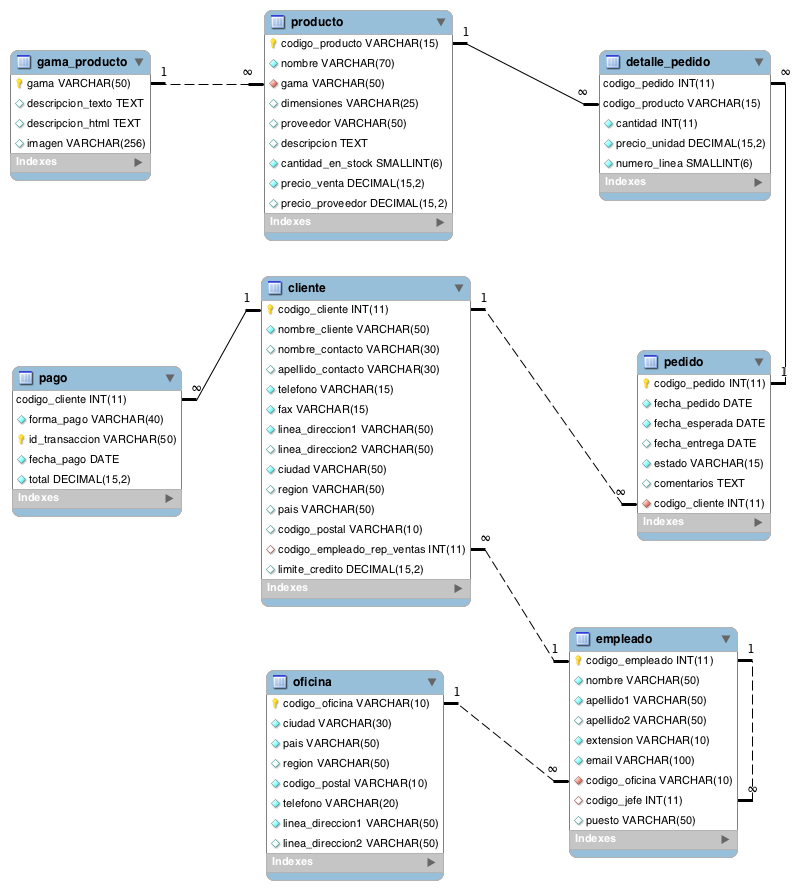

# Tarea 11
## Lectura del fichero db.
Mediante el siguiente comando entramos en sqlite y a su vez abrimos la base de datos que se nos proporciona:
```sql
sqlite3 jardineria.db 
```

## Realización de consultas


### Consultas SQL sobre una tabla
- Devuelve un listado con el código de oficina y la ciudad donde hay oficinas.
```sql
select codigo_oficina, ciudad from oficina;
```
| codigo_oficina |        ciudad        |
|----------------|----------------------|
| BCN-ES         | Barcelona            |
| BOS-USA        | Boston               |
| LON-UK         | Londres              |
| MAD-ES         | Madrid               |
| PAR-FR         | Paris                |
| SFC-USA        | San Francisco        |
| SYD-AU         | Sydney               |
| TAL-ES         | Talavera de la Reina |
| TOK-JP         | Tokyo                |

- Devuelve un listado con la ciudad y el teléfono de las oficinas de España.
```sql
select ciudad, telefono from oficina where pais='España';
```
|        ciudad        |    telefono    |
|----------------------|----------------|
| Barcelona            | +34 93 3561182 |
| Madrid               | +34 91 7514487 |
| Talavera de la Reina | +34 925 867231 |

- Devuelve un listado con el nombre, apellidos y email de los empleados cuyo jefe tiene un código de jefe igual a 7.
```sql
select nombre, apellido1 ||' '|| apellido2 as apellidos, email from empleado where codigo_jefe=7;
```
| nombre  |     apellidos     |          email           |
|---------|-------------------|--------------------------|
| Mariano | López Murcia      | mlopez@jardineria.es     |
| Lucio   | Campoamor Martín  | lcampoamor@jardineria.es |
| Hilario | Rodriguez Huertas | hrodriguez@jardineria.es |

- Devuelve el nombre del puesto, nombre, apellidos y email del jefe de la empresa.
```sql
select puesto, nombre, apellido1 ||' '|| apellido2 as apellidos, email from empleado where codigo_jefe not null;
```
|        puesto         |     nombre      |     apellidos      |           email           |
|-----------------------|-----------------|--------------------|---------------------------|
| Subdirector Marketing | Ruben           | López Martinez     | rlopez@jardineria.es      |
| Subdirector Ventas    | Alberto         | Soria Carrasco     | asoria@jardineria.es      |
| Secretaria            | Maria           | Solís Jerez        | msolis@jardineria.es      |
| Representante Ventas  | Felipe          | Rosas Marquez      | frosas@jardineria.es      |
| Representante Ventas  | Juan Carlos     | Ortiz Serrano      | cortiz@jardineria.es      |
| Director Oficina      | Carlos          | Soria Jimenez      | csoria@jardineria.es      |
| Representante Ventas  | Mariano         | López Murcia       | mlopez@jardineria.es      |
| Representante Ventas  | Lucio           | Campoamor Martín   | lcampoamor@jardineria.es  |
| Representante Ventas  | Hilario         | Rodriguez Huertas  | hrodriguez@jardineria.es  |
| Director Oficina      | Emmanuel        | Magaña Perez       | manu@jardineria.es        |
| Representante Ventas  | José Manuel     | Martinez De la Osa | jmmart@hotmail.es         |
| Representante Ventas  | David           | Palma Aceituno     | dpalma@jardineria.es      |
| Representante Ventas  | Oscar           | Palma Aceituno     | opalma@jardineria.es      |
| Director Oficina      | Francois        | Fignon             | ffignon@gardening.com     |
| Representante Ventas  | Lionel          | Narvaez            | lnarvaez@gardening.com    |
| Representante Ventas  | Laurent         | Serra              | lserra@gardening.com      |
| Director Oficina      | Michael         | Bolton             | mbolton@gardening.com     |
| Representante Ventas  | Walter Santiago | Sanchez Lopez      | wssanchez@gardening.com   |
| Director Oficina      | Hilary          | Washington         | hwashington@gardening.com |
| Representante Ventas  | Marcus          | Paxton             | mpaxton@gardening.com     |
| Representante Ventas  | Lorena          | Paxton             | lpaxton@gardening.com     |
| Director Oficina      | Nei             | Nishikori          | nnishikori@gardening.com  |
| Representante Ventas  | Narumi          | Riko               | nriko@gardening.com       |
| Representante Ventas  | Takuma          | Nomura             | tnomura@gardening.com     |
| Director Oficina      | Amy             | Johnson            | ajohnson@gardening.com    |
| Representante Ventas  | Larry           | Westfalls          | lwestfalls@gardening.com  |
| Representante Ventas  | John            | Walton             | jwalton@gardening.com     |
| Director Oficina      | Kevin           | Fallmer            | kfalmer@gardening.com     |
| Representante Ventas  | Julian          | Bellinelli         | jbellinelli@gardening.com |
| Representante Ventas  | Mariko          | Kishi              | mkishi@gardening.com      |

- Devuelve un listado con el nombre, apellidos y puesto de aquellos empleados que no sean representantes de ventas.
```sql
select nombre, apellido1 ||' '|| apellido2 as apellidos, puesto from empleado where puesto!="Representante Ventas";
```
|  nombre  |   apellidos    |        puesto         |
|----------|----------------|-----------------------|
| Marcos   | Magaña Perez   | Director General      |
| Ruben    | López Martinez | Subdirector Marketing |
| Alberto  | Soria Carrasco | Subdirector Ventas    |
| Maria    | Solís Jerez    | Secretaria            |
| Carlos   | Soria Jimenez  | Director Oficina      |
| Emmanuel | Magaña Perez   | Director Oficina      |
| Francois | Fignon         | Director Oficina      |
| Michael  | Bolton         | Director Oficina      |
| Hilary   | Washington     | Director Oficina      |
| Nei      | Nishikori      | Director Oficina      |
| Amy      | Johnson        | Director Oficina      |
| Kevin    | Fallmer        | Director Oficina      |

- Devuelve un listado con el nombre de los todos los clientes españoles.
```sql
select nombre_cliente from cliente where pais='Spain';
```
|         nombre_cliente         |
|--------------------------------|
| Lasas S.A.                     |
| Beragua                        |
| Club Golf Puerta del hierro    |
| Naturagua                      |
| DaraDistribuciones             |
| Madrileña de riegos            |
| Lasas S.A.                     |
| Camunas Jardines S.L.          |
| Dardena S.A.                   |
| Jardin de Flores               |
| Flores Marivi                  |
| Flowers, S.A                   |
| Naturajardin                   |
| Golf S.A.                      |
| Americh Golf Management SL     |
| Aloha                          |
| El Prat                        |
| Sotogrande                     |
| Vivero Humanes                 |
| Fuenla City                    |
| Jardines y Mansiones Cactus SL |
| Jardinerías Matías SL          |
| Agrojardin                     |
| Top Campo                      |
| Jardineria Sara                |
| Campohermoso                   |
| Flores S.L.                    |

- Devuelve un listado con los distintos estados por los que puede pasar un pedido.
```sql
select distinct estado from pedido;
```
|  estado   |
|-----------|
| Entregado |
| Rechazado |
| Pendiente |

- Devuelve un listado con el código de cliente de aquellos clientes que realizaron algún pago en 2008. Tenga en cuenta que deberá eliminar aquellos códigos de cliente que aparezcan repetidos.
```sql
select distinct codigo_cliente from pago where fecha_pago regexp "2008";
```
| codigo_cliente |
|----------------|
| 1              |
| 13             |
| 14             |
| 26             |

- Devuelve un listado con el código de pedido, código de cliente, fecha esperada y fecha de entrega de los pedidos que no han sido entregados a tiempo.
```sql
select codigo_pedido, codigo_cliente, fecha_esperada, fecha_entrega from pedido where fecha_esperada < fecha_entrega;
```
| codigo_pedido | codigo_cliente | fecha_esperada | fecha_entrega |
|---------------|----------------|----------------|---------------|
| 9             | 1              | 2008-12-27     | 2008-12-28    |
| 13            | 7              | 2009-01-14     | 2009-01-15    |
| 16            | 7              | 2009-01-07     | 2009-01-15    |
| 17            | 7              | 2009-01-09     | 2009-01-11    |
| 18            | 9              | 2009-01-06     | 2009-01-07    |
| 22            | 9              | 2009-01-11     | 2009-01-13    |
| 28            | 3              | 2009-02-17     | 2009-02-20    |
| 31            | 13             | 2008-09-30     | 2008-10-04    |
| 32            | 4              | 2007-01-19     | 2007-01-27    |
| 38            | 19             | 2009-03-06     | 2009-03-07    |
| 39            | 19             | 2009-03-07     | 2009-03-09    |
| 40            | 19             | 2009-03-10     | 2009-03-13    |
| 42            | 19             | 2009-03-23     | 2009-03-27    |
| 43            | 23             | 2009-03-26     | 2009-03-28    |
| 44            | 23             | 2009-03-27     | 2009-03-30    |
| 45            | 23             | 2009-03-04     | 2009-03-07    |
| 46            | 23             | 2009-03-04     | 2009-03-05    |
| 49            | 26             | 2008-07-22     | 2008-07-30    |
| 55            | 14             | 2009-01-10     | 2009-01-11    |
| 60            | 1              | 2008-12-27     | 2008-12-28    |
| 68            | 3              | 2009-02-17     | 2009-02-20    |
| 92            | 27             | 2009-04-30     | 2009-05-03    |
| 96            | 35             | 2008-04-12     | 2008-04-13    |
| 103           | 30             | 2009-01-20     | 2009-01-24    |
| 106           | 30             | 2009-05-15     | 2009-05-20    |
| 112           | 36             | 2009-04-06     | 2009-05-07    |
| 113           | 36             | 2008-11-09     | 2009-01-09    |
| 114           | 36             | 2009-01-29     | 2009-01-31    |
| 115           | 36             | 2009-01-26     | 2009-02-27    |
| 123           | 30             | 2009-01-20     | 2009-01-24    |
| 126           | 30             | 2009-05-15     | 2009-05-20    |
| 128           | 38             | 2008-12-10     | 2008-12-29    |

- Devuelve un listado con el código de pedido, código de cliente, fecha esperada y fecha de entrega de los pedidos cuya fecha de entrega ha sido al menos dos días antes de la fecha esperada.
```sql
select codigo_pedido, codigo_cliente, fecha_esperada, fecha_entrega from pedido where (fecha_esperada, '-2') < fecha_entrega;
```
-- no funciona

- Devuelve un listado de todos los pedidos que fueron rechazados en 2009.
```sql

```
- Devuelve un listado de todos los pedidos que han sido entregados en el mes de enero de cualquier año.
```sql
```
- Devuelve un listado con todos los pagos que se realizaron en el año 2008 mediante Paypal. Ordene el resultado de mayor a menor.
```sql
```
- Devuelve un listado con todas las formas de pago que aparecen en la tabla pago. Tenga en cuenta que no deben aparecer formas de pago repetidas.
```sql
```
- Devuelve un listado con todos los productos que pertenecen a la gama Ornamentales y que tienen más de 100 unidades en stock. El listado deberá estar ordenado por su precio de venta, mostrando en primer lugar los de mayor precio.
```sql
```
- Devuelve un listado con todos los clientes que sean de la ciudad de Madrid y cuyo representante de ventas tenga el código de empleado 11 o 30.
```sql
```

### Consultas multitabla (Where para unir tablas)
- Obtén un listado con el nombre de cada cliente y el nombre y apellido de su representante de ventas.
```sql
```
- Muestra el nombre de los clientes que hayan realizado pagos junto con el nombre de sus representantes de ventas.
```sql
```
- Muestra el nombre de los clientes que no hayan realizado pagos junto con el nombre de sus representantes de ventas.
```sql
```
- Devuelve el nombre de los clientes que han hecho pagos y el nombre de sus representantes junto con la ciudad de la oficina a la que pertenece el representante.
```sql
```
- Devuelve el nombre de los clientes que no hayan hecho pagos y el nombre de sus representantes junto con la ciudad de la oficina a la que pertenece el representante.
```sql
```
- Lista la dirección de las oficinas que tengan clientes en Fuenlabrada.
```sql
```
- Devuelve el nombre de los clientes y el nombre de sus representantes junto con la ciudad de la oficina a la que pertenece el representante.
```sql
```
- Devuelve un listado con el nombre de los empleados junto con el nombre de sus jefes.
```sql
```
- Devuelve un listado que muestre el nombre de cada empleados, el nombre de su jefe y el nombre del jefe de sus jefe.
```sql
```
- Devuelve el nombre de los clientes a los que no se les ha entregado a tiempo un pedido.
```sql
```
- Devuelve un listado de las diferentes gamas de producto que ha comprado cada cliente.
```sql
```

### Consultas multitabla (inner join)
- Devuelve un listado que muestre solamente los clientes que no han realizado ningún pago.
```sql
```
- Devuelve un listado que muestre solamente los clientes que no han realizado ningún pedido.
```sql
```
- Devuelve un listado que muestre los clientes que no han realizado ningún pago y los que no han realizado ningún pedido.
```sql
```
- Devuelve un listado que muestre solamente los empleados que no tienen una oficina asociada.
```sql
```
- Devuelve un listado que muestre solamente los empleados que no tienen un cliente asociado.
```sql
```
- Devuelve un listado que muestre solamente los empleados que no tienen un cliente asociado junto con los datos de la oficina donde trabajan.
```sql
```
- Devuelve un listado que muestre los empleados que no tienen una oficina asociada y los que no tienen un cliente asociado.
```sql
```
- Devuelve un listado de los productos que nunca han aparecido en un pedido.
```sql
```
- Devuelve un listado de los productos que nunca han aparecido en un pedido. El resultado debe mostrar el nombre, la descripción y la imagen del producto.
```sql
```
- Devuelve las oficinas donde no trabajan ninguno de los empleados que hayan sido los representantes de ventas de algún cliente que haya realizado la compra de algún producto de la gama Frutales.
```sql
```
- Devuelve un listado con los clientes que han realizado algún pedido pero no han realizado ningún pago.
```sql
```
- Devuelve un listado con los datos de los empleados que no tienen clientes asociados y el nombre de su jefe asociado.
```sql
```

### Consultas resumen (count, avg, ...)
- ¿Cuántos empleados hay en la compañía?
```sql
```
- ¿Cuántos clientes tiene cada país?
```sql
```
- ¿Cuál fue el pago medio en 2009?
```sql
```
- ¿Cuántos pedidos hay en cada estado? Ordena el resultado de forma descendente por el número de pedidos.
```sql
```
- Calcula el precio de venta del producto más caro y más barato en una misma consulta.
```sql
```
- Calcula el número de clientes que tiene la empresa.
```sql
```
- ¿Cuántos clientes existen con domicilio en la ciudad de Madrid?
```sql
```
- ¿Calcula cuántos clientes tiene cada una de las ciudades que empiezan por M?
```sql
```
- Devuelve el nombre de los representantes de ventas y el número de clientes al que atiende cada uno.
```sql
```
- Calcula el número de clientes que no tiene asignado representante de ventas.
```sql
```
- Calcula la fecha del primer y último pago realizado por cada uno de los clientes. El listado deberá mostrar el nombre y los apellidos de cada cliente.
```sql
```
- Calcula el número de productos diferentes que hay en cada uno de los pedidos.
```sql
```
- Calcula la suma de la cantidad total de todos los productos que aparecen en cada uno de los pedidos.
```sql
```
- Devuelve un listado de los 20 productos más vendidos y el número total de unidades que se han vendido de cada uno. El listado deberá estar ordenado por el número total de unidades vendidas.
```sql
```
- La facturación que ha tenido la empresa en toda la historia, indicando la base imponible, el IGIC y el total facturado. La base imponible se calcula sumando el coste del producto por el número de unidades vendidas de la tabla detalle_pedido. El IGIC es el 7 % de la base imponible, y el total la suma de los dos campos anteriores.
```sql
```
- La misma información que en la pregunta anterior, pero agrupada por código de producto.
```sql
```
- La misma información que en la pregunta anterior, pero agrupada por código de producto filtrada por los códigos que empiecen por OR.
```sql
```
- Lista las ventas totales de los productos que hayan facturado más de 3000 euros. Se mostrará el nombre, unidades vendidas, total facturado y total facturado con impuestos (7% IGIC).
```sql
```
- Muestre la suma total de todos los pagos que se realizaron para cada uno de los años que aparecen en la tabla pagos.
```sql
```

### Subconsultas en SQL
- Devuelve el nombre del cliente con mayor límite de crédito.
```sql
```
- Devuelve el nombre del producto que tenga el precio de venta más caro.
```sql
```
- Devuelve el nombre del producto del que se han vendido más unidades. (Tenga en cuenta que tendrá que calcular cuál es el número total de unidades que se han vendido de cada producto a partir de los datos de la tabla detalle_pedido)
```sql
```
- Los clientes cuyo límite de crédito sea mayor que los pagos que haya realizado. (Sin utilizar INNER JOIN).
```sql
```
- Devuelve el producto que más unidades tiene en stock.
```sql
```
- Devuelve el producto que menos unidades tiene en stock.
```sql
```
- Devuelve el nombre, los apellidos y el email de los empleados que están a cargo de Alberto Soria.
```sql
```
- Devuelve el nombre del cliente con mayor límite de crédito.
```sql
```
- Devuelve el nombre del producto que tenga el precio de venta más caro.
```sql
```
- Devuelve el producto que menos unidades tiene en stock.
```sql
```
- Devuelve el nombre, apellido1 y cargo de los empleados que no representen a ningún cliente.
```sql
```
- Devuelve un listado que muestre solamente los clientes que no han realizado ningún pago.
```sql
```
- Devuelve un listado que muestre solamente los clientes que sí han realizado algún pago.
```sql
```
- Devuelve un listado de los productos que nunca han aparecido en un pedido.
```sql
```
- Devuelve el nombre, apellidos, puesto y teléfono de la oficina de aquellos empleados que no sean representante de ventas de ningún cliente.
```sql
```
- Devuelve las oficinas donde no trabajan ninguno de los empleados que hayan sido los representantes de ventas de algún cliente que haya realizado la compra de algún producto de la gama Frutales.
```sql
```
- Devuelve un listado con los clientes que han realizado algún pedido pero no han realizado ningún pago.
```sql
```
- Devuelve un listado que muestre solamente los clientes que no han realizado ningún pago.
```sql
```
- Devuelve un listado que muestre solamente los clientes que sí han realizado algún pago.
```sql
```
- Devuelve un listado de los productos que nunca han aparecido en un pedido.
```sql
```
- Devuelve un listado de los productos que han aparecido en un pedido alguna vez.
```sql
```

### Consultas variadas en SQL
- Devuelve el listado de clientes indicando el nombre del cliente y cuántos pedidos ha realizado. Tenga en cuenta que pueden existir clientes que no han realizado ningún pedido.
```sql
```
- Devuelve un listado con los nombres de los clientes y el total pagado por cada uno de ellos. Tenga en cuenta que pueden existir clientes que no han realizado ningún pago.
```sql
```
- Devuelve el nombre de los clientes que hayan hecho pedidos en 2008 ordenados alfabéticamente de menor a mayor.
```sql
```
- Devuelve el nombre del cliente, el nombre y primer apellido de su representante de ventas y el número de teléfono de la oficina del representante de ventas, de aquellos clientes que no hayan realizado ningún pago.
```sql
```
- Devuelve el listado de clientes donde aparezca el nombre del cliente, el nombre y primer apellido de su representante de ventas y la ciudad donde está su oficina.
```sql
```
- Devuelve el nombre, apellidos, puesto y teléfono de la oficina de aquellos empleados que no sean representante de ventas de ningún cliente.
```sql
```
- Devuelve un listado indicando todas las ciudades donde hay oficinas y el número de empleados que tiene.
```sql
```