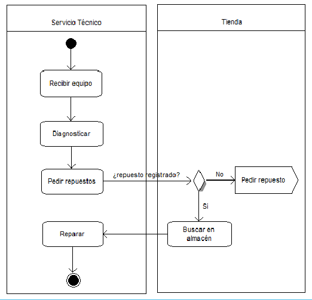
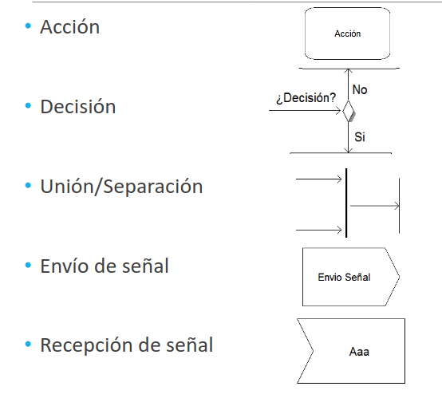

# Diagramas

## Índice

1. [Diagramas de casos de uso](#diagramas-de-casos-de-uso)
2. [Diagramas de secuencia](#diagramas-de-secuencia)
3. [Diagramas de actividades](#diagramas-de-actividades)

## Diagramas de casos de uso

Este es un __diagrama estructural__ y suele ser uno de los primeros diagramas a realizar cuando se planea crear un software. Esto porque plantea las funciones más importantes de un sistema.

En estos diagramas, las funciones de sistemas se suelen representar desde el punto de vista de un usuario, que se le llama __actor__. Dicho actor puede no ser necesariamente un ser humano; también lo puede ser un sistema externo. De este modo, este tipo de diagramas muestra __la relación entre un actor y sus requisitos o expectativas del sistema__, sin representar las acciones que tienen lugar o ponerlas en un orden lógico.

### Elementos

Hay tres elementos principales:
- __Actor:__ se representa con el dibujo de una figura humana.
- __Sistema:__ se representa con un rectángulo.
- __Caso de uso:__ se muestra como un elipse que suele incluir un texto descriptivo del proceso.

    

Entre los actores y los casos de usos existen __relaciones__ (representadas con flechas) que pueden ser de distintos tipos:

- __Flecha continua:__ actor y caso de uso.
- __Flecha discontinua:__ relación entre casos de usos que puede ser...
        - __<<include>>__: ambos casos de uso se deben realizar.
        - __<<exclude>>__: la realización de un caso de uso PUEDE incluir otro si se cumple cierta condición.

    

## Diagramas de secuencia

Es un __diagrama de interacción__ y muestra la interacción entre componentes del sistema desde un punto de vista temporal. La interacción se representa con el paso de mensajes entre objetos o actores a lo largo del tiempo. Se utiliza para describir procesos internos entre diferentes módulos y describir las comunicaciones existentes con otros sistemas o actores.

Se representa el tiempo para un actor/objeto mediante un eje vertical. El paso de mensajes se indica con una linea horizontal entre los objetos, además de la descripción del mensaje.

Cuando el actor/objeto se encuentra activo, este se representa como un rectángulo sobre la línea de tiempo tan grande como el tiempo que se encuentre activo.

### Elementos

    

Tenemos cuatro elementos principales:
- __Actor/Objeto:__ se representa con una figura humana (en el caso de actores) o un rectángulo (en el caso de los objetos).
- __Objeto en ejecución (activo):__ se representa en la linea del tiempo como un rectángulo vertical.
- __Actor/Objeto desconocido:__ se representa como un circulo negro.
- __Fin de una "linea de vida":__ se representa con una __X__.
- __Mensajes:__ se representan con lineas horizontales.

Los mensajes pueden ser:
- __Síncronos:__ el emisor espera respuesta.
- __Asíncronos:__ el emisor NO espera respuesta.
- __Automensaje:__ el emisor se manda mensaje a sí mismo.

Los mensajes se representan mediante una flecha continua, mientras que los mensajes de retorno, la flecha es discontinua. Se puede indicar un número que identifique el orden de ejecución de los mensajes. El mensaje puede ser escrito en lenguaje humano o a nivel técnico.

    

## Diagramas de actividades

Es un __diagrama de comportamiento__ desde el punto de vista de las __actividades__ que realiza el sistema. Muestra el paso a paso de las diferentes actividades ejecutadas por un sistema. Es utilizado para modelar el comportamiento de determinados procesos y representar el flujo de negocio de un sistema.

    

### Elementos

Estos diagramas tienen cinco elementos principales:

    

