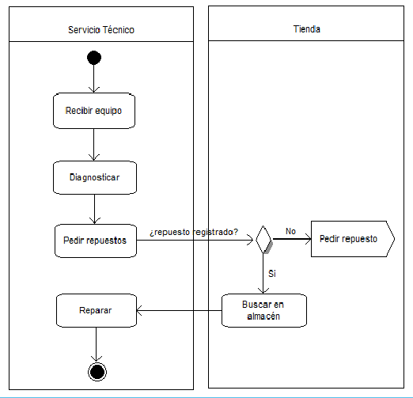
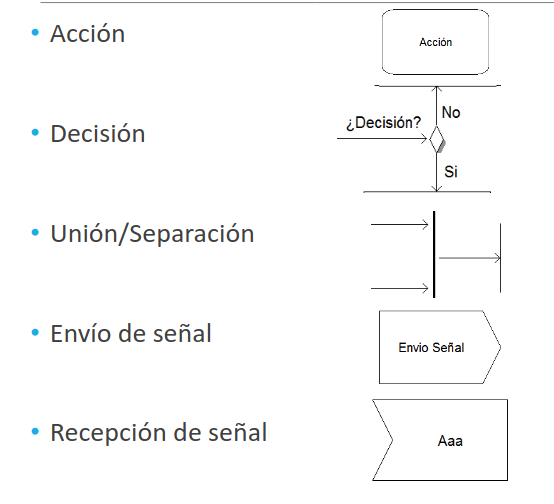

# Diagramas de actividades

Es un __diagrama de comportamiento__ desde el punto de vista de las __actividades__ que realiza el sistema. Muestra el paso a paso de las diferentes actividades ejecutadas por un sistema. Es utilizado para modelar el comportamiento de determinados procesos y representar el flujo de negocio de un sistema.

    

## Elementos

Estos diagramas tienen cinco elementos principales:

    

