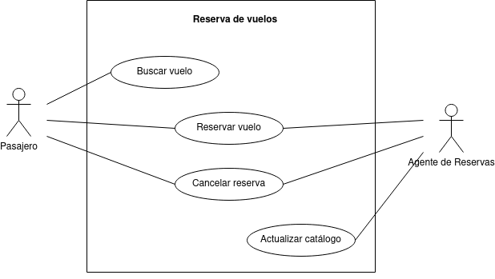
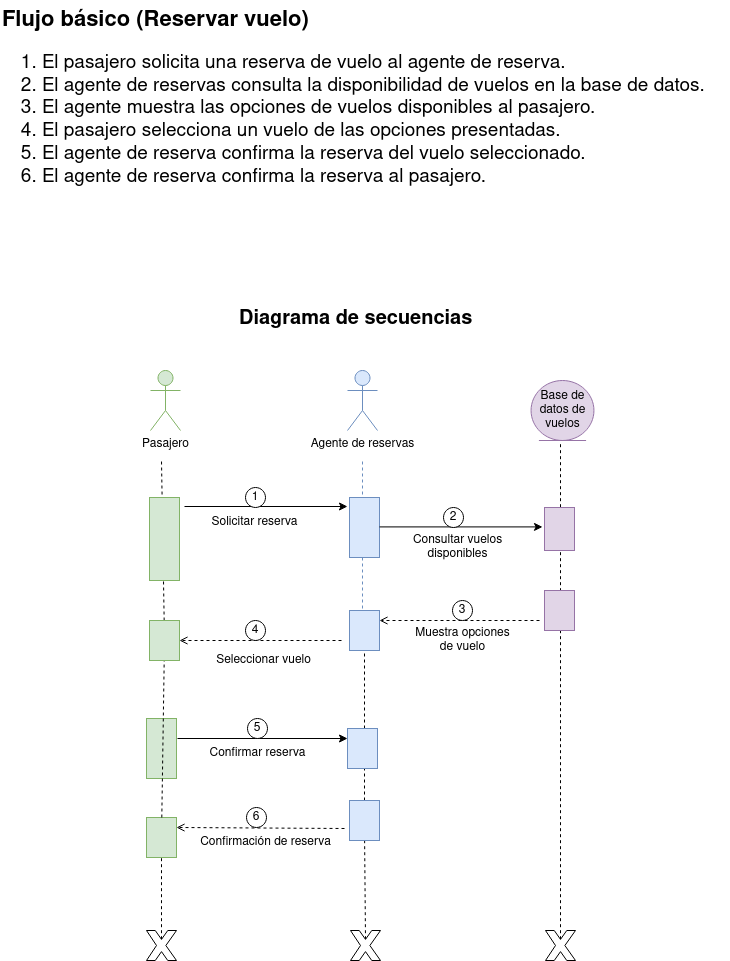

# Reserva de vuelos
En este ejercicio procederemos a analizar el diagrama de comportamiento de la siguiente imagen: 

## Actores
|  Actor | Pasajero |
|---|---|
| Descripción  | Persona que utiliza el sistema de reservas de vuelos para buscar, reservar y gestionar vuelos. |
| Características  | - Puede buscar vuelos por diferentes criterios.   - Tiene la capacidad de realizar reservas.   - Puede cancelar sus propias reservas. |
| Relaciones | - Realiza acciones similares al "Agente de Reservas" al buscar vuelos y gestionar reservas. |
| Referencias | Buscar Vuelo, Reservar Vuelo, Cancelar Reserva |
| Notas | - Puede tener preferencias de asiento o necesidades especiales. |
| Autor | Rashi Chugani Narwanni |
| Fecha | 19/01/2024 |

|  Actor | Agente de Reservas |
|---|---|
| Descripción  | Persona que trabaja en el sistema de reservas de vuelos para gestionar reservas en nombre de los pasajeros. |
| Características  | - Tiene la capacidad de buscar y gestionar reservas en nombre de los pasajeros.   - Puede cancelar reservas. |
| Relaciones | - Realiza acciones similares al "Pasajero" al buscar vuelos y gestionar reservas. |
| Referencias | Gestionar Reservas, Cancelar Reserva |
| Notas | - Puede tener acceso a información adicional y herramientas de gestión. |
| Autor | Rashi Chugani Narwanni |
| Fecha | 19/01/2024 |

### Casos de Uso
|  Caso de Uso	CU | Buscar Vuelo  |
|---|---|
| Fuentes  | Sistema de reservas de vuelos |
| Actor  | Pasajero  |
| Descripción | Permite al pasajero buscar vuelos disponibles según diferentes criterios.  |
| Flujo básico | 1. El pasajero inicia sesión en el sistema.   2. Accede a la sección de búsqueda de vuelos.   3. Ingresa criterios como fecha, destino, etc.   4. Examina los resultados de la búsqueda. |
| Pre-condiciones | El pasajero ha iniciado sesión en el sistema. |
| Post-condiciones  | El pasajero visualiza una lista de vuelos que coinciden con los criterios de búsqueda.  |
| Requerimientos | Conexión a Internet para acceder a la base de datos de vuelos.  |
| Notas | - Se pueden proporcionar opciones avanzadas de búsqueda. |
| Autor | Rashi Chugani Narwanni |
| Fecha | 19/01/2024 |

|  Caso de Uso	CU | Reservar Vuelo  |
|---|---|
| Fuentes  | Sistema de reservas de vuelos |
| Actor  | Pasajero  |
| Descripción | Permite al pasajero reservar un vuelo encontrado en la búsqueda.  |
| Flujo básico | 1. El pasajero busca y selecciona un vuelo.   2. Proporciona la información necesaria para la reserva.   3. Confirma la reserva. |
| Pre-condiciones | El pasajero ha iniciado sesión y ha encontrado un vuelo deseado. |
| Post-condiciones  | El sistema registra la reserva asociada al pasajero.  |
| Requerimientos | Disponibilidad del vuelo y detalles del pasajero.  |
| Notas | - Se puede proporcionar la opción de elegir asientos. |
| Autor | Rashi Chugani Narwanni |
| Fecha | 19/01/2024 |

|  Caso de Uso	CU | Gestionar Reservas  |
|---|---|
| Fuentes  | Sistema de reservas de vuelos |
| Actor  | Agente de Reservas  |
| Descripción | Permite al agente de reservas buscar y gestionar reservas en nombre de los pasajeros.  |
| Flujo básico | 1. El agente de reservas inicia sesión en el sistema.   2. Accede a la sección de gestión de reservas.   3. Busca y selecciona la reserva deseada.   4. Realiza acciones como modificar detalles o verificar el estado de la reserva. |
| Pre-condiciones | El agente de reservas ha iniciado sesión y tiene permisos adecuados. |
| Post-condiciones  | La reserva se actualiza según las acciones realizadas por el agente de reservas.  |
| Requerimientos | Conexión a Internet para acceder a la base de datos de reservas.  |
| Notas | - Puede requerir autenticación adicional para la seguridad. |
| Autor | Rashi Chugani Narwanni |
| Fecha | 19/01/2024 |

|  Caso de Uso	CU | Cancelar Reservas  |
|---|---|
| Fuentes  | Sistema de reservas de vuelos |
| Actor  | Agente de Reservas, Pasajero  |
| Descripción | Permite al agente de reservas o al pasajero cancelar una reserva existente.  |
| Flujo básico | 1. El agente de reservas o pasajero inicia sesión en el sistema.   2. Accede a la sección de gestión de reservas.   3. Selecciona la reserva a cancelar.   4. Confirma la cancelación. |
| Pre-condiciones | La reserva existe en el sistema y el actor tiene permisos para cancelar. |
| Post-condiciones  | La reserva se marca como cancelada en el sistema.  |
| Requerimientos | La reserva no debe estar en un estado que impida la cancelación.  |
| Notas | - Se pueden aplicar políticas de cancelación y cargos. |
| Autor | Rashi Chugani Narwanni |
| Fecha | 19/01/2024 |

## Redacciónes de Casos de Uso
| **CU-001**  | **Buscar Vuelo**  | |
|---|---|---|
| **Versión** | 1.0 (29/01/2024)      | |
| **Dependencias** | N/A | |
| **Precondición** | El pasajero ha iniciado sesión en el sistema. | |
| **Descripción** | Permite al pasajero buscar vuelos disponibles según diferentes criterios. | |
| **Secuencia normal** | **Paso** | **Acción** |
| | 1   | El pasajero inicia sesión en el sistema. |
| | 2   | El pasajero accede a la sección de búsqueda de vuelos. |
| | 3   | El pasajero ingresa criterios como fecha, destino, etc. |
| | 4   | El pasajero examina los resultados de la búsqueda. |
| **Postcondición** | El pasajero visualiza una lista de vuelos que coinciden con los criterios de búsqueda. | |
| **Excepciones** | N/A | |
| **Comentarios** | Se pueden proporcionar opciones avanzadas de búsqueda. | |

| **CU-002**  | **Reservar Vuelo**  | |
|---|---|---|
| **Versión** | 1.0 (29/01/2024)      | |
| **Dependencias** | CU-001 Buscar Vuelo | |
| **Precondición** | El pasajero ha iniciado sesión y ha encontrado un vuelo deseado. | |
| **Descripción** | Permite al pasajero reservar un vuelo encontrado en la búsqueda. | |
| **Secuencia normal** | **Paso** | **Acción** |
| | 1   | El pasajero busca y selecciona un vuelo. |
| | 2   | El pasajero proporciona la información necesaria para la reserva. |
| | 3   | El pasajero confirma la reserva. |
| **Postcondición** | El sistema registra la reserva asociada al pasajero. | |
| **Excepciones** | N/A | |
| **Comentarios** | Se puede proporcionar la opción de elegir asientos. | |

| **CU-003**  | **Gestionar Reservas**  | |
|---|---|---|
| **Versión** | 1.0 (29/01/2024)      | |
| **Dependencias** | CU-002 Reservar Vuelo | |
| **Precondición** | El agente de reservas ha iniciado sesión y tiene permisos adecuados. | |
| **Descripción** | Permite al agente de reservas buscar y gestionar reservas en nombre de los pasajeros. | |
| **Secuencia normal** | **Paso** | **Acción** |
| | 1   | El agente de reservas inicia sesión en el sistema. |
| | 2   | El agente de reservas accede a la sección de gestión de reservas. |
| | 3   | El agente de reservas busca y selecciona la reserva deseada. |
| | 4   | El agente de reservas realiza acciones como modificar detalles o verificar el estado de la reserva. |
| **Postcondición** | La reserva se actualiza según las acciones realizadas por el agente de reservas. | |
| **Excepciones** | N/A | |
| **Comentarios** | Puede requerir autenticación adicional para la seguridad. | |

| **CU-004**  | **Cancelar Reservas**  | |
|---|---|---|
| **Versión** | 1.0 (29/01/2024)      | |
| **Dependencias** | CU-002 Reserval Vuelo | |
| **Precondición** | La reserva existe en el sistema y el actor tiene permisos para cancelar. | |
| **Descripción** | Permite al agente de reservas o al pasajero cancelar una reserva existente. | |
| **Secuencia normal** | **Paso** | **Acción** |
| | 1   | El agente de reservas o pasajero inicia sesión en el sistema. |
| | 2   | El agente de reservas o pasajero accede a la sección de gestión de reservas. |
| | 3   | El agente de reservas o pasajero selecciona la reserva a cancelar. |
| | 4   | El agente de reservas o pasajero confirma la cancelación. |
| **Postcondición** | La reserva se marca como cancelada en el sistema. | |
| **Excepciones** | N/A | |
| **Comentarios** | Se pueden aplicar políticas de cancelación y cargos. | |

## Diagrama de secuencias
A continuación le proporcionamos el diagrama de secuencias relacionado con el caso de uso principal, "Reservar vuelo":

