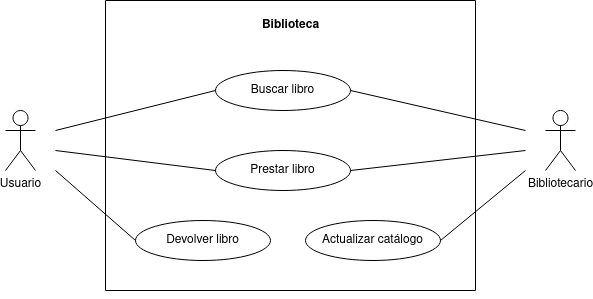
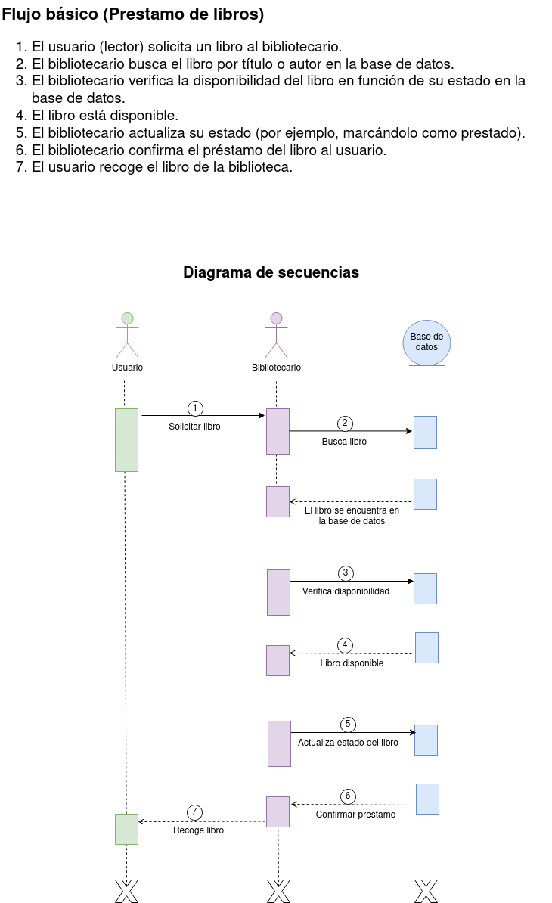
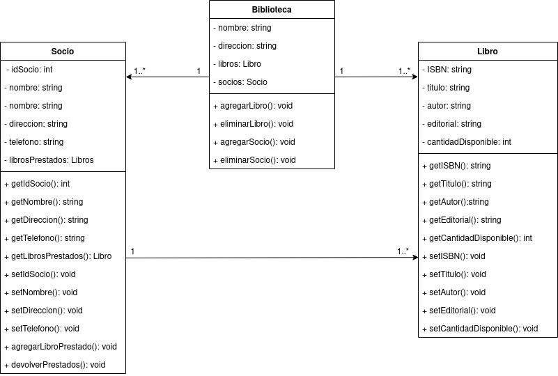
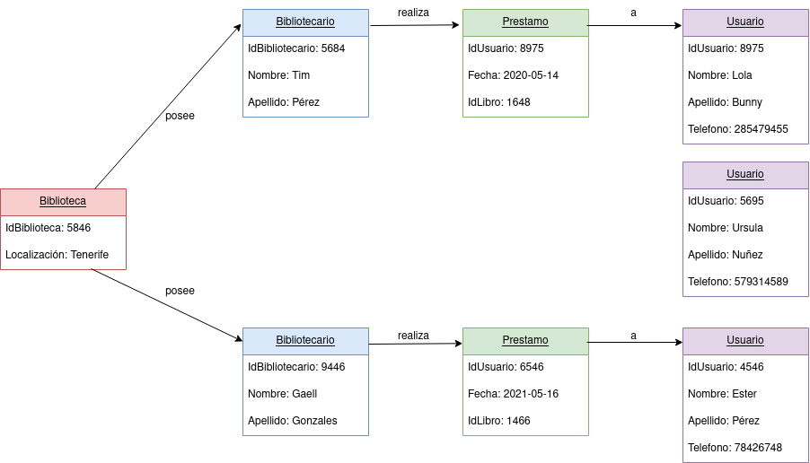
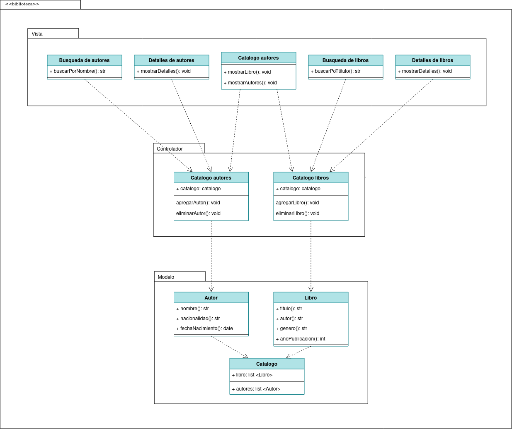

# Biblioteca
En este ejercicio procederemos a analizar el diagrama de comportamiento de la siguiente imagen: 

### Actores
|  Actor | Usuario |
|---|---|
| Descripción  | Persona que utiliza el sistema de biblioteca para buscar, prestar y devolver libros.  |
| Características  | - Capacidad para buscar libros por título, autor, etc.   - Capacidad para realizar préstamos y devoluciones.   - Puede acceder a su historial de préstamos. |
| Relaciones | Interactúa con el caso de uso "Buscar Libro", "Prestar Libro", "Devolver Libro". |
| Referencias | Buscar Libro, Prestar Libro, Devolver Libro |
| Notas | - Los usuarios pueden tener diferentes niveles de acceso según su tipo (estudiante, profesor, etc.). |
| Autor | Rashi Chugani Narwanni |
| Fecha | 18/01/2024 |

|  Actor | Bibliotecario |
|---|---|
| Descripción  | Personal encargado de la gestión y administración del sistema de biblioteca.  |
| Características  | - Capacidad para gestionar el inventario de libros.   - Puede registrar nuevos libros en el sistema.   - Gestiona los préstamos y devoluciones. |
| Relaciones | Interactúa con el caso de uso "Gestionar Inventario", "Registrar Libro", "Gestionar Préstamos". |
| Referencias | Gestionar Inventario, Registrar Libro, Gestionar Préstamos |
| Notas | - Puede tener acceso a informes y estadísticas sobre el uso de la biblioteca. |
| Autor | Rashi Chugani Narwanni |
| Fecha | 18/01/2024 |

### Casos de uso
|  Caso de Uso	CU | Buscar Libro  |
|---|---|
| Fuentes  | Catálogo de la biblioteca  |
| Actor  | Usuario  |
| Descripción | Permite al usuario buscar libros en el catálogo de la biblioteca.  |
| Flujo básico | 1. El usuario inicia sesión en el sistema.   2. Navega al catálogo de libros.   3. Ingresa criterios de búsqueda (título, autor, etc.).   4. Examina los resultados de búsqueda. |
| Pre-condiciones | El usuario ha iniciado sesión en el sistema. |
| Post-condiciones  | El usuario visualiza una lista de libros que coinciden con los criterios de búsqueda.  |
| Requerimientos | Conexión a Internet para acceder al catálogo en línea.  |
| Notas | - Se pueden proporcionar filtros avanzados para mejorar la precisión de la búsqueda. |
| Autor | Rashi Chugani Narwanni |
| Fecha | 18/01/2024 |

|  Caso de Uso	CU | Prestar libros  |
|---|---|
| Fuentes  | Sistema de préstamos  |
| Actor  | Bibliotecario  |
| Descripción | Permite al bibliotecario gestionar los préstamos de libros realizados por los usuarios.  |
| Flujo básico | 1. El bibliotecario inicia sesión en el sistema.   2. Accede a la sección de gestión de préstamos.   3. Visualiza los préstamos activos y su estado.   4. Registra la devolución de libros. |
| Pre-condiciones | El bibliotecario ha iniciado sesión y tiene los permisos adecuados. |
| Post-condiciones  | El sistema registra la devolución de libros y actualiza el estado de los préstamos.  |
| Requerimientos | Conexión a la base de datos del sistema de biblioteca.  |
| Notas | - Se pueden generar multas por devoluciones tardías. |
| Autor | Rashi Chugani Narwanni |
| Fecha | 18/01/2024 |

|  Caso de Uso	CU | Devolver Libro  |
|---|---|
| Fuentes  | Sistema de préstamos, Inventario de la biblioteca  |
| Actor  | Usuario  |
| Descripción | Permite al usuario devolver un libro prestado a la biblioteca.  |
| Flujo básico | 1. El usuario inicia sesión en el sistema.   2. Accede a la sección de "Mis Préstamos" o una función similar.   3. Selecciona el libro que desea devolver.   4. Confirma la devolución.   5. El sistema verifica la devolución y actualiza el estado del libro. |
| Pre-condiciones | El usuario ha iniciado sesión y tiene libros prestados. |
| Post-condiciones  | El libro se registra como devuelto, y el estado del préstamo se actualiza en el sistema.  |
| Requerimientos | El libro debe estar en buen estado para la devolución.  |
| Notas | - Se pueden generar recordatorios automáticos para la devolución próxima. - Puede haber un período de gracia para devoluciones tardías antes de aplicar multas. |
| Autor | Rashi Chugani Narwanni |
| Fecha | 18/01/2024 |

|  Caso de Uso	CU | Actualizar Catálogo  |
|---|---|
| Fuentes  | Catálogo de la biblioteca, Sistema de inventario  |
| Actor  | Bibliotecario  |
| Descripción | Permite al bibliotecario agregar, eliminar o actualizar información en el catálogo de la biblioteca.  |
| Flujo básico | 1. El bibliotecario inicia sesión en el sistema.   2. Accede a la sección de gestión de catálogo.   3. Selecciona la opción de actualizar catálogo.   4. Agrega nuevos libros, actualiza detalles o elimina registros según sea necesario. |
| Pre-condiciones | El bibliotecario ha iniciado sesión y tiene los permisos adecuados. |
| Post-condiciones  | El catálogo se actualiza según las modificaciones realizadas por el bibliotecario.  |
| Requerimientos | Conexión a la base de datos del sistema de biblioteca.  |
| Notas | - Se puede incluir la capacidad de cargar información en formato de archivo para realizar actualizaciones masivas. - El sistema puede generar registros de cambios para mantener un historial del catálogo. |
| Autor | Rashi Chugani Narwanni |
| Fecha | 18/01/2024 |

### Redacciónes de Casos de Uso
| **CU-001**  | **Buscar Libro**  | |
|---|---|---|
| **Versión** | 1.0 (29/01/2024)      | |
| **Dependencias** | N/A | |
| **Precondición** | El usuario ha iniciado sesión en el sistema. | |
| **Descripción** | Permite al usuario buscar libros en el catálogo de la biblioteca. | |
| **Secuencia normal** | **Paso** | **Acción** |
| | 1   | El usuario inicia sesión en el sistema. |
| | 2   | El usuario navega al catálogo de libros. |
| | 3   | El usuario ingresa criterios de búsqueda (título, autor, etc.). |
| | 4   | El usuario examina los resultados de búsqueda. |
| **Postcondición** | El usuario visualiza una lista de libros que coinciden con los criterios de búsqueda. | |
| **Excepciones** | N/A | |
| **Comentarios** | Se pueden proporcionar filtros avanzados para mejorar la precisión de la búsqueda. | |

| **CU-002**  | **Prestar Libros**  | |
|---|---|---|
| **Versión** | 1.0 (29/01/2024)      | |
| **Dependencias** | CU-003 Devolver Libros | |
| **Precondición** | El bibliotecario ha iniciado sesión y tiene los permisos adecuados. | |
| **Descripción** | Permite al bibliotecario gestionar los préstamos de libros realizados por los usuarios. | |
| **Secuencia normal** | **Paso** | **Acción** |
| | 1   | El bibliotecario inicia sesión en el sistema. |
| | 2   | El bibliotecario accede a la sección de gestión de préstamos. |
| | 3   | El bibliotecario visualiza los préstamos activos y su estado. |
| | 4   | El bibliotecario registra la el prestamo del libro. |
| **Postcondición** | El sistema registra la devolución de libros y actualiza el estado de los préstamos. | |
| **Excepciones** | **Paso** | **Comentarios** |
| | 3   | El bibliotecario no puede realizar el prestamo debido a que el usuario tiene penalizaciones. |
| |     | *E.1* El bibliotecario notifica al usuario de que no se le puede realizar el prestamo por la penalización.   *E.2* El usuario debe esperar a que termine el periodo de penalización.   *E.3* Se cancela el caso de uso. |
| **Comentarios** | Se pueden generar multas por devoluciones tardías. | |

| **CU-003**  | **Devolver Libro**  | |
|---|---|---|
| **Versión** | 1.0 (29/01/2024)      | |
| **Dependencias** | CU-002 Prestar Libros | |
| **Precondición** | El usuario ha iniciado sesión y tiene libros prestados. | |
| **Descripción** | Permite al usuario devolver un libro prestado a la biblioteca. | |
| **Secuencia normal** | **Paso** | **Acción** |
| | 1   | El usuario inicia sesión en el sistema. |
| | 2   | El usuario accede a la sección de "Mis Préstamos" o una función similar. |
| | 3   | El usuario selecciona el libro que desea devolver. |
| | 4   | El usuario confirma la devolución. |
| | 5   | El sistema verifica la devolución y actualiza el estado del libro. |
| **Postcondición** | El libro se registra como devuelto, y el estado del préstamo se actualiza en el sistema. | |
| **Excepciones** | N/A | |
| **Comentarios** | Se pueden generar recordatorios automáticos para la devolución próxima. Puede haber un período de gracia para devoluciones tardías antes de aplicar multas. | |

| **CU-004**  | **Actualizar Catálogo**  | |
|---|---|---|
| **Versión** | 1.0 (29/01/2024)      | |
| **Dependencias** | CU-002 Prestar Libros   CU-003 Devolver Libros | |
| **Precondición** | El bibliotecario ha iniciado sesión y tiene los permisos adecuados. | |
| **Descripción** | Permite al bibliotecario agregar, eliminar o actualizar información en el catálogo de la biblioteca. | |
| **Secuencia normal** | **Paso** | **Acción** |
| | 1   | El bibliotecario inicia sesión en el sistema. |
| | 2   | El bibliotecario accede a la sección de gestión de catálogo. |
| | 3   | El bibliotecario selecciona la opción de actualizar catálogo. |
| | 4   | El bibliotecario agrega nuevos libros, actualiza detalles o elimina registros según sea necesario. |
| **Postcondición** | El catálogo se actualiza según las modificaciones realizadas por el bibliotecario. | |
| **Excepciones** | N/A | |
| **Comentarios** | Se puede incluir la capacidad de cargar información en formato de archivo para realizar actualizaciones masivas. El sistema puede generar registros de cambios para mantener un historial del catálogo. | |

## Diagrama de secuencias
A continuación le proporcionamos el diagrama de secuencias relacionado con "Gestión de biblioteca":

## Diagrama de actividades
A continuación le proporcionamos el diagrama de actividades relacionado con "Gestión de biblioteca":

## Diagrama de clases
A continuación le proporcionamos el diagrama de clases relacionado con "Gestión de biblioteca":

## Diagrama de objetos
A continuación le proporcionamos el diagrama de objetos relacionado con "Gestión de biblioteca":

## Diagrama de paquetes MVC
A continuación le proporcionamos el diagrama de paquetes relacionado con "Gestión de biblioteca":

