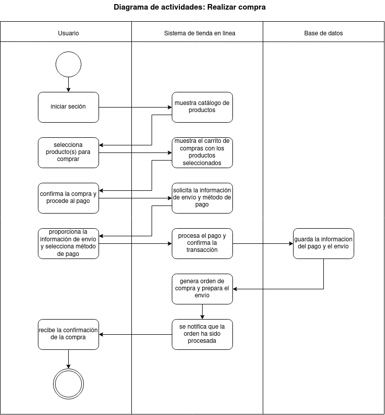
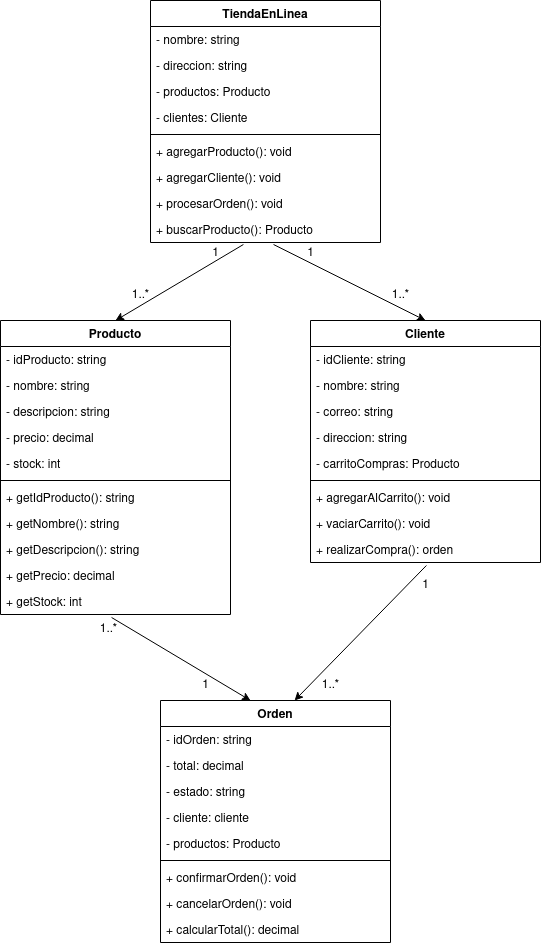
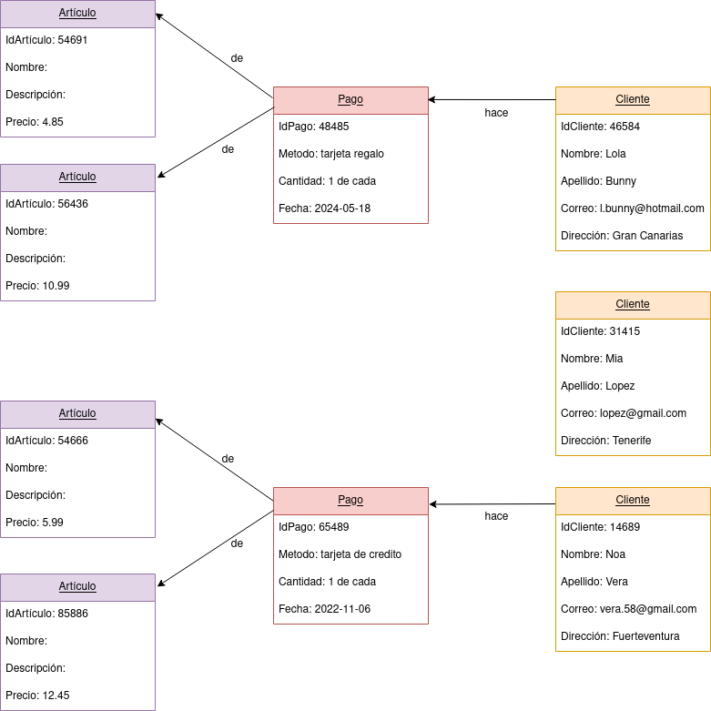
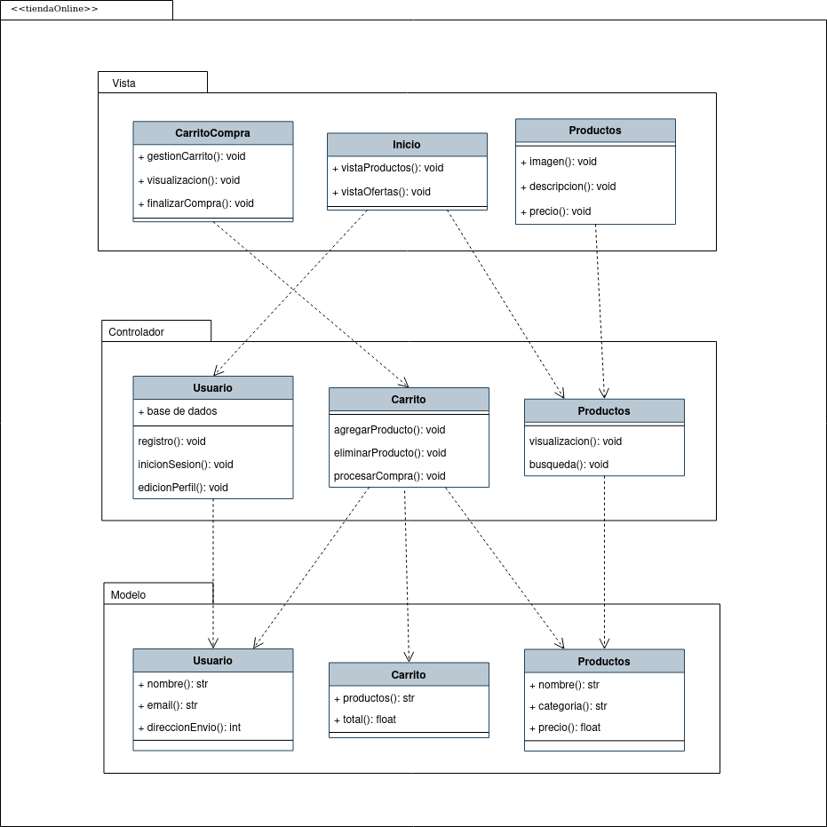

# Tienda en línea
En este ejercicio procederemos a analizar el diagrama de comportamiento de la siguiente imagen: 

### Actores
| Actor | Cliente  |
|---|---|
| Descripción  | Persona que utiliza el sistema de gestión de la tienda en línea para explorar productos y realizar compras. |
| Características  | - Puede ver el catálogo de productos.   - Puede realizar compras.   - Tiene una cuenta con información de pago. |
| Relaciones | - Realiza acciones similares al "Administrador" al explorar productos, pero no tiene acceso a la gestión del inventario. |
| Referencias | Ver Catálogo, Realizar Compra, Gestionar Cuenta |
| Notas | - Puede tener preferencias de búsqueda y un historial de compras. |
| Autor | Rashi Chugani Narwanni |
| Fecha | 20/01/2024 |

| Actor | Administrador  |
|---|---|
| Descripción  | Persona encargada de la gestión y administración del sistema de la tienda en línea. |
| Características  | - Puede gestionar el inventario de productos.   - Tiene acceso a la información de clientes y pedidos. |
| Relaciones | - Realiza acciones similares al "Cliente" al gestionar el inventario, pero tiene un acceso más amplio. |
| Referencias | Gestionar Inventario, Gestionar Pedidos, Ver Información de Clientes |
| Notas | - Puede generar informes y estadísticas sobre las ventas y el rendimiento del sistema. |
| Autor | Rashi Chugani Narwanni |
| Fecha | 20/01/2024 |

### Caso de Uso
| Caso de Uso CU | Ver Catálogo  |
|---|---|
| Fuentes  | Sistema de gestión de tienda en línea |
| Actor  | Cliente  |
| Descripción | Permite al cliente explorar el catálogo de productos de la tienda en línea.  |
| Flujo básico | 1. El cliente inicia sesión en el sistema.   2. Accede a la sección de catálogo.   3. Explora productos utilizando filtros y categorías.   4. Visualiza detalles de productos individuales. |
| Pre-condiciones | El cliente ha iniciado sesión en el sistema. |
| Post-condiciones  | El cliente puede ver y explorar productos en el catálogo.  |
| Requerimientos | Conexión a Internet para acceder al catálogo en línea.  |
| Notas | - Se pueden proporcionar funciones de búsqueda avanzada. |
| Autor | Rashi Chugani Narwanni |
| Fecha | 20/01/2024 |

| Caso de Uso CU | Realizar Compra  |
|---|---|
| Fuentes  | Sistema de gestión de tienda en línea |
| Actor  | Cliente  |
| Descripción | Permite al cliente seleccionar productos y realizar la compra.  |
| Flujo básico | 1. El cliente selecciona productos para comprar.   2. Agrega productos al carrito.   3. Revisa y confirma la orden de compra.   4. Proporciona información de pago y dirección de envío.   5. Confirma y completa la compra. |
| Pre-condiciones | El cliente ha iniciado sesión y ha seleccionado productos para comprar. |
| Post-condiciones  | La compra se registra en el sistema, y los productos se reservan para el cliente.  |
| Requerimientos | Información de pago y dirección de envío del cliente.  |
| Notas | - Se pueden proporcionar opciones para aplicar cupones o descuentos. |
| Autor | Rashi Chugani Narwanni |
| Fecha | 20/01/2024 |

| Caso de Uso CU | Gestionar Inventario  |
|---|---|
| Fuentes  | Sistema de gestión de tienda en línea |
| Actor  | Administrador  |
| Descripción | Permite al administrador gestionar el inventario de productos de la tienda en línea.  |
| Flujo básico | 1. El administrador inicia sesión en el sistema.   2. Accede a la sección de gestión de inventario.   3. Agrega, actualiza o elimina información de productos. |
| Pre-condiciones | El administrador ha iniciado sesión y tiene los permisos adecuados. |
| Post-condiciones  | El inventario se actualiza según las modificaciones realizadas por el administrador.  |
| Requerimientos | Conexión a la base de datos del sistema de la tienda en línea.  |
| Notas | - Se pueden registrar detalles como el precio, la cantidad disponible, etc. |
| Autor | Rashi Chugani Narwanni |
| Fecha | 20/01/2024 |

| Caso de Uso CU | Gestionar Pedidos  |
|---|---|
| Fuentes  | Sistema de gestión de tienda en línea |
| Actor  | Administrador  |
| Descripción | Permite al administrador gestionar los pedidos realizados por los clientes.  |
| Flujo básico | 1. El administrador inicia sesión en el sistema.   2. Accede a la sección de gestión de pedidos.   3. Visualiza los pedidos activos y su estado.   4. Actualiza el estado de los pedidos según sea necesario. |
| Pre-condiciones | El administrador ha iniciado sesión y tiene los permisos adecuados. |
| Post-condiciones  | El sistema registra las actualizaciones realizadas por el administrador en el estado de los pedidos.  |
| Requerimientos | Conexión a la base de datos del sistema de la tienda en línea.  |
| Notas | - Puede haber diferentes estados de pedido como "En proceso", "Enviado", etc. |
| Autor | Rashi Chugani Narwanni |
| Fecha | 20/01/2024 |

| Caso de Uso CU  | Gestión de Cuenta  |
|---|---|
| Fuentes  | Sistema de gestión de tienda en línea   |
| Actor  | Cliente  |
| Descripción  | Permite al cliente gestionar su cuenta, modificar información personal y cambiar la contraseña. |
| Flujo Básico  | 1. El cliente inicia sesión en el sistema.   2. Accede a la sección de gestión de cuenta.   3. Visualiza y modifica la información personal (nombre, dirección, etc.).   4. Cambia la contraseña si es necesario.   5. Guarda los cambios realizados. |
| Pre-condiciones  | El cliente ha iniciado sesión en el sistema.  |
| Post-condiciones  | La información de la cuenta del cliente se actualiza según las modificaciones realizadas. |
| Requerimientos  | Conexión a Internet para acceder al sistema.  |
| Notas  | - Se pueden agregar capas de seguridad, como la confirmación de cambios por correo electrónico. |
| Autor | Rashi Chugani Narwanni |
| Fecha | 20/01/2024 |

| Caso de Uso CU | Ver Información de Clientes  |
|---|---|
| Fuentes  | Sistema de gestión de tienda en línea |
| Actor  | Administrador  |
| Descripción | Permite al administrador acceder a la información de los clientes registrados.  |
| Flujo básico | 1. El administrador inicia sesión en el sistema.   2. Accede a la sección de información de clientes.   3. Visualiza detalles como historial de compras, información de contacto, etc. |
| Pre-condiciones | El administrador ha iniciado sesión y tiene los permisos adecuados. |
| Post-condiciones  | El administrador puede acceder y revisar la información de los clientes registrados en el sistema.  |
| Requerimientos | Conexión a la base de datos del sistema de la tienda en línea.  |
| Notas | - Puede incluir información sobre preferencias de productos o historial de compras. |
| Autor | Rashi Chugani Narwanni |
| Fecha | 20/01/2024 |

### Redacciónes de Casos de Uso
| **CU-001**  | **Publicar Mensaje**  | |
|---|---|---|
| **Versión** | 1.0 (29/01/2024)  | |
| **Dependencias** | CU-003 Realizar Compra.  | |
| **Precondición** | El usuario ha iniciado sesión en la aplicación. | |
| **Descripción** | Permite al usuario publicar un mensaje en su perfil o en el de sus amigos. | |
| **Secuencia normal** | **Paso** | **Acción** |
| | 1   | El usuario inicia sesión en la aplicación. |
| | 2   | Accede a la sección de publicación. |
| | 3   | Redacta el mensaje. |
| | 4   | Publica el mensaje en su perfil. |
| **Postcondición** | El mensaje se publica en el perfil seleccionado. | |
| **Excepciones** | N/A  |
| **Comentarios** | Este caso de uso es fundamental para la interacción y comunicación dentro de la plataforma, permitiendo a los usuarios compartir información y experiencias. | |

| **CU-002**  | **Ver Catálogo**  | |
|---|---|---|
| **Versión** | 1.0 (29/01/2024)  | |
| **Dependencias** | N/A  | |
| **Precondición** | El cliente ha iniciado sesión en el sistema. | |
| **Descripción** | Permite al cliente explorar el catálogo de productos de la tienda en línea. | |
| **Secuencia normal** | **Paso** | **Acción** |
| | 1   | El cliente inicia sesión en el sistema. |
| | 2   | Accede a la sección de catálogo. |
| | 3   | Explora productos utilizando filtros y categorías. |
| | 4   | Visualiza detalles de productos individuales. |
| **Postcondición** | El cliente puede ver y explorar productos en el catálogo. | |
| **Excepciones** | N/A  |
| **Comentarios** | Se pueden proporcionar funciones de búsqueda avanzada. | |

| **CU-003**  | **Realizar Compra**  | |
|---|---|---|
| **Versión** | 1.0 (29/01/2024)  | |
| **Dependencias** | CU-002 Ver Catálogo  | |
| **Precondición** | El cliente ha iniciado sesión y ha seleccionado productos para comprar. | |
| **Descripción** | Permite al cliente seleccionar productos y realizar la compra. | |
| **Secuencia normal** | **Paso** | **Acción** |
| | 1   | El cliente selecciona productos para comprar. |
| | 2   | Agrega productos al carrito. |
| | 3   | Revisa y confirma la orden de compra. |
| | 4   | Proporciona información de pago y dirección de envío. |
| | 5   | Confirma y completa la compra. |
| **Postcondición** | La compra se registra en el sistema, y los productos se reservan para el cliente. | |
| **Excepciones** | **Paso** | **Comentarios** |
| | 3   | El cliente decide no hacer la compra en ese momento. |
| |     | E.1   Se cancela el caso de uso. |
| **Comentarios** | Se pueden proporcionar opciones para aplicar cupones o descuentos. | |

| **CU-004**  | **Gestionar Inventario**  | |
|---|---|---|
| **Versión** | 1.0 (29/01/2024)  | |
| **Dependencias** | N/A  | |
| **Precondición** | El administrador ha iniciado sesión y tiene los permisos adecuados. | |
| **Descripción** | Permite al administrador gestionar el inventario de productos de la tienda en línea. | |
| **Secuencia normal** | **Paso** | **Acción** |
| | 1   | El administrador inicia sesión en el sistema. |
| | 2   | Accede a la sección de gestión de inventario. |
| | 3   | Agrega, actualiza o elimina información de productos. |
| **Postcondición** | El inventario se actualiza según las modificaciones realizadas por el administrador. | |
| **Excepciones** | N/A  |
| **Comentarios** | Se pueden registrar detalles como el precio, la cantidad disponible, etc. | |

| **CU-005**  | **Gestionar Pedidos**  | |
|---|---|---|
| **Versión** | 1.0 (29/01/2024)  | |
| **Dependencias** | CU-004 Gestionar Inventario | |
| | CU-007 Ver Información de Cliente  | |
| **Precondición** | El administrador ha iniciado sesión y tiene los permisos adecuados. | |
| **Descripción** | Permite al administrador gestionar los pedidos realizados por los clientes. | |
| **Secuencia normal** | **Paso** | **Acción** |
| | 1   | El administrador inicia sesión en el sistema. |
| | 2   | Accede a la sección de gestión de pedidos. |
| | 3   | Visualiza los pedidos activos y su estado. |
| | 4   | Actualiza el estado de los pedidos según sea necesario. |
| **Postcondición** | El sistema registra las actualizaciones realizadas por el administrador en el estado de los pedidos. | |
| **Excepciones** | N/A  |
| **Comentarios** | Puede haber diferentes estados de pedido como "En proceso", "Enviado", etc. | |

| **CU-006**  | **Gestión de Cuenta**  | |
|---|---|---|
| **Versión** | 1.0 (29/01/2024)  | |
| **Dependencias** | N/A  | |
| **Precondición** | El cliente ha iniciado sesión en el sistema. | |
| **Descripción** | Permite al cliente gestionar su cuenta, modificar información personal y cambiar la contraseña. | |
| **Secuencia normal** | **Paso** | **Acción** |
| | 1   | El cliente inicia sesión en el sistema. |
| | 2   | Accede a la sección de gestión de cuenta. |
| | 3   | Visualiza y modifica la información personal (nombre, dirección, etc.). |
| | 4   | Cambia la contraseña si es necesario. |
| | 5   | Guarda los cambios realizados. |
| **Postcondición** | La información de la cuenta del cliente se actualiza según las modificaciones realizadas. | |
| **Excepciones** | N/A  |
| **Comentarios** | Se pueden agregar capas de seguridad, como la confirmación de cambios por correo electrónico. | |

| **CU-007**  | **Ver Información de Clientes**  | |
|---|---|---|
| **Versión** | 1.0 (29/01/2024)  | |
| **Dependencias** | CU-003 Realizar Pedido  | |
| **Precondición** | El administrador ha iniciado sesión y tiene los permisos adecuados. | |
| **Descripción** | Permite al administrador acceder a la información de los clientes registrados. | |
| **Secuencia normal** | **Paso** | **Acción** |
| | 1   | El administrador inicia sesión en el sistema. |
| | 2   | Accede a la sección de información de clientes. |
| | 3   | Visualiza detalles como historial de compras, información de contacto, etc. |
| **Postcondición** | El administrador puede acceder y revisar la información de los clientes registrados en el sistema. | |
| **Excepciones** | N/A  |
| **Comentarios** | Puede incluir información sobre preferencias de productos o historial de compras. | |

## Diagrama de actividades
A continuación le proporcionamos el diagrama de actividades relacionado con "Tienda en línea":

## Diagrama de clases
A continuación le proporcionamos el diagrama de clases relacionado con "Tienda en línea":

## Diagrama de objetos
A continuación le proporcionamos el diagrama de objetos relacionado con "Tienda en línea":

## Diagrama de paquetes MVC
A continuación le proporcionamos el diagrama de paquetes relacionado con "Tienda en línea":

