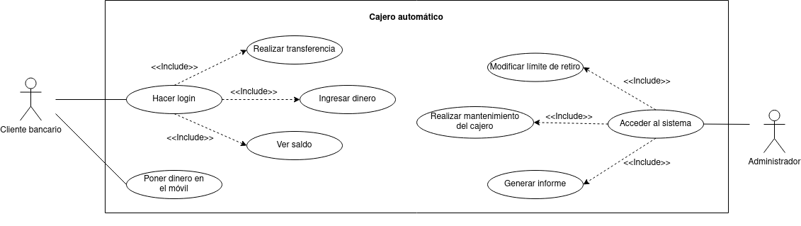
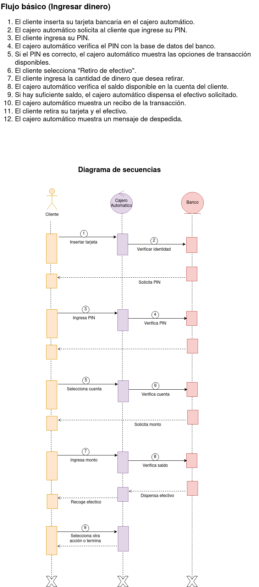
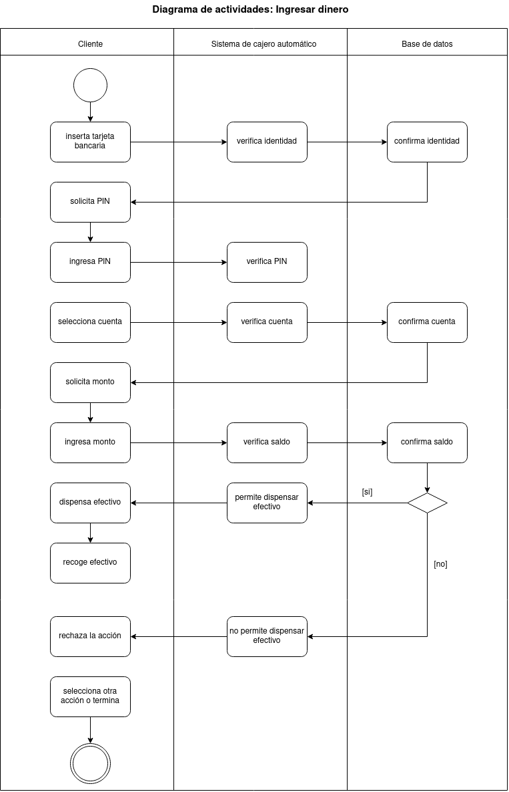
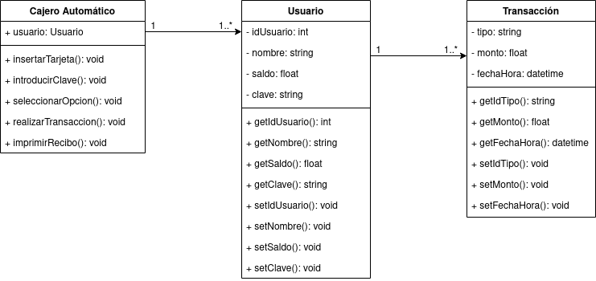
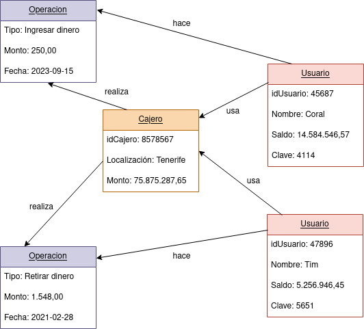

# Cajero automático

En este ejercicio procederemos a analizar el diagrama de comportamiento de la siguiente imagen: 

### Actores
|  Actor | Administrador |
|---|---|
| Descripción  | Persona encargada de administrar el sistema de cajero. |
| Características  | Acceso a funciones de administración del sistema, como la gestión de usuarios y la configuración del cajero. |
| Relaciones | Puede realizar algunas acciones similares a las de un Cliente Bancario, como verificar el saldo o realizar transferencias, pero con privilegios de administrador. |
| Referencias | Realizar transferencia, Ver saldo, Ingresar dinero, Poner dinero al móvil, etc. |   
| Notas | Puede tener acceso a funciones adicionales como la gestión de cajeros, la generación de informes, etc. |
| Autor | Rashi Chugani Narwani |
| Fecha | 30/01/2024 |

|  Actor | Cliente Bancario |
|---|---|
| Descripción  | Persona que utiliza el cajero para realizar transacciones bancarias. |
| Características  | Acceso limitado al sistema, solo puede realizar operaciones relacionadas con su cuenta bancaria. |
| Relaciones | No tiene relaciones directas con otros actores en el sistema. |
| Referencias | Hacer login, Realizar transferencia, Ver saldo, Ingresar dinero, Poner dinero al móvil, etc. |   
| Notas | Puede acceder a funciones estándar de un cajero automático. |
| Autor | Rashi Chugani Narwani |
| Fecha | 30/01/2024 |

### Casos de Uso
|  Caso de Uso	CU | Hacer login  |
|---|---|
| Fuentes  | Especificación del sistema de cajero.  |
| Actor  | Cliente Bancario |
| Descripción | Permite al cliente bancario acceder a su cuenta bancaria en el cajero. |
| Flujo básico | 1. El cliente ingresa su tarjeta bancaria.   2. El cliente ingresa su PIN.   3. El sistema verifica las credenciales del cliente.   4. El cliente accede a su cuenta bancaria. |
| Pre-condiciones | El cliente debe tener una tarjeta bancaria válida. |  
| Post-condiciones  | El cliente está autenticado en su cuenta bancaria. |  
| Requerimientos | La tarjeta bancaria debe estar activa y asociada a una cuenta válida. |
| Notas | El sistema debe cifrar el PIN ingresado por el cliente para proteger la seguridad de la cuenta. |
| Autor | Rashi Chugani Narwani |
| Fecha | 30/01/2024 |

|  Caso de Uso	CU | Realizar transferencia  |
|---|---|
| Fuentes  | Especificación del sistema de cajero.  |
| Actor  | Cliente Bancario |
| Descripción | Permite al cliente bancario transferir fondos a otra cuenta bancaria. |
| Flujo básico | 1. El cliente selecciona la opción de transferencia en el menú.   2. El cliente ingresa los detalles de la cuenta destino y el monto a transferir.   3. El sistema verifica la disponibilidad de fondos en la cuenta del cliente.   4. Se realiza la transferencia y se actualizan los saldos. |
| Pre-condiciones | El cliente debe estar autenticado en su cuenta bancaria. |  
| Post-condiciones  | Se realiza con éxito la transferencia de fondos. |  
| Requerimientos | El cliente debe tener suficientes fondos en su cuenta para completar la transferencia. |
| Notas | El sistema debe enviar un mensaje de confirmación al cliente después de completar la transferencia. |
| Autor | Rashi Chugani Narwani |
| Fecha | 30/01/2024 |

|  Caso de Uso	CU | Ingresar dinero  |
|---|---|
| Fuentes  | Especificación del sistema de cajero.  |
| Actor  | Cliente Bancario |
| Descripción | Permite al cliente bancario depositar dinero en su cuenta bancaria a través del cajero. |
| Flujo básico | 1. El cliente selecciona la opción de ingresar dinero en el menú.   2. El cliente inserta el dinero en la ranura designada.   3. El sistema cuenta y verifica la cantidad de dinero ingresado.   4. Se actualiza el saldo de la cuenta del cliente. |
| Pre-condiciones | El cliente debe estar autenticado en su cuenta bancaria. |  
| Post-condiciones  | Se deposita con éxito el dinero en la cuenta del cliente. |  
| Requerimientos | El cajero debe tener la capacidad de aceptar depósitos de dinero en efectivo. |
| Notas | El sistema debe proporcionar un recibo al cliente después de cada depósito. |
| Autor | Rashi Chugani Narwani |
| Fecha | 30/01/2024 |

|  Caso de Uso	CU | Ver saldo  |
|---|---|
| Fuentes  | Especificación del sistema de cajero.  |
| Actor  | Cliente Bancario |
| Descripción | Permite al cliente bancario verificar el saldo disponible en su cuenta. |
| Flujo básico | 1. El cliente selecciona la opción de ver saldo en el menú.   2. El sistema muestra el saldo actual de la cuenta del cliente. |
| Pre-condiciones | El cliente debe estar autenticado en su cuenta bancaria. |  
| Post-condiciones  | Se muestra el saldo actualizado al cliente. |  
| Requerimientos | - |
| Notas | El sistema debe mostrar el saldo de forma clara y legible para el cliente. |
| Autor | Rashi Chugani Narwani |
| Fecha | 30/01/2024 |

|  Caso de Uso	CU | Poner dinero en el móvil  |
|---|---|
| Fuentes  | Especificación del sistema de cajero.  |
| Actor  | Cliente Bancario |
| Descripción | Permite al cliente bancario transferir fondos a su cuenta móvil asociada. |
| Flujo básico | 1. El cliente selecciona la opción de poner dinero en el móvil en el menú.   2. El cliente ingresa los detalles de la cuenta móvil y el monto a transferir.   3. El sistema verifica la disponibilidad de fondos en la cuenta del cliente.   4. Se realiza la transferencia a la cuenta móvil y se actualizan los saldos. |
| Pre-condiciones | El cliente debe estar autenticado en su cuenta bancaria. La cuenta móvil debe estar previamente asociada a la cuenta bancaria del cliente. |  
| Post-condiciones  | Se realiza con éxito la transferencia de fondos a la cuenta móvil del cliente. |  
| Requerimientos | El cliente debe tener suficientes fondos en su cuenta bancaria para completar la transferencia. La cuenta móvil debe estar activa y asociada a la cuenta bancaria del cliente. |
| Notas | El cliente recibirá una confirmación de la transferencia en su dispositivo móvil después de completar la transacción. |
| Autor | Rashi Chugani Narwani |
| Fecha | 30/01/2024 |

|  Caso de Uso	CU | Acceder al sistema  |
|---|---|
| Fuentes  | Especificación del sistema de cajero.  |
| Actor  | Administrador |
| Descripción | Permite al administrador acceder al sistema de administración del cajero. |
| Flujo básico | 1. El administrador inicia sesión en el sistema de administración.   2. El sistema verifica las credenciales del administrador.   3. El administrador obtiene acceso al sistema de administración. |
| Pre-condiciones | El administrador debe tener credenciales válidas para iniciar sesión. |  
| Post-condiciones  | El administrador está autenticado en el sistema de administración del cajero. |  
| Requerimientos | El sistema de administración debe estar en funcionamiento y accesible. |
| Notas | El acceso al sistema de administración debe estar restringido solo a usuarios autorizados mediante autenticación segura. |
| Autor | Rashi Chugani Narwani |
| Fecha | 30/01/2024 |

|  Caso de Uso	CU | Modificar límites de retiro  |
|---|---|
| Fuentes  | Especificación del sistema de cajero.  |
| Actor  | Administrador |
| Descripción | Permite al administrador modificar los límites de retiro en el cajero. |
| Flujo básico | 1. El administrador accede al sistema de administración del cajero.   2. El administrador selecciona la opción de modificar límites de retiro.   3. El administrador ingresa los nuevos límites de retiro.   4. El sistema actualiza los límites de retiro en el cajero. |
| Pre-condiciones | El administrador debe estar autenticado en el sistema de administración. |  
| Post-condiciones  | Los límites de retiro en el cajero se actualizan con éxito. |  
| Requerimientos | El sistema de administración debe tener la capacidad de comunicarse con el cajero para realizar la actualización. |
| Notas | Es importante registrar y auditar cualquier cambio en los límites de retiro para mantener un registro de actividades. |
| Autor | Rashi Chugani Narwani |
| Fecha | 30/01/2024 |

|  Caso de Uso	CU | Realizar mantenimiento del cajero  |
|---|---|
| Fuentes  | Especificación del sistema de cajero.  |
| Actor  | Administrador |
| Descripción | Permite al administrador realizar tareas de mantenimiento en el cajero. |
| Flujo básico | 1. El administrador accede al sistema de administración del cajero.   2. El administrador selecciona la opción de realizar mantenimiento.   3. El administrador realiza las tareas de mantenimiento necesarias. |
| Pre-condiciones | El administrador debe estar autenticado en el sistema de administración. |  
| Post-condiciones  | Se completan las tareas de mantenimiento en el cajero. |  
| Requerimientos | El sistema de administración debe tener la capacidad de enviar comandos de mantenimiento al cajero. |
| Notas | Se debe garantizar que las tareas de mantenimiento no afecten la disponibilidad del cajero durante las horas de mayor actividad. |
| Autor | Rashi Chugani Narwani |
| Fecha | 30/01/2024 |

|  Caso de Uso	CU | Generar informes  |
|---|---|
| Fuentes  | Especificación del sistema de cajero.  |
| Actor  | Administrador |
| Descripción | Permite al administrador generar informes sobre el funcionamiento y las transacciones del cajero. |
| Flujo básico | 1. El administrador accede al sistema de administración del cajero.   2. El administrador selecciona la opción de generar informes.   3. El sistema recopila datos y genera el informe solicitado. |
| Pre-condiciones | El administrador debe estar autenticado en el sistema de administración. |  
| Post-condiciones  | Se genera con éxito el informe solicitado. |  
| Requerimientos | El sistema de administración debe tener acceso a la base de datos del cajero para recopilar los datos necesarios. |
| Notas | Los informes generados deben ser claros, detallados y comprensibles para los usuarios finales. |
| Autor | Rashi Chugani Narwani |
| Fecha | 30/01/2024 |

### Redacciónes de Casos de Uso
| **CU-001**  | **Hacer login**  | |
|---|---|---|
| **Versión** | 1.0 (30/01/2024)      | |
| **Dependencias** | N/A | |
| **Precondición** | El cliente debe tener una tarjeta bancaria válida. | |
| **Descripción** | Permite al cliente bancario acceder a su cuenta bancaria en el cajero. | |
| **Secuencia normal** | **Paso** | **Acción** |
| | 1   | El cliente ingresa su tarjeta bancaria. |
| | 2   | El cliente ingresa su PIN. |
| | 3   | El sistema verifica las credenciales del cliente. |
| | 4   | El cliente accede a su cuenta bancaria. |
| **Postcondición** | El cliente está autenticado en su cuenta bancaria. | |
| **Excepciones** | **Paso** | **Comentarios** |
| | 3   | El el sistema no consigue validar las credenciales.   |
| |     | *E.1* Intentar ingresar las credenciales de nuevo.   *E.2* Vuelve a dar error.   *E.3* Intentar ingresar las credenciales de nuevo.   *E.4* Vuelve a dar error.   *E.5* Se bloquea la trjeta.   *E.6* Se cancela el caso de uso. |
| **Comentarios** | El sistema debe cifrar el PIN ingresado por el cliente para proteger la seguridad de la cuenta. | |

| **CU-002**  | **Realizar transferencia**  | |
|---|---|---|
| **Versión** | 1.0 (30/01/2024)      | |
| **Dependencias** | CU-001 Hacer login   CU-003 Ingresar dinero | |
| **Precondición** | El cliente debe estar autenticado en su cuenta bancaria. | |
| **Descripción** | Permite al cliente bancario transferir fondos a otra cuenta bancaria. | |
| **Secuencia normal** | **Paso** | **Acción** |
| | 1   | El cliente selecciona la opción de transferencia en el menú. |
| | 2   | El cliente ingresa los detalles de la cuenta destino y el monto a transferir. |
| | 3   | El sistema verifica la disponibilidad de fondos en la cuenta del cliente. |
| | 4   | Se realiza la transferencia y se actualizan los saldos. |
| **Postcondición** | Se realiza con éxito la transferencia de fondos. | |
| **Excepciones** | **Paso** | **Comentarios** |
| | 3   | El el sistema detecta que no hay suficente fondos en la cuenta.   |
| |     | *E.1* Se cancela el caso de uso. |
| **Comentarios** | El sistema debe enviar un mensaje de confirmación al cliente después de completar la transferencia. | |

| **CU-003**  | **Ingresar dinero**  | |
|---|---|---|
| **Versión** | 1.0 (30/01/2024)      | |
| **Dependencias** | CU-001 Hacer login | |
| **Precondición** | El cliente debe estar autenticado en su cuenta bancaria. | |
| **Descripción** | Permite al cliente bancario depositar dinero en su cuenta bancaria a través del cajero. | |
| **Secuencia normal** | **Paso** | **Acción** |
| | 1   | El cliente selecciona la opción de ingresar dinero en el menú. |
| | 2   | El cliente inserta el dinero en la ranura designada. |
| | 3   | El sistema cuenta y verifica la cantidad de dinero ingresado. |
| | 4   | Se actualiza el saldo de la cuenta del cliente. |
| **Postcondición** | Se deposita con éxito el dinero en la cuenta del cliente. | |
| **Excepciones** | N/A | |
| **Comentarios** | El sistema debe proporcionar un recibo al cliente después de cada depósito. | |

| **CU-004**  | **Ver saldo**  | |
|---|---|---|
| **Versión** | 1.0 (30/01/2024)      | |
| **Dependencias** | CU-001 Hacer login | |
| **Precondición** | El cliente debe estar autenticado en su cuenta bancaria. | |
| **Descripción** | Permite al cliente bancario verificar el saldo disponible en su cuenta. | |
| **Secuencia normal** | **Paso** | **Acción** |
| | 1   | El cliente selecciona la opción de ver saldo en el menú. |
| | 2   | El sistema muestra el saldo actual de la cuenta del cliente. |
| **Postcondición** | Se muestra el saldo actualizado al cliente. | |
| **Excepciones** | N/A | |
| **Comentarios** | El sistema debe mostrar el saldo de forma clara y legible para el cliente. | |

| **CU-005**  | **Poner dinero en el móvil**  | |
|---|---|---|
| **Versión** | 1.0 (30/01/2024)      | |
| **Dependencias** | CU-003 Ingresar dinero   CU-004 Ver saldo | |
| **Precondición** | El cliente debe estar autenticado en su cuenta bancaria. La cuenta móvil debe estar previamente asociada a la cuenta bancaria del cliente. | |
| **Descripción** | Permite al cliente bancario transferir fondos a su cuenta móvil asociada. | |
| **Secuencia normal** | **Paso** | **Acción** |
| | 1   | El cliente selecciona la opción de poner dinero en el móvil en el menú. |
| | 2   | El cliente ingresa los detalles de la cuenta móvil y el monto a transferir. |
| | 3   | El sistema verifica la disponibilidad de fondos en la cuenta del cliente. |
| | 4   | Se realiza la transferencia a la cuenta móvil y se actualizan los saldos. |
| **Postcondición** | Se realiza con éxito la transferencia de fondos a la cuenta móvil del cliente. | |
| **Excepciones** | **Paso** | **Comentarios** |
| | 3   | El el sistema detecta que no hay suficente fondos en la cuenta.   |
| |     | *E.1* Se cancela el caso de uso. |
| **Comentarios** | El cliente recibirá una confirmación de la transferencia en su dispositivo móvil después de completar la transacción. | |

| **CU-006**  | **Acceder al sistema**  | |
|---|---|---|
| **Versión** | 1.0 (30/01/2024)      | |
| **Dependencias** | N/A | |
| **Precondición** | El administrador debe tener credenciales válidas para iniciar sesión. | |
| **Descripción** | Permite al administrador acceder al sistema de administración del cajero. | |
| **Secuencia normal** | **Paso** | **Acción** |
| | 1   | El administrador inicia sesión en el sistema de administración. |
| | 2   | El sistema verifica las credenciales del administrador. |
| | 3   | El administrador obtiene acceso al sistema de administración. |
| **Postcondición** | El administrador está autenticado en el sistema de administración del cajero. | |
| **Excepciones** | **Paso** | **Comentarios** |
| | 2   | El el sistema no consigue validar las credenciales.   |
| |     | *E.1* Intentar ingresar las credenciales de nuevo.   *E.2* Vuelve a dar error.   *E.3* Intentar ingresar las credenciales de nuevo.   *E.4* Vuelve a dar error.   *E.5* Se bloquea la seción.   *E.6* Se cancela el caso de uso. |
| **Comentarios** | El acceso al sistema de administración debe estar restringido solo a usuarios autorizados mediante autenticación segura. | |

| **CU-007**  | **Modificar límites de retiro**  | |
|---|---|---|
| **Versión** | 1.0 (30/01/2024)      | |
| **Dependencias** | CU-006 Acceder al sistema | |
| **Precondición** | El administrador debe estar autenticado en el sistema de administración. | |
| **Descripción** | Permite al administrador modificar los límites de retiro en el cajero. | |
| **Secuencia normal** | **Paso** | **Acción** |
| | 1   | El administrador accede al sistema de administración del cajero. |
| | 2   | El administrador selecciona la opción de modificar límites de retiro. |
| | 3   | El administrador ingresa los nuevos límites de retiro. |
| | 4   | El sistema actualiza los límites de retiro en el cajero. |
| **Postcondición** | Los límites de retiro en el cajero se actualizan con éxito. | |
| **Excepciones** | N/A | |
| **Comentarios** | Es importante registrar y auditar cualquier cambio en los límites de retiro para mantener un registro de actividades. | |

| **CU-008**  | **Realizar mantenimiento del cajero**  | |
|---|---|---|
| **Versión** | 1.0 (30/01/2024)      | |
| **Dependencias** | CU-006 Acceder al sistema | |
| **Precondición** | El administrador debe estar autenticado en el sistema de administración. | |
| **Descripción** | Permite al administrador realizar tareas de mantenimiento en el cajero. | |
| **Secuencia normal** | **Paso** | **Acción** |
| | 1   | El administrador accede al sistema de administración del cajero. |
| | 2   | El administrador selecciona la opción de realizar mantenimiento. |
| | 3   | El administrador realiza las tareas de mantenimiento necesarias. |
| **Postcondición** | Se completan las tareas de mantenimiento en el cajero. | |
| **Excepciones** | **Paso** | **Comentarios** |
| | 1   | El el sistema no consigue validar las credenciales.   |
| |     | *E.1* Intentar ingresar las credenciales de nuevo.   *E.2* Vuelve a dar error.   *E.3* Intentar ingresar las credenciales de nuevo.   *E.4* Vuelve a dar error.   *E.5* Se bloquea la seción.   *E.6* Se cancela el caso de uso. |
| **Comentarios** | Se debe garantizar que las tareas de mantenimiento no afecten la disponibilidad del cajero durante las horas de mayor actividad. | |

| **CU-009**  | **Generar informes**  | |
|---|---|---|
| **Versión** | 1.0 (30/01/2024)      | |
| **Dependencias** | CU-006 Acceder al sistema | |
| **Precondición** | El administrador debe estar autenticado en el sistema de administración. | |
| **Descripción** | Permite al administrador generar informes sobre el funcionamiento y las transacciones del cajero. | |
| **Secuencia normal** | **Paso** | **Acción** |
| | 1   | El administrador accede al sistema de administración del cajero. |
| | 2   | El administrador selecciona la opción de generar informes. |
| | 3   | El sistema recopila datos y genera el informe solicitado. |
| **Postcondición** | Se genera con éxito el informe solicitado. | |
| **Excepciones** | **Paso** | **Comentarios** |
| | 1   | El el sistema no consigue validar las credenciales.   |
| |     | *E.1* Intentar ingresar las credenciales de nuevo.   *E.2* Vuelve a dar error.   *E.3* Intentar ingresar las credenciales de nuevo.   *E.4* Vuelve a dar error.   *E.5* Se bloquea la seción.   *E.6* Se cancela el caso de uso. |
| **Comentarios** | Los informes generados deben ser claros, detallados y comprensibles para los usuarios finales. | |

## Tabla de Relaciones de "Include"
| Caso de Uso Principal  | Caso de Uso Incluido  | Descripción  |
|---|---|---|
| Hacer login  | Realizar transferencia  | El usuario debe estar autenticado para realizar una transferencia. |
| Hacer login  | Ingresar dinero  | Requiere autenticación del usuario para depositar dinero en la cuenta. |
| Hacer login  | Ver saldo  | Después del inicio de sesión, el usuario puede ver su saldo actual. |
| Acceder al sistema  | Modificar límite de retiro  | Acceder al sistema es necesario para ajustar el límite de retiro para los usuarios. |
| Acceder al sistema  | Realizar mantenimiento del cajero  | Se necesita acceso al sistema para llevar a cabo tareas de mantenimiento en el cajero automático. |
| Acceder al sistema  | Generar informe  | Permite acceder al sistema para generar informes sobre transacciones u otros datos relevantes. |

## Diagrama de secuencias
A continuación le proporcionamos el diagrama de secuencias relacionado con "Cajero automático":

## Diagrama de actividades
A continuación le proporcionamos el diagrama de actividades relacionado con "Cajero automático":

## Diagrama de clases
A continuación le proporcionamos el diagrama de clases relacionado con "Cajero automático":

## Diagrama de objetos
A continuación le proporcionamos el diagrama de objetos relacionado con "Cajero automático":

