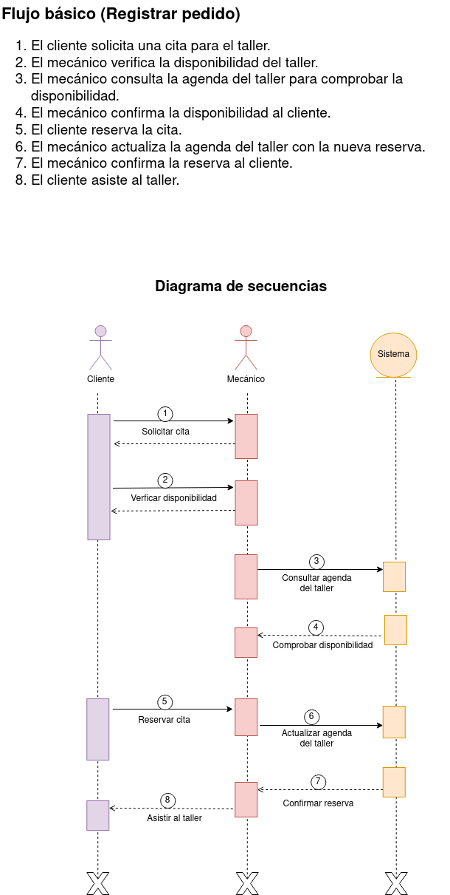

# Taller

En este ejercicio procederemos a analizar el diagrama de comportamiento de la siguiente imagen: 

### Actores
| Actor | Cliente |
|---|---|
| Descripción | Persona que solicita servicios de reparación para un vehículo en el taller. |
| Características | Proporciona información sobre el vehículo y las reparaciones necesarias. |
| Relaciones | Interactúa con el Mecánico para registrar pedidos y consultar el estado de los mismos. |
| Referencias | Registrar Pedido, Consultar Estado Pedido, Generar Factura |
| Notas | Este actor puede ser un cliente individual o una empresa con una flota de vehículos. |
| Autor | Rashi Chugani Narwanni |
| Fecha | 11/02/2024 |

| Actor | Mecánico |
|---|---|
| Descripción | Profesional encargado de realizar las reparaciones y mantenimiento de los vehículos en el taller. |
| Características | Posee conocimientos técnicos sobre automóviles y herramientas para llevar a cabo las reparaciones. |
| Relaciones | Interactúa con el Cliente para registrar y finalizar servicios. |
| Referencias | Registrar Servicio, Finalizar Servicio |
| Notas | Puede haber varios mecánicos trabajando en el taller simultáneamente. |
| Autor | Rashi Chugani Narwanni |
| Fecha | 11/02/2024 |

### Casos de Uso
| Caso de Uso | Registrar Pedido      |
|---|---|
| Fuentes     | Especificación del sistema de taller. |
| Actor       | Cliente               |
| Descripción | El cliente registra un pedido para reparar un vehículo en el taller. |
| Flujo básico | 1. El cliente proporciona información sobre el vehículo y las reparaciones necesarias.   2. El sistema registra el pedido. |
| Pre-condiciones | El cliente debe estar registrado en el sistema. |
| Post-condiciones | Se crea un nuevo pedido en el sistema. |
| Requerimientos | El cliente debe proporcionar información completa y precisa sobre el vehículo y las reparaciones necesarias. |
| Notas       | Pueden incluirse detalles adicionales sobre el estado del vehículo o las preferencias del cliente. |
| Autor | Rashi Chugani Narwanni |
| Fecha | 11/02/2024 |

| Caso de Uso | Consultar Estado de Pedido |
|---|---|
| Fuentes     | Especificación del sistema de taller. |
| Actor       | Cliente                |
| Descripción | El cliente verifica el estado de un pedido realizado previamente en el taller. |
| Flujo básico | 1. El cliente ingresa al sistema de taller.   2. El cliente busca el pedido utilizando un identificador único o el número de placa del vehículo.   3. El sistema muestra el estado actual del pedido. |
| Pre-condiciones | El cliente debe haber registrado al menos un pedido previamente. |
| Post-condiciones | El cliente está informado sobre el estado del pedido. |
| Requerimientos | El cliente debe tener acceso válido al sistema y conocer el identificador del pedido o la placa del vehículo. |
| Autor | Rashi Chugani Narwanni |
| Fecha | 11/02/2024 |

| Caso de Uso | Registrar Servicio    |
|---|---|
| Fuentes     | Especificación del sistema de taller. |
| Actor       | Mecánico              |
| Descripción | El mecánico registra los servicios realizados en un vehículo. |
| Flujo básico | 1. El mecánico ingresa al sistema de taller.   2. El mecánico busca el pedido utilizando un identificador único o el número de placa del vehículo.   3. El mecánico registra los servicios realizados y cualquier pieza reemplazada. |
| Pre-condiciones | El mecánico debe haber sido asignado a un pedido existente. |
| Post-condiciones | Los servicios y las piezas reemplazadas se registran en el sistema. |
| Requerimientos | El mecánico debe tener acceso válido al sistema y conocer el identificador del pedido o la placa del vehículo. |
| Notas       | Este caso de uso puede implicar la actualización del estado del vehículo y la disponibilidad de piezas en el inventario. |
| Autor | Rashi Chugani Narwanni |
| Fecha | 11/02/2024 |

| Caso de Uso | Finalizar Servicio    |
|---|---|
| Fuentes     | Especificación del sistema de taller. |
| Actor       | Mecánico              |
| Descripción | El mecánico marca un pedido como completado una vez que todas las reparaciones han sido realizadas. |
| Flujo básico | 1. El mecánico ingresa al sistema de taller.   2. El mecánico busca el pedido utilizando un identificador único o el número de placa del vehículo.   3. El mecánico marca el pedido como completado. |
| Pre-condiciones | Todas las reparaciones deben haber sido realizadas satisfactoriamente. |
| Post-condiciones | El pedido se marca como completado en el sistema. |
| Requerimientos | El mecánico debe tener acceso válido al sistema y conocer el identificador del pedido o la placa del vehículo. |
| Notas       | Esta acción puede generar automáticamente la generación de una factura para el cliente. |
| Autor | Rashi Chugani Narwanni |
| Fecha | 11/02/2024 |

| Caso de Uso | Generar Factura       |
|---|---|
| Fuentes     | Especificación del sistema de taller. |
| Actor       | Mecánico, Cliente     |
| Descripción | El sistema genera una factura para el cliente una vez que el servicio ha sido completado. |
| Flujo básico | 1. El sistema identifica los servicios realizados y las piezas reemplazadas en un pedido.   2. El sistema calcula el monto total a pagar.   3. El sistema genera una factura detallada.   4. La factura se envía al cliente. |
| Pre-condiciones | El pedido debe haber sido marcado como completado por el mecánico. |
| Post-condiciones | El cliente recibe una factura detallada. |
| Requerimientos | El sistema debe tener acceso a los detalles del pedido, incluidos los servicios realizados y las piezas reemplazadas. |
| Notas       | La factura puede incluir detalles como el costo de la mano de obra, el costo de las piezas reemplazadas y los impuestos aplicables. |
| Autor | Rashi Chugani Narwanni |
| Fecha | 11/02/2024 |

### Redacciónes de Casos de Uso
| **CU-001**  | **Registrar Pedido**  | |
|---|---|---|
| **Versión** | 1.0 (11/02/2024)      | |
| **Dependencias** | N/A | |
| **Precondición** | El cliente debe estar registrado en el sistema de taller. | |
| **Descripción** | Permite al cliente solicitar la reparación de un vehículo en el taller. | |
| **Secuencia normal** | **Paso** | **Acción** |
| | 1   | El cliente ingresa al sistema de taller. |
| | 2   | El cliente selecciona la opción para registrar un nuevo pedido. |
| | 3   | El cliente proporciona información sobre el vehículo y las reparaciones necesarias. |
| | 4   | El sistema registra el pedido en la base de datos. |
| **Postcondición** | Se crea un nuevo pedido en el sistema de taller. | |
| **Excepciones** | **Paso** | **Comentarios** |
| | 3   | El cliente no proporciona información completa.   |
| |     | *E.1* Solicitar al cliente que complete la información requerida.   *E.2* Volver al paso 3. |
| **Comentarios** | Puede ser necesario validar la disponibilidad de piezas y la agenda de los mecánicos antes de registrar el pedido. | |

| **CU-002**  | **Consultar Estado Pedido**  | |
|---|---|---|
| **Versión** | 1.0 (11/02/2024)      | |
| **Dependencias** | N/A | |
| **Precondición** | El cliente debe tener al menos un pedido registrado en el sistema de taller. | |
| **Descripción** | Permite al cliente verificar el estado de un pedido realizado previamente en el taller. | |
| **Secuencia normal** | **Paso** | **Acción** |
| | 1   | El cliente ingresa al sistema de taller. |
| | 2   | El cliente selecciona la opción para consultar el estado de un pedido. |
| | 3   | El cliente proporciona el identificador único o el número de placa del vehículo asociado al pedido. |
| | 4   | El sistema muestra al cliente el estado actual del pedido. |
| **Postcondición** | El cliente está informado sobre el estado del pedido. | |
| **Excepciones** | **Paso** | **Comentarios** |
| | 3   | El cliente proporciona un identificador incorrecto o no existente.   |
| |     | *E.1* Informar al cliente sobre la falta de coincidencias y solicitar nuevamente el identificador.   *E.2* Volver al paso 3. |
| **Comentarios** | El estado del pedido puede incluir información sobre las reparaciones realizadas y el tiempo estimado de finalización. | |

| **CU-003**  | **Registrar Servicio**  | |
|---|---|---|
| **Versión** | 1.0 (11/02/2024)      | |
| **Dependencias** | N/A | |
| **Precondición** | El mecánico debe haber sido asignado a un pedido existente en el sistema de taller. | |
| **Descripción** | Permite al mecánico registrar los servicios realizados en un vehículo. | |
| **Secuencia normal** | **Paso** | **Acción** |
| | 1   | El mecánico ingresa al sistema de taller. |
| | 2   | El mecánico selecciona el pedido al cual desea registrar un servicio. |
| | 3   | El mecánico registra los servicios realizados y cualquier pieza reemplazada. |
| | 4   | El sistema actualiza el registro del pedido con la información del servicio. |
| **Postcondición** | Los servicios y las piezas reemplazadas se registran en el sistema de taller. | |
| **Excepciones** | **Paso** | **Comentarios** |
| | 3   | El mecánico no puede completar el registro debido a información incorrecta o faltante.   |
| |     | *E.1* Informar al mecánico sobre la falta de información y solicitar nuevamente los detalles del servicio.   *E.2* Volver al paso 3. |
| **Comentarios** | Este caso de uso puede implicar la actualización del estado del vehículo y la disponibilidad de piezas en el inventario. | |

| **CU-004**  | **Finalizar Servicio**  | |
|---|---|---|
| **Versión** | 1.0 (11/02/2024)      | |
| **Dependencias** | N/A | |
| **Precondición** | Todas las reparaciones deben haber sido realizadas satisfactoriamente en el pedido. | |
| **Descripción** | Permite al mecánico marcar un pedido como completado una vez que todas las reparaciones han sido realizadas. | |
| **Secuencia normal** | **Paso** | **Acción** |
| | 1   | El mecánico ingresa al sistema de taller. |
| | 2   | El mecánico selecciona el pedido que ha sido completado. |
| | 3   | El mecánico marca el pedido como completado en el sistema. |
| **Postcondición** | El pedido se marca como completado en el sistema de taller. | |
| **Excepciones** | **Paso** | **Comentarios** |
| | 3   | El mecánico no puede finalizar el pedido debido a alguna inconsistencia.   |
| |     | *E.1* Investigar la causa de la inconsistencia y tomar medidas correctivas.   *E.2* Volver al paso 2. |
| **Comentarios** | Esta acción puede generar automáticamente la generación de una factura para el cliente. | |

| **CU-005**  | **Generar Factura**  | |
|---|---|---|
| **Versión** | 1.0 (11/02/2024)      | |
| **Dependencias** | N/A | |
| **Precondición** | El pedido debe haber sido marcado como completado por el mecánico en el sistema de taller. | |
| **Descripción** | El sistema genera una factura para el cliente una vez que el servicio ha sido completado. | |
| **Secuencia normal** | **Paso** | **Acción** |
| | 1   | El sistema identifica el pedido completado en el sistema de taller. |
| | 2   | El sistema calcula el monto total a pagar por los servicios y las piezas utilizadas. |
| | 3   | El sistema genera una factura detallada. |
| | 4   | La factura se envía al cliente. |
| **Postcondición** | El cliente recibe una factura detallada en el sistema de taller. | |
| **Excepciones** | **Paso** | **Comentarios** |
| | 2   | El sistema no puede calcular el monto total debido a algún error.   |
| |     | *E.1* Investigar la causa del error y corregirlo.   *E.2* Volver al paso 2. |
| **Comentarios** | La factura puede incluir detalles como el costo de la mano de obra, el costo de las piezas reemplazadas y los impuestos aplicables. | |

## Diagrama de secuencias
A continuación le proporcionamos el diagrama de secuencias relacionado con  "Taller":

