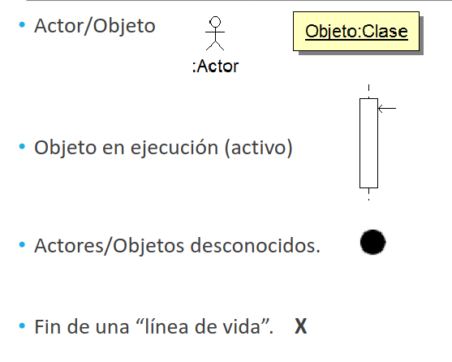

# Diagramas de secuencia

Es un __diagrama de interacción__ y muestra la interacción entre componentes del sistema desde un punto de vista temporal. La interacción se representa con el paso de mensajes entre objetos o actores a lo largo del tiempo. Se utiliza para describir procesos internos entre diferentes módulos y describir las comunicaciones existentes con otros sistemas o actores.

Se representa el tiempo para un actor/objeto mediante un eje vertical. El paso de mensajes se indica con una linea horizontal entre los objetos, además de la descripción del mensaje.

Cuando el actor/objeto se encuentra activo, este se representa como un rectángulo sobre la línea de tiempo tan grande como el tiempo que se encuentre activo.

## Elementos

    

Tenemos cuatro elementos principales:
- __Actor/Objeto:__ se representa con una figura humana (en el caso de actores) o un rectángulo (en el caso de los objetos).
- __Objeto en ejecución (activo):__ se representa en la linea del tiempo como un rectángulo vertical.
- __Actor/Objeto desconocido:__ se representa como un circulo negro.
- __Fin de una "linea de vida":__ se representa con una __X__.
- __Mensajes:__ se representan con lineas horizontales.

Los mensajes pueden ser:
- __Síncronos:__ el emisor espera respuesta.
- __Asíncronos:__ el emisor NO espera respuesta.
- __Automensaje:__ el emisor se manda mensaje a sí mismo.

Los mensajes se representan mediante una flecha continua, mientras que los mensajes de retorno, la flecha es discontinua. Se puede indicar un número que identifique el orden de ejecución de los mensajes. El mensaje puede ser escrito en lenguaje humano o a nivel técnico.

    

