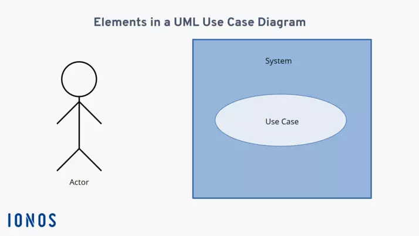
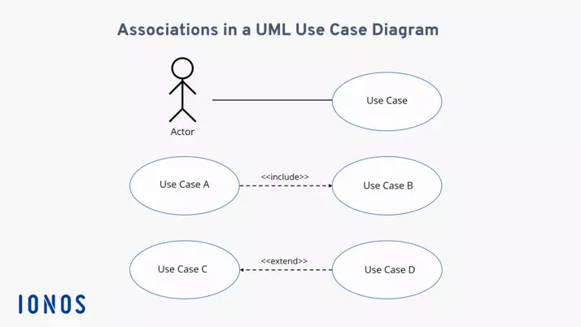

# Diagrama de caso de uso

Este es un __diagrama estructural__ y suele ser uno de los primeros diagramas a realizar cuando se planea crear un software. Esto porque plantea las funciones más importantes de un sistema.

En estos diagramas, las funciones de sistemas se suelen representar desde el punto de vista de un usuario, que se le llama __actor__. Dicho actor puede no ser necesariamente un ser humano; también lo puede ser un sistema externo. De este modo, este tipo de diagramas muestra __la relación entre un actor y sus requisitos o expectativas del sistema__, sin representar las acciones que tienen lugar o ponerlas en un orden lógico.

## Elementos

Hay tres elementos principales:
- __Actor:__ se representa con el dibujo de una figura humana.
- __Sistema:__ se representa con un rectángulo.
- __Caso de uso:__ se muestra como un elipse que suele incluir un texto descriptivo del proceso.

    

Entre los actores y los casos de usos existen __relaciones__ (representadas con flechas) que pueden ser de distintos tipos:

- __Flecha continua:__ actor y caso de uso.
- __Flecha discontinua:__ relación entre casos de usos que puede ser...
        - __<<include>>__: ambos casos de uso se deben realizar.
        - __<<exclude>>__: la realización de un caso de uso PUEDE incluir otro si se cumple cierta condición.

    

### Actores
|  Actor | XXX (Nombre del Actor) |
|---|---|
| Descripción  | _Breve descripción del actor_  |
| Características  | _Características que describen al actor_ |
| Relaciones | _Relaciones que tiene con otros actores. Básicamente cuando realiza las mismas acciones que otro actor._  |
| Referencias | _Que casos de uso realiza_ |   
| Notas |  _Notas adicionales_ |
| Autor  | _Quien desarrolla la especificación del actor_ |
| Fecha | _Fecha de la especificación_ |

### Casos de Uso
|  Caso de Uso	CU | XXX  |
|---|---|
| Fuentes  | _Documento que sustenta el caso de uso_  |
| Actor  |  _Actores que participan en el caso de uso_ |
| Descripción | _Descripción del caso de uso_  |
| Flujo básico | _Descripción paso a paso de la ejecución. (1->2->3.)_ |
| Pre-condiciones | _Que debe ocurrir con anterioridad_  |  
| Post-condiciones  | _Que debe ocurrir con posterioridad_  |  
| Requerimientos | _Que debe de exister para que el caso de uso se ejecute. Ej: Tarjeta de crédito_  |
| Notas |  _Notas adicionales_ |
| Autor  | _Quien desarrolla la especificación del actor_ |
| Fecha | _Fecha de la especificación_ |

### Redacciónes de Casos de Uso
| **CU-XXX**  | **Nombre del Caso de Uso**  | |
|---|---|---|
| **Versión** | X.X (DD/MM/AAAA)      | |
| **Dependencias** | CU-YYY Dependencia 1   CU-ZZZ Dependencia 2, etc. | |
| **Precondición** | Descripción de la precondición. | |
| **Descripción** | Descripción del caso de uso. | |
| **Secuencia normal** | **Paso** | **Acción** |
| | X   | Acción del actor 1. |
| | X+1   | Acción del actor 2. |
| | ...   | ... |
| **Postcondición** | Descripción de la postcondición. | |
| **Excepciones** | **Paso** | **Comentarios** |
| | X   | Descripción de las excepciones, si las hay. |
| |     | *E.1* Manera de solucionarlo.   *E.2* Segundo paso para solucionarlo (si lo hay).   *...* ...   *E.X* Se cancela el caso de uso. |
| **Comentarios** | Comentarios adicionales sobre el caso de uso. | |

## Tabla de Relaciones de "Include"
| Caso de Uso Principal  | Caso de Uso Incluido  | Descripción  |
|-------------------------|------------------------|--------------|
| ...                     | ...                    | ...          |