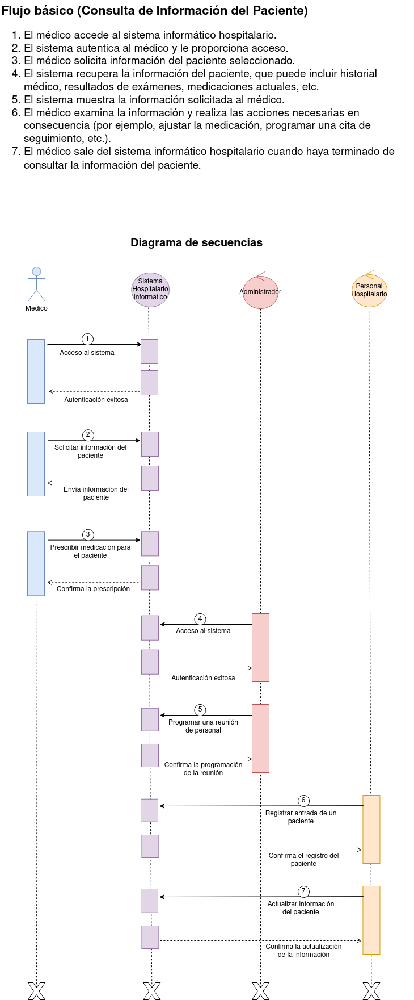
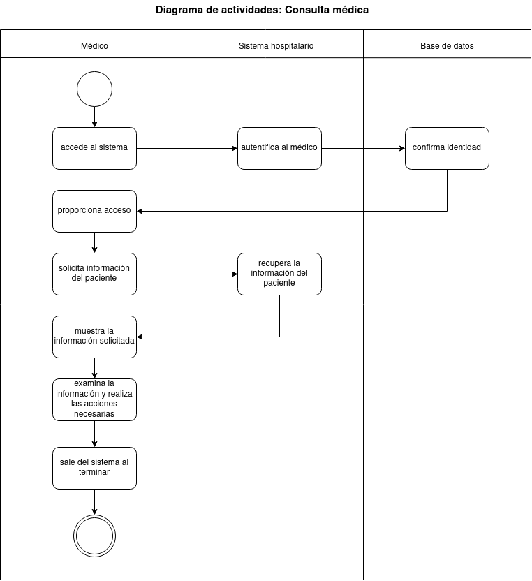
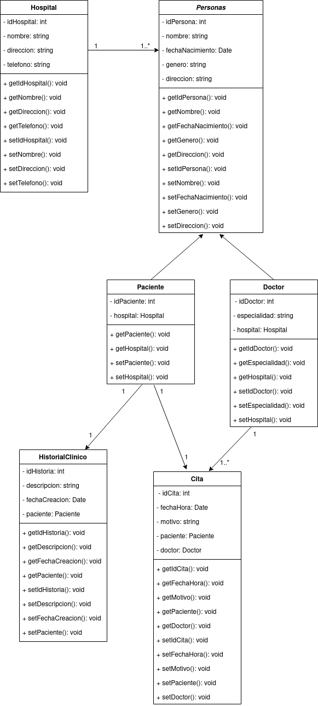
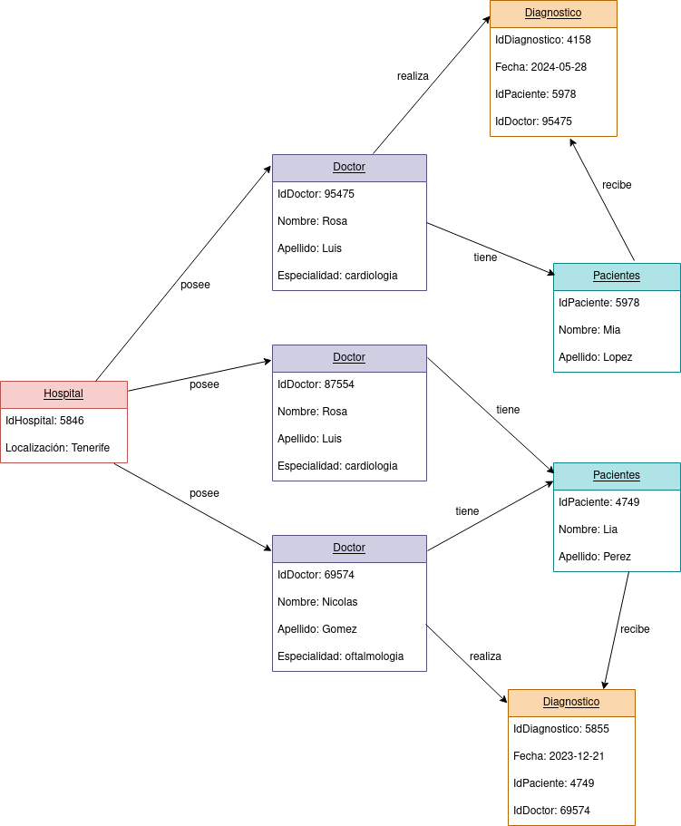
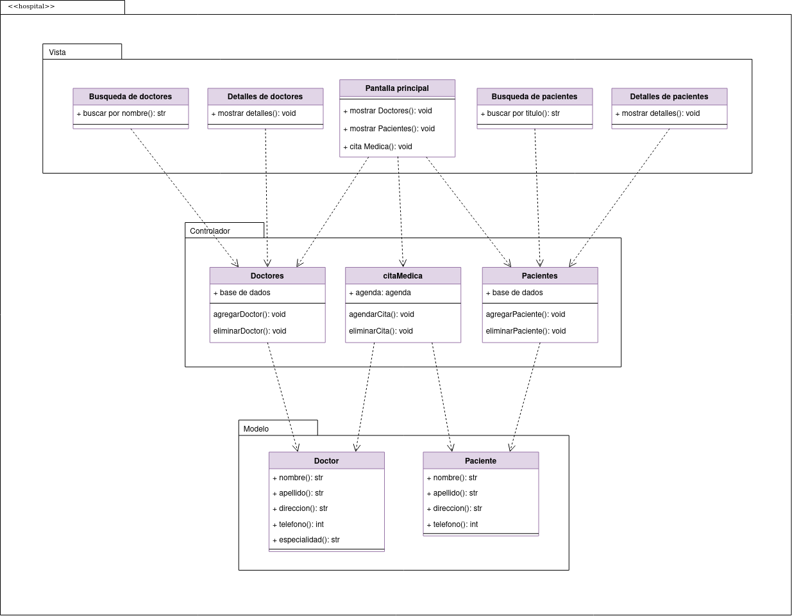

# Sistema Hospitalario

## Diagrama de secuencias
A continuación le proporcionamos el diagrama de secuencias relacionado con "Sistema hospitalario":

## Diagrama de actividades
A continuación le proporcionamos el diagrama de actividades relacionado con "Sistema hospitalario":

## Diagrama de clases
A continuación le proporcionamos el diagrama de clases relacionado con "Sistema hospitalario":

## Diagrama de objetos
A continuación le proporcionamos el diagrama de objetos relacionado con "Sistema hospitalario":

## Diagrama de paquetes MVC
A continuación le proporcionamos el diagrama de paquetes relacionado con "Sistema hospitalario":

