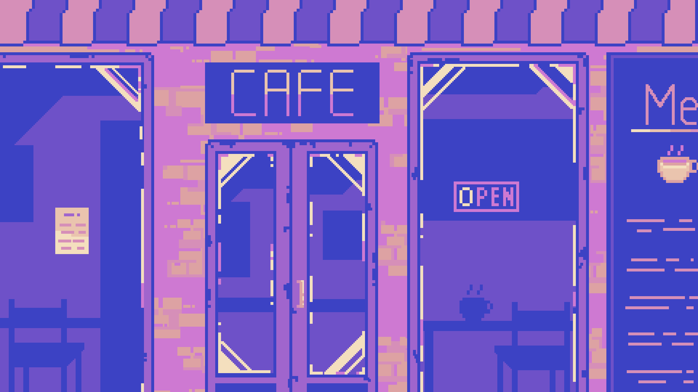

## Informe sobre la Creación de la Página Web del "Libro de Recetas de Rashi"
 

https://www.rookiemag.com/wp-content/uploads/2016/03/1456855014belton-5.gif

## Contenido
- [Introducción]()
- [Estructura y Contenido]()
- [Conceptos Utilizados en la Creación]()
- [Conclusiones]()

### Introducción
La página web del "Libro de Recetas de Rashi" es una plataforma digital diseñada para proporcionar una colección de recetas culinarias, junto con instrucciones detalladas para preparar cada plato. El objetivo principal de esta página es ofrecer a los usuarios una experiencia interactiva y educativa en el mundo de la cocina, inspirando y facilitando la preparación de diversas delicias gastronómicas.

### Estructura y Contenido
La estructura de la página se divide en varias secciones principales, cada una dedicada a una receta específica del libro. A continuación, se describe la organización y contenido de cada sección:

1. **Encabezado (Header):**
   - El encabezado contiene el título principal de la página, "Rashi's Recipe Book", proporcionando una identidad clara y reconocible para la marca.
   - Además, incluye una barra de navegación que permite a los usuarios acceder fácilmente a cada receta mediante enlaces anclados.

2. **Contenido Principal (Main):**
   - Esta sección alberga el corazón de la página, que incluye las recetas individuales y el formulario de suscripción.
   - Cada receta se presenta en su propia sección, comenzando con un título, una imagen representativa y detalles como tiempo de preparación y porciones.
   - La lista de ingredientes y los pasos de preparación se organizan en formato de tabla y lista, respectivamente, proporcionando una visualización clara y estructurada de la información.
   - Para cada receta, se incluye una fuente de referencia que indica la procedencia de la receta, promoviendo la transparencia y la atribución adecuada.
   - Finalmente, se incorpora un formulario de suscripción que permite a los usuarios recibir actualizaciones y nuevas recetas directamente en su bandeja de entrada.

3. **Pie de Página (Footer):**
   - El pie de página ofrece información adicional, como derechos de autor y el año de publicación, proporcionando contexto y legalidad al contenido de la página.

### Conceptos Utilizados en la Creación
La página web del "Libro de Recetas de Rashi" se ha desarrollado utilizando una variedad de conceptos y tecnologías web, que incluyen:

1. **HTML (HyperText Markup Language):**
   - Se utiliza para estructurar y organizar el contenido de la página, dividiéndolo en elementos semánticos como encabezados, párrafos, listas y tablas.

2. **CSS (Cascading Style Sheets):**
   - Se emplea para aplicar estilos visuales a los elementos HTML, como colores, tipografías, márgenes y diseños de página.

3. **Enlaces (a):**
   - Se utilizan para la navegación dentro de la página y para vincular recursos externos, como imágenes y fuentes, proporcionando una experiencia de usuario fluida y coherente.

4. **Formularios (form):**
   - Permiten a los usuarios enviar información al servidor web, en este caso, para suscribirse al blog de recetas y recibir actualizaciones periódicas.

5. **Elementos Semánticos HTML:**
   - Se utilizan para agregar significado y estructura al contenido, mejorando la accesibilidad y la indexación de la página por parte de los motores de búsqueda.

6. **Tablas HTML:**
   - Ayudan a organizar datos de manera tabular, como la lista de ingredientes en cada receta, facilitando la comprensión y la legibilidad del contenido.

7. **Imágenes (img):**
   - Se incorporan para enriquecer visualmente el contenido y proporcionar representaciones visuales de cada receta, aumentando su atractivo y apelación visual.

8. **Listas (ul, li):**
   - Se utilizan para enumerar elementos, como las recetas en la barra de navegación, facilitando la navegación y la selección de contenido por parte de los usuarios.

9. **Metadatos HTML:**
   - Se incluyen en la sección `<head>` para proporcionar información adicional sobre el documento, como el título, la codificación de caracteres y la configuración de la ventana gráfica para dispositivos móviles.

### Conclusiones
La página web del "Libro de Recetas de Rashi" es un ejemplo de cómo combinar eficazmente diferentes tecnologías y conceptos web para crear una experiencia digital atractiva y funcional. Al integrar HTML, CSS y otros elementos interactivos, la página logra ofrecer contenido informativo y útil de manera visualmente atractiva y fácilmente accesible para los usuarios.
