# FLEX
## Propiedades aplicables al contenedor flex
### display: Flex
Lo primero que tenemos que entender es que si establecemos en un contenedor: 

```html
<!DOCTYPE html>
<html>
<head>
    <meta charset="UTF-8" />
    <meta name="author" content="juan carlos p.r."/>
    <meta name="viewport" content="width=device-width, initial-scale=1.0"/>
    <title>inicios con flex</title>

    <style type="text/css" >
        header, section, footer, aside, nav, main, article, figure {
        display: block;
        }
        .contenedorFlex {
        display: flex;
        background: #F6EBC6;
        }
    </style>
</head>

<body>
    <main class="contenedorFlex">
        <p>1 Lorem ipsum dolor sit amet, consectetur adipisicing elit. Eum incidunt, nostrum! lorem</p>
        <p>2 Lorem ipsum dolor sit amet, consectetur adipisicing elit. Inventore ipsa laudantium ea.</p>
        <p>3 Lorem ipsum dolor sit amet, consectetur adipisicing elit. Totam laborum provident pariatur aspernatur? Lorem ipsum dolor sit amet, consectetur adipisicing elit. Id maiores reiciendis quod sit cupiditate debitis amet mollitia, recusandae consequatur alias!</p>
        <p>4 Lorem ipsum dolor sit amet, consectetur adipisicing elit. Totam voluptatem tempore blanditiis facere natus.</p>
        <p>5 Lorem ipsum dolor sit amet, consectetur adipisicing elit. Voluptates, animi! Reiciendis, sequi, quasi. Totam, minus. Lorem ipsum dolor sit amet, consectetur adipisicing elit. Voluptatum, eius, velit reiciendis molestiae vitae ipsam.</p>
    </main>
</body>
</html>
```
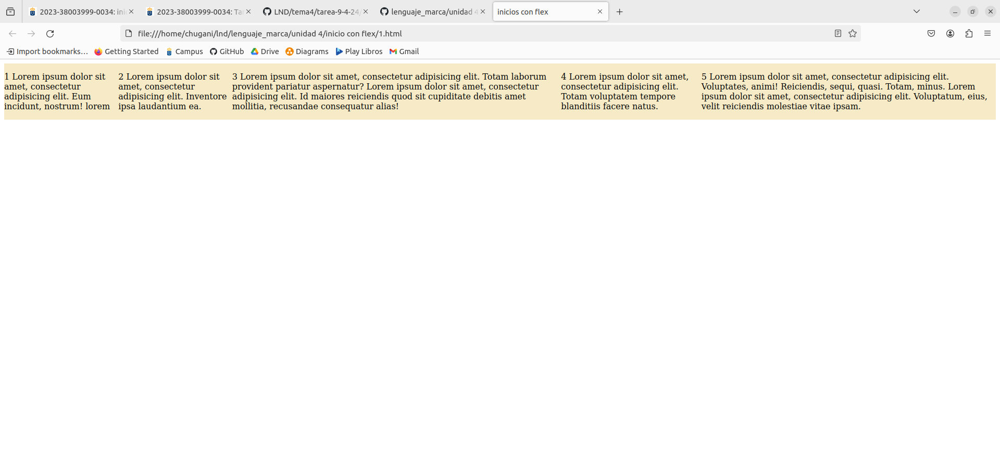


Quizás prefiramos que todas las columnas sean de un ancho parecido. En ese caso, por supuesto que podemos seguir usando el atributo width en los párrafos:

```html
<!DOCTYPE html>
<html>
<head>
    <meta charset="UTF-8" />
    <meta name="author" content="juan carlos p.r."/>
    <meta name="viewport" content="width=device-width, initial-scale=1.0"/>
    <title>inicios con flex</title>

    <style type="text/css" >
        header, section, footer, aside, nav, main, article, figure {
        display: block;
        }
        .contenedorFlex {
        display: flex;
        background: #F6EBC6;
        }
        p {
        max-width: 20%;
        border: 1px solid gray;
        }
    </style>
</head>

<body>
    <main class="contenedorFlex">
        <p>1 Lorem ipsum dolor sit amet, consectetur adipisicing elit. Eum incidunt, nostrum! lorem</p>
        <p>2 Lorem ipsum dolor sit amet, consectetur adipisicing elit. Inventore ipsa laudantium ea.</p>
        <p>3 Lorem ipsum dolor sit amet, consectetur adipisicing elit. Totam laborum provident pariatur aspernatur? Lorem ipsum dolor sit amet, consectetur adipisicing elit. Id maiores reiciendis quod sit cupiditate debitis amet mollitia, recusandae consequatur alias!</p>
        <p>4 Lorem ipsum dolor sit amet, consectetur adipisicing elit. Totam voluptatem tempore blanditiis facere natus.</p>
        <p>5 Lorem ipsum dolor sit amet, consectetur adipisicing elit. Voluptates, animi! Reiciendis, sequi, quasi. Totam, minus. Lorem ipsum dolor sit amet, consectetur adipisicing elit. Voluptatum, eius, velit reiciendis molestiae vitae ipsam.</p>
    </main>
</body>
</html>
```
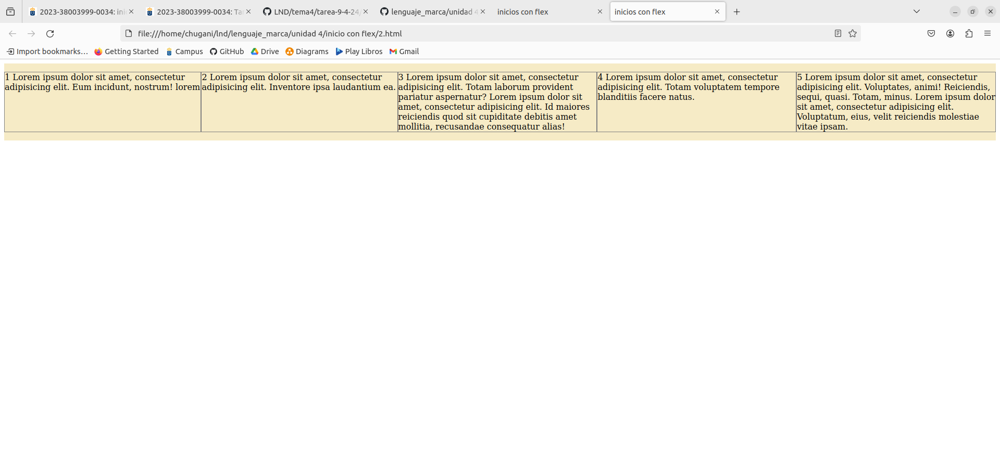

### flex-flow
El comportamiento por defecto en flex es dejar todo distribuido en una única fila. Pero es fácil conseguir que ocupe diferentes filas. Para ello ponemos en el contenedor flex :

```html
<!DOCTYPE html>
<html>
<head>
    <meta charset="UTF-8" />
    <meta name="author" content="juan carlos p.r."/>
    <meta name="viewport" content="width=device-width, initial-scale=1.0"/>
    <title>inicios con flex</title>

    <style type="text/css" >
        header, section, footer, aside, nav, main, article, figure{
        display: block;
        }
        .contenedorFlex{
        display: flex;
        flex-flow: row wrap;
        background: #F6EBC6;
        }
        p{
        max-width: 23%;
        border: 1px solid gray;
        }
    </style>
</head>

<body>
    <main class="contenedorFlex">
        <p>1 Lorem ipsum dolor sit amet, consectetur adipisicing elit. Eum incidunt, nostrum! lorem</p>
        <p>2 Lorem ipsum dolor sit amet, consectetur adipisicing elit. Inventore ipsa laudantium ea.</p>
        <p>3 Lorem ipsum dolor sit amet, consectetur adipisicing elit. Totam laborum provident pariatur aspernatur? Lorem ipsum dolor sit amet, consectetur adipisicing elit. Id maiores reiciendis quod sit cupiditate debitis amet mollitia, recusandae consequatur alias!</p>
        <p>4 Lorem ipsum dolor sit amet, consectetur adipisicing elit. Totam voluptatem tempore blanditiis facere natus.</p>
        <p>5 Lorem ipsum dolor sit amet, consectetur adipisicing elit. Voluptates, animi! Reiciendis, sequi, quasi. Totam, minus. Lorem ipsum dolor sit amet, consectetur adipisicing elit. Voluptatum, eius, velit reiciendis molestiae vitae ipsam.</p>
    </main>
</body>
</html>
```
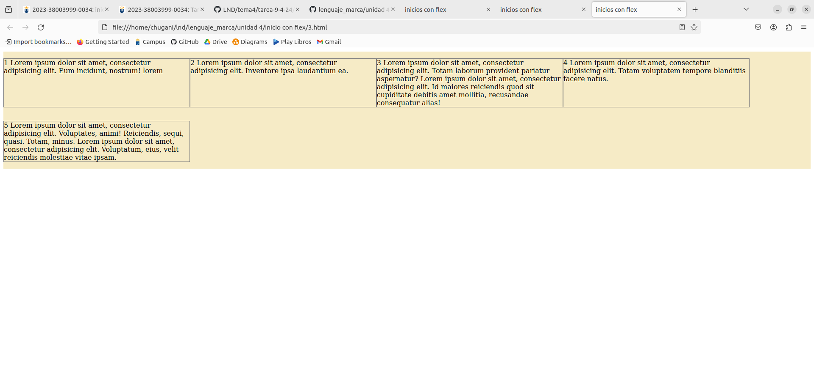

Pongamos en nuestro contenedor flex un height:

```html
<!DOCTYPE html>
<html>
<head>
    <meta charset="UTF-8" />
    <meta name="author" content="juan carlos p.r."/>
    <meta name="viewport" content="width=device-width, initial-scale=1.0"/>
    <title>inicios con flex</title>

    <style type="text/css" >
        header, section, footer, aside, nav, main, article, figure{
        display: block;
        }
        .contenedorFlex{
        display: flex;
        flex-flow: column wrap;
        background: #F6EBC6;
        height: 400px;
        }
        p{
        max-width: 23%;
        border: 1px solid gray;
        }
    </style>
</head>

<body>
    <main class="contenedorFlex">
        <p>1 Lorem ipsum dolor sit amet, consectetur adipisicing elit. Eum incidunt, nostrum! lorem</p>
        <p>2 Lorem ipsum dolor sit amet, consectetur adipisicing elit. Inventore ipsa laudantium ea.</p>
        <p>3 Lorem ipsum dolor sit amet, consectetur adipisicing elit. Totam laborum provident pariatur aspernatur? Lorem ipsum dolor sit amet, consectetur adipisicing elit. Id maiores reiciendis quod sit cupiditate debitis amet mollitia, recusandae consequatur alias!</p>
        <p>4 Lorem ipsum dolor sit amet, consectetur adipisicing elit. Totam voluptatem tempore blanditiis facere natus.</p>
        <p>5 Lorem ipsum dolor sit amet, consectetur adipisicing elit. Voluptates, animi! Reiciendis, sequi, quasi. Totam, minus. Lorem ipsum dolor sit amet, consectetur adipisicing elit. Voluptatum, eius, velit reiciendis molestiae vitae ipsam.</p>
    </main>
</body>
</html>
```
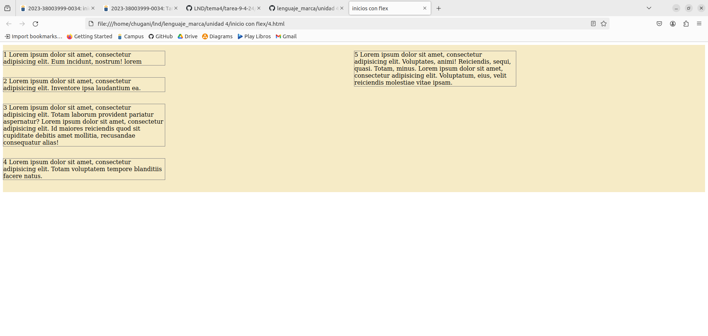

### justify-content
Para trabajar esta nueva propiedad en nuestro contenedor flex vamos a dejar nuestro CSS de la siguiente forma:

```html
<!DOCTYPE html>
<html>
<head>
    <meta charset="UTF-8" />
    <meta name="author" content="juan carlos p.r."/>
    <meta name="viewport" content="width=device-width, initial-scale=1.0"/>
    <title>inicios con flex</title>

    <style type="text/css" >
        header, section, footer, aside, nav, main, article, figure{
        display: block;
        }
        .contenedorFlex{
        display: flex;
        flex-flow: row nowrap;
        justify-content: flex-start;
        background: #F6EBC6;
        }
        p{
        max-width: 15%;
        border: 1px solid gray;
        }
    </style>
</head>

<body>
    <main class="contenedorFlex">
        <p>1 Lorem ipsum dolor sit amet, consectetur adipisicing elit. Eum incidunt, nostrum! lorem</p>
        <p>2 Lorem ipsum dolor sit amet, consectetur adipisicing elit. Inventore ipsa laudantium ea.</p>
        <p>3 Lorem ipsum dolor sit amet, consectetur adipisicing elit. Totam laborum provident pariatur aspernatur? Lorem ipsum dolor sit amet, consectetur adipisicing elit. Id maiores reiciendis quod sit cupiditate debitis amet mollitia, recusandae consequatur alias!</p>
        <p>4 Lorem ipsum dolor sit amet, consectetur adipisicing elit. Totam voluptatem tempore blanditiis facere natus.</p>
        <p>5 Lorem ipsum dolor sit amet, consectetur adipisicing elit. Voluptates, animi! Reiciendis, sequi, quasi. Totam, minus. Lorem ipsum dolor sit amet, consectetur adipisicing elit. Voluptatum, eius, velit reiciendis molestiae vitae ipsam.</p>
    </main>
</body>
</html>
```
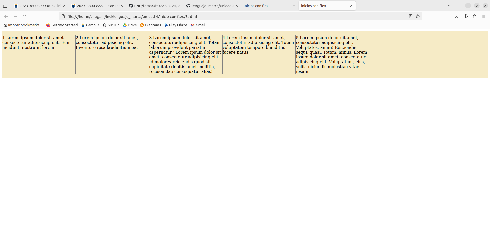

### align-items
Antes vimos que podemos alinear nuestros elementos ( párrafos en nuestro ejemplo ) a lo largo de nuestro eje principal Y observamos que tiene bastantes posibilidades. Pero adicionalmente flex nos permite alinear nuestros elementos en el segundo eje mediante align-items

```html
<!DOCTYPE html>
<html>
<head>
    <meta charset="UTF-8" />
    <meta name="author" content="juan carlos p.r."/>
    <meta name="viewport" content="width=device-width, initial-scale=1.0"/>
    <title>inicios con flex</title>

    <style type="text/css" >
        header, section, footer, aside, nav, main, article, figure{
        display: block;
        }
        .contenedorFlex{
        display: flex;
        flex-flow: row wrap;
        justify-content: flex-start;
        align-items: flex-start;
        background: #F6EBC6;
        }
        p{
        max-width: 31%;
        border: 1px solid gray;
        }
    </style>
</head>

<body>
    <main class="contenedorFlex">
        <p>1 Lorem ipsum dolor sit amet, consectetur adipisicing elit. Eum incidunt, nostrum! lorem</p>
        <p>2 Lorem ipsum dolor sit amet, consectetur adipisicing elit. Inventore ipsa laudantium ea.</p>
        <p>3 Lorem ipsum dolor sit amet, consectetur adipisicing elit. Totam laborum provident pariatur aspernatur? Lorem ipsum dolor sit amet, consectetur adipisicing elit. Id maiores reiciendis quod sit cupiditate debitis amet mollitia, recusandae consequatur alias!</p>
        <p>4 Lorem ipsum dolor sit amet, consectetur adipisicing elit. Totam voluptatem tempore blanditiis facere natus.</p>
        <p>5 Lorem ipsum dolor sit amet, consectetur adipisicing elit. Voluptates, animi! Reiciendis, sequi, quasi. Totam, minus. Lorem ipsum dolor sit amet, consectetur adipisicing elit. Voluptatum, eius, velit reiciendis molestiae vitae ipsam.</p>
    </main>
</body>
</html>
```
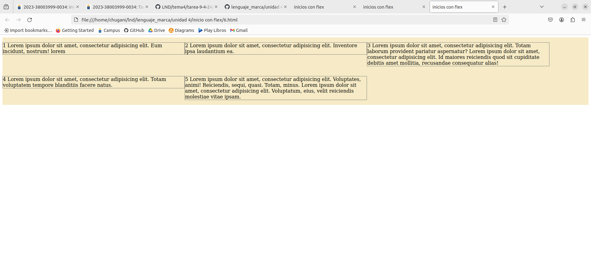

## Propiedades aplicables a un elemento FLEX
### flex:
Mediante la propiedad: flex podemos conseguir establecer el tamaño inicial de un elemento flex y como se comportará cuando disponga de más o menos espacio para crecer/decrecer

```html
<!DOCTYPE html>
<html>
<head>
    <meta charset="UTF-8" />
    <meta name="author" content="juan carlos p.r."/>
    <meta name="viewport" content="width=device-width, initial-scale=1.0"/>
    <title>inicios con flex</title>

    <style type="text/css" >
        header, section, footer, aside, nav, main, article, figure{
        display: block;
        }
        .contenedorFlex{
        display: flex;
        flex-flow: row wrap;
        justify-content: flex-start;
        align-items: flex-start;
        background: #F6EBC6;
        }
        p{
        flex: 0 0 20%;
        border: 1px solid gray;
        }
    </style>
</head>

<body>
    <main class="contenedorFlex">
        <p>1 Lorem ipsum dolor sit amet, consectetur adipisicing elit. Eum incidunt, nostrum! lorem</p>
        <p>2 Lorem ipsum dolor sit amet, consectetur adipisicing elit. Inventore ipsa laudantium ea.</p>
        <p>3 Lorem ipsum dolor sit amet, consectetur adipisicing elit. Totam laborum provident pariatur aspernatur? Lorem ipsum dolor sit amet, consectetur adipisicing elit. Id maiores reiciendis quod sit cupiditate debitis amet mollitia, recusandae consequatur alias!</p>
        <p>4 Lorem ipsum dolor sit amet, consectetur adipisicing elit. Totam voluptatem tempore blanditiis facere natus.</p>
        <p>5 Lorem ipsum dolor sit amet, consectetur adipisicing elit. Voluptates, animi! Reiciendis, sequi, quasi. Totam, minus. Lorem ipsum dolor sit amet, consectetur adipisicing elit. Voluptatum, eius, velit reiciendis molestiae vitae ipsam.</p>
    </main>
</body>
</html>
```
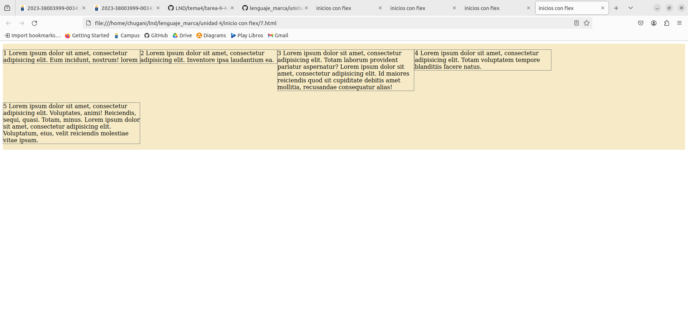

Veamos como cambia si le permitimos crecer:

```html
<!DOCTYPE html>
<html>
<head>
    <meta charset="UTF-8" />
    <meta name="author" content="juan carlos p.r."/>
    <meta name="viewport" content="width=device-width, initial-scale=1.0"/>
    <title>inicios con flex</title>

    <style type="text/css" >
        header, section, footer, aside, nav, main, article, figure{
        display: block;
        }
        .contenedorFlex{
        display: flex;
        flex-flow: row wrap;
        justify-content: flex-start;
        align-items: stretch;
        background: #F6EBC6;
        }
        p:not(:nth-of-type(1)){
        border: 1px solid gray;
        flex: 1 0 20%;
        }
        p:nth-of-type(1){
        border: 1px solid gray;
        flex: 7 0 20%;
        }
    </style>
</head>

<body>
    <main class="contenedorFlex">
        <p>1 Lorem ipsum dolor sit amet, consectetur adipisicing elit. Eum incidunt, nostrum! lorem</p>
        <p>2 Lorem ipsum dolor sit amet, consectetur adipisicing elit. Inventore ipsa laudantium ea.</p>
        <p>3 Lorem ipsum dolor sit amet, consectetur adipisicing elit. Totam laborum provident pariatur aspernatur? Lorem ipsum dolor sit amet, consectetur adipisicing elit. Id maiores reiciendis quod sit cupiditate debitis amet mollitia, recusandae consequatur alias!</p>
        <p>4 Lorem ipsum dolor sit amet, consectetur adipisicing elit. Totam voluptatem tempore blanditiis facere natus.</p>
        <p>5 Lorem ipsum dolor sit amet, consectetur adipisicing elit. Voluptates, animi! Reiciendis, sequi, quasi. Totam, minus. Lorem ipsum dolor sit amet, consectetur adipisicing elit. Voluptatum, eius, velit reiciendis molestiae vitae ipsam.</p>
    </main>
</body>
</html>
```
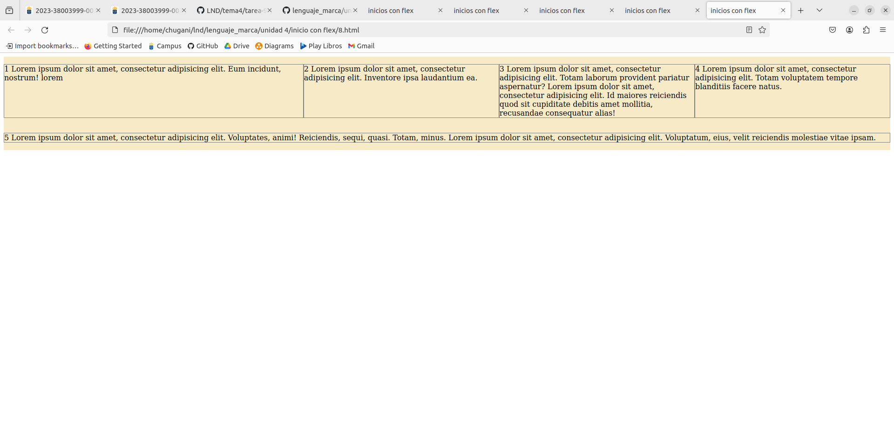

Para observar la otra propiedad ( flex-shrink ) en la que se estrecha el espacio a partir de una cantidad inicial usaremos el siguiente CSS:

```html
<!DOCTYPE html>
<html>
<head>
    <meta charset="UTF-8" />
    <meta name="author" content="juan carlos p.r."/>
    <meta name="viewport" content="width=device-width, initial-scale=1.0"/>
    <title>inicios con flex</title>

    <style type="text/css" >
        header, section, footer, aside, nav, main, article, figure{
        display: block;
        }
        .contenedorFlex{
        display: flex;
        flex-flow: row nowrap;
        justify-content: flex-start;
        align-items: stretch;
        background: #F6EBC6;
        }
        p:not(:nth-of-type(2)){
        border: 1px solid gray;
        flex: 0 1 400px;
        }
        p:nth-of-type(2){
        border: 1px solid gray;
        flex: 0 5 400px;
        }
    </style>
</head>

<body>
    <main class="contenedorFlex">
        <p>1 Lorem ipsum dolor sit amet, consectetur adipisicing elit. Eum incidunt, nostrum! lorem</p>
        <p>2 Lorem ipsum dolor sit amet, consectetur adipisicing elit. Inventore ipsa laudantium ea.</p>
        <p>3 Lorem ipsum dolor sit amet, consectetur adipisicing elit. Totam laborum provident pariatur aspernatur? Lorem ipsum dolor sit amet, consectetur adipisicing elit. Id maiores reiciendis quod sit cupiditate debitis amet mollitia, recusandae consequatur alias!</p>
        <p>4 Lorem ipsum dolor sit amet, consectetur adipisicing elit. Totam voluptatem tempore blanditiis facere natus.</p>
        <p>5 Lorem ipsum dolor sit amet, consectetur adipisicing elit. Voluptates, animi! Reiciendis, sequi, quasi. Totam, minus. Lorem ipsum dolor sit amet, consectetur adipisicing elit. Voluptatum, eius, velit reiciendis molestiae vitae ipsam.</p>
    </main>
</body>
</html>
```
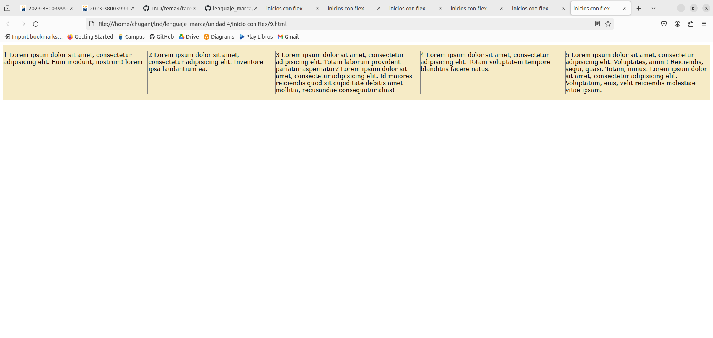

En el siguiente ejemplo establecemos dos elementos que al final ocupan todo el ancho de forma proporcional:
```html
<!DOCTYPE html>
<html>
<head>
    <meta charset="UTF-8" />
    <meta name="author" content="juan carlos p.r."/>
    <meta name="viewport" content="width=device-width, initial-scale=1.0"/>
    <title>inicios con flex</title>

    <style type="text/css" >
        header, section, footer, aside, nav, main, article, figure{
        display: block;
        }
        .contenedorFlex{
        display: flex;
        flex-flow: row wrap;
        justify-content: flex-start;
        align-items: stretch;
        background: #F6EBC6;
        }
        p{
        border: 5px solid gray;
        margin: 3px;
        flex: 1 0 45%;
        }
    </style>
</head>

<body>
    <main class="contenedorFlex">
        <p>1 Lorem ipsum dolor sit amet, consectetur adipisicing elit. Eum incidunt, nostrum! lorem</p>
        <p>2 Lorem ipsum dolor sit amet, consectetur adipisicing elit. Inventore ipsa laudantium ea.</p>
        <p>3 Lorem ipsum dolor sit amet, consectetur adipisicing elit. Totam laborum provident pariatur aspernatur? Lorem ipsum dolor sit amet, consectetur adipisicing elit. Id maiores reiciendis quod sit cupiditate debitis amet mollitia, recusandae consequatur alias!</p>
        <p>4 Lorem ipsum dolor sit amet, consectetur adipisicing elit. Totam voluptatem tempore blanditiis facere natus.</p>
        <p>5 Lorem ipsum dolor sit amet, consectetur adipisicing elit. Voluptates, animi! Reiciendis, sequi, quasi. Totam, minus. Lorem ipsum dolor sit amet, consectetur adipisicing elit. Voluptatum, eius, velit reiciendis molestiae vitae ipsam.</p>
    </main>
</body>
</html>
```
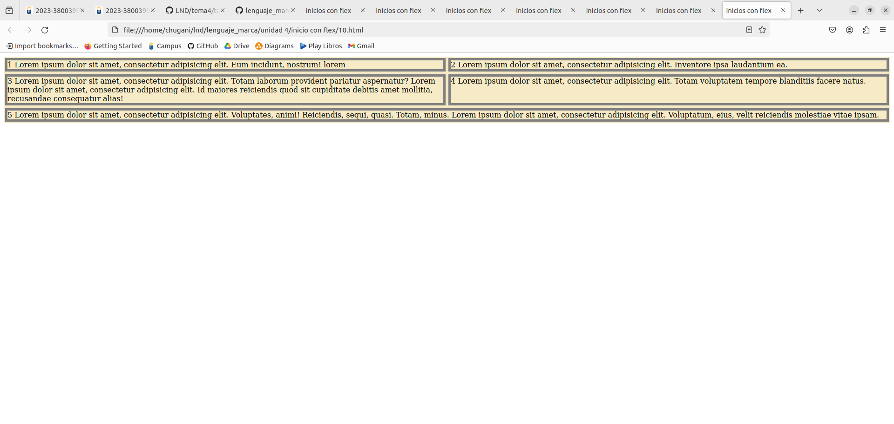

### align-self
Esta propiedad de un elemento flex ( repetimos, estas dos últimas propiedades que hemos visto son de los elementos flex, no del contenedor flex ) que veremos. Nos permite particularizar el comportamiento en el segundo eje para un elemento en concreto. En el siguiente ejemplo todos los elementos tienen un comportamiento flex-start salvo el tercero que es stretch y el cuarto que es center:

```html
<!DOCTYPE html>
<html>
<head>
    <meta charset="UTF-8" />
    <meta name="author" content="juan carlos p.r."/>
    <meta name="viewport" content="width=device-width, initial-scale=1.0"/>
    <title>inicios con flex</title>

    <style type="text/css" >
        header, section, footer, aside, nav, main, article, figure{
        display: block;
        }
        .contenedorFlex{
        display: flex;
        flex-flow: row nowrap;
        justify-content: space-between;
        align-items: flex-start;
        background: #F6EBC6;
        }
        p{
        border: 5px solid gray;
        margin: 3px;
        flex: 1 1 15%;
        }
        p:nth-of-type(3){
        align-self: stretch;
        }
        p:nth-of-type(4){
        align-self: center;
        }
    </style>
</head>

<body>
    <main class="contenedorFlex">
        <p>1 Lorem ipsum dolor sit amet, consectetur adipisicing elit. Eum incidunt, nostrum! lorem</p>
        <p>2 Lorem ipsum dolor sit amet, consectetur adipisicing elit. Inventore ipsa laudantium ea.</p>
        <p>3 Lorem ipsum dolor sit amet, consectetur adipisicing elit. Totam laborum provident pariatur aspernatur? Lorem ipsum dolor sit amet, consectetur adipisicing elit. Id maiores reiciendis quod sit cupiditate debitis amet mollitia, recusandae consequatur alias!</p>
        <p>4 Lorem ipsum dolor sit amet, consectetur adipisicing elit. Totam voluptatem tempore blanditiis facere natus.</p>
        <p>5 Lorem ipsum dolor sit amet, consectetur adipisicing elit. Voluptates, animi! Reiciendis, sequi, quasi. Totam, minus. Lorem ipsum dolor sit amet, consectetur adipisicing elit. Voluptatum, eius, velit reiciendis molestiae vitae ipsam.</p>
    </main>
</body>
</html>
```
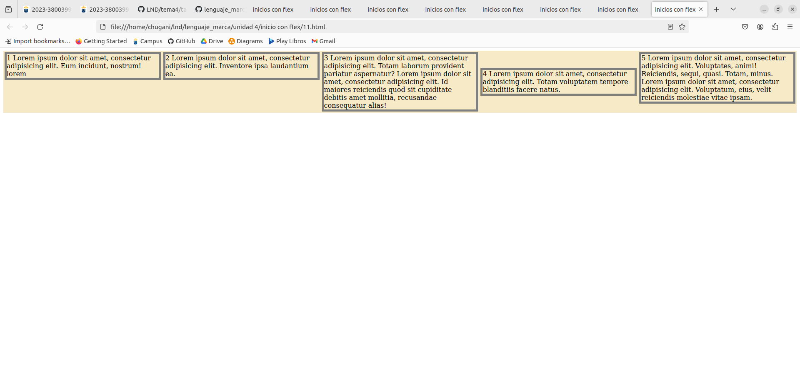

### order
La propiedad order nos permite ubicar allí donde queramos cualquier elemento. Debemos de tener en cuenta que por defecto los elementos flex tienen un order: 0 y se van distribuyendo según el flujo normal. Veamos un ejemplo en el que especificamos un order negativo al tercer elemento:

```html
<!DOCTYPE html>
<html>
<head>
    <meta charset="UTF-8" />
    <meta name="author" content="juan carlos p.r."/>
    <meta name="viewport" content="width=device-width, initial-scale=1.0"/>
    <title>inicios con flex</title>

    <style type="text/css" >
        header, section, footer, aside, nav, main, article, figure{
        display: block;
        }
        .contenedorFlex{
        display: flex;
        flex-flow: row nowrap;
        justify-content: space-between;
        align-items: flex-start;
        background: #F6EBC6;
        }
        p{
        border: 5px solid gray;
        margin: 3px;
        flex: 1 1 15%;
        }
        p:nth-of-type(3){
        align-self: stretch;
        order: -1;
        }
        p:nth-of-type(4){
        align-self: center;
        }
    </style>
</head>

<body>
    <main class="contenedorFlex">
        <p>1 Lorem ipsum dolor sit amet, consectetur adipisicing elit. Eum incidunt, nostrum! lorem</p>
        <p>2 Lorem ipsum dolor sit amet, consectetur adipisicing elit. Inventore ipsa laudantium ea.</p>
        <p>3 Lorem ipsum dolor sit amet, consectetur adipisicing elit. Totam laborum provident pariatur aspernatur? Lorem ipsum dolor sit amet, consectetur adipisicing elit. Id maiores reiciendis quod sit cupiditate debitis amet mollitia, recusandae consequatur alias!</p>
        <p>4 Lorem ipsum dolor sit amet, consectetur adipisicing elit. Totam voluptatem tempore blanditiis facere natus.</p>
        <p>5 Lorem ipsum dolor sit amet, consectetur adipisicing elit. Voluptates, animi! Reiciendis, sequi, quasi. Totam, minus. Lorem ipsum dolor sit amet, consectetur adipisicing elit. Voluptatum, eius, velit reiciendis molestiae vitae ipsam.</p>
    </main>
</body>
</html>
```
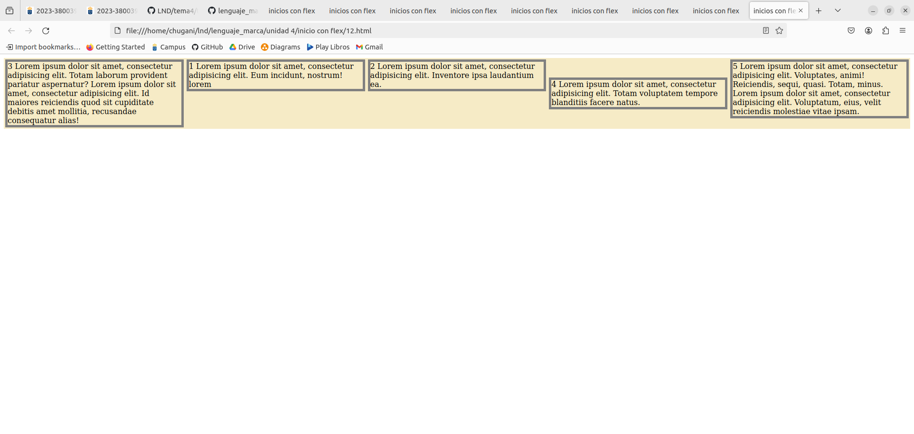
