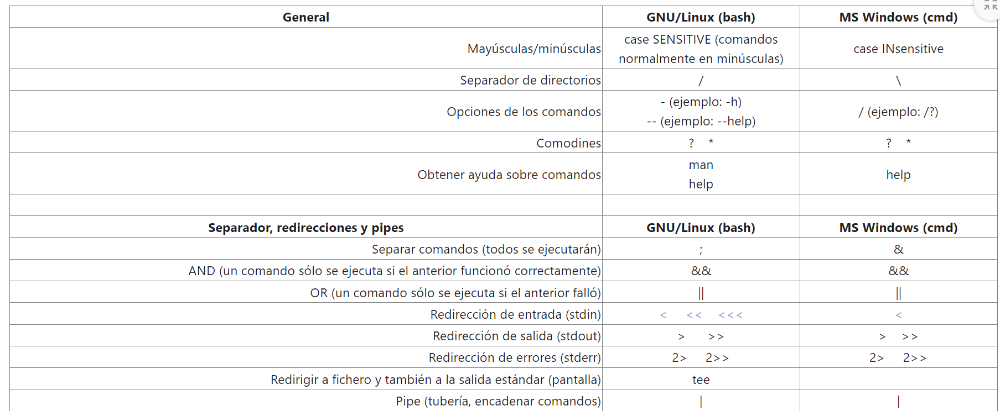
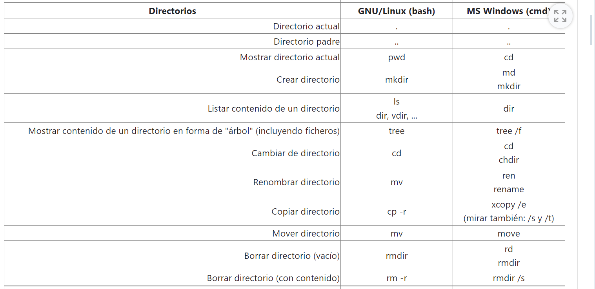
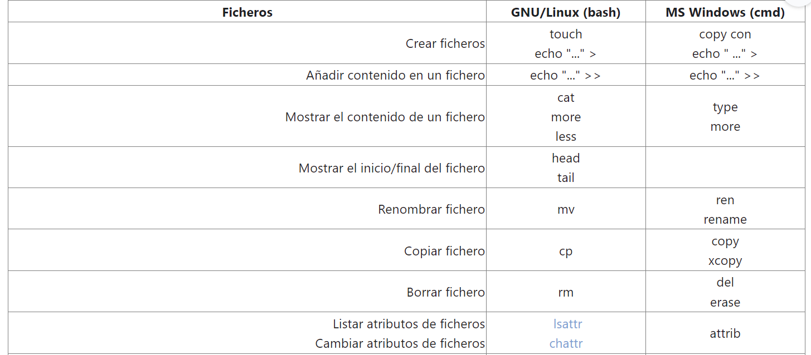
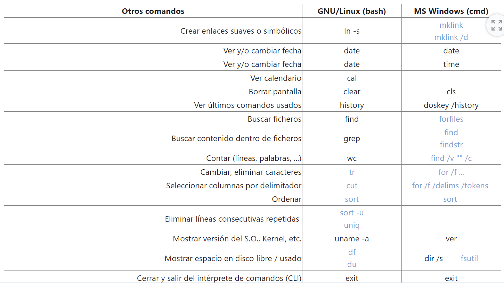
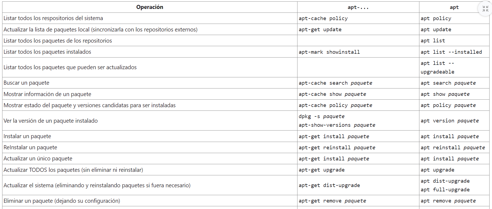
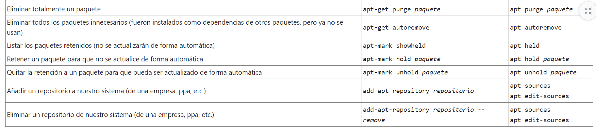
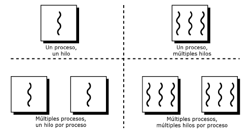
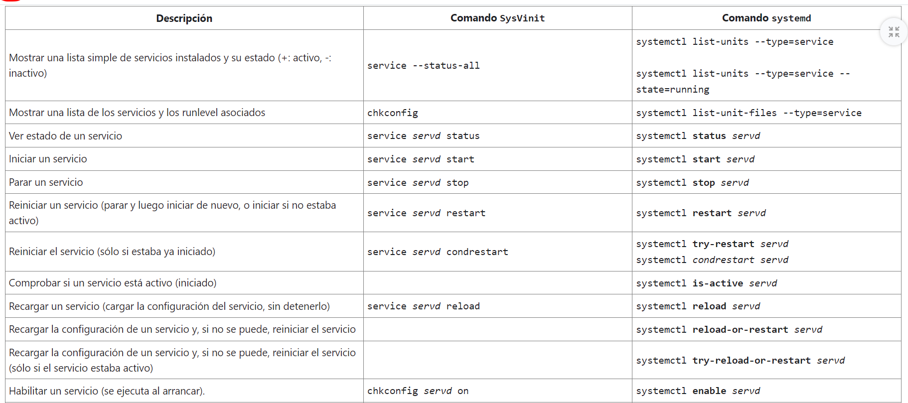
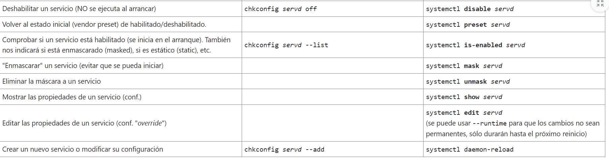

# ÍNDICE
- <a href="#tablas">Comandos Bash/Batch</a>
- <a href="#permisos">Permisos</a>
- <a href="#comp">Compresores y empaquetadores</a>
- <a href="#scripts">SCRIPTS</a>
- <a href="#inst">Instalación Software</a>
- <a href="#gestipali">Gestión de Paquetes en GNU/Linux </a>
- <a href="#gestipawi">Gestión de Paquetes en Batch/Windows </a>
- <a href="#proces">PROCESOS Y THREADS</a>
- <a href="#proceli">PROCESOS LINUX/BASH</a>
- <a href="#procewi">PROCESOS BATCH/WINDOWS</a>
- <a href="#demon">DEMONIOS/SERVICIOS</a>
- <a href="#demonli">Demonios en GNU/Linux</a>
- <a href="#demonwi">Servicios en Windows</a>

# Comandos Básicos Linux/Windows
<div id="tablas"></div>





# Permisos en Linux
<div id="permisos"></div>

## Comandos y Conceptos Básicos
- **chmod**: Comando para cambiar permisos.
- **Permisos en Ficheros/Directorios**:
  - **r (lectura)**: Ver contenido archivo / ver archivos que tiene direct.
  - **w (escritura)**: Modificar archivo / agregar o quitar archivos.
  - **x (ejecución/acceso)**: Ejecutar archivos / acceder a directorios mediante búsquedas.

### Formato de Permisos (rwxrwxrwx):
- 1º: Propietario. (u)
- 2º: Grupo. (g)
- 3º: Otros. (o)

## Modificación de Permisos
- **Modificar con Letras**:
  - Quitar permiso de escritura: `chmod -w tuArchivo`.
  - Añadir opción de ejecutar: `chmod +x tuScript`.
  - Quitar/Añadir todos los permisos: `chmod -rwx archivo` / `chmod +rwx archivo`.
  - Establecer combinación exacta: `chmod =r archivo`.
  - Modificar específicamente: `chmod g-x,o-x archivo` / `chmod u-x+w archivo`.

## Tabla de Permisos en Octal
```plaintext
| rwx |  7  | Lectura, escritura y ejecución    |
| rw- |  6  | Lectura, escritura        |
| r-x |  5  | Lectura y ejecución       |
| r-- |  4  | Lectura               |
| -wx |  3  | Escritura y ejecución             |
| -w- |  2  | Escritura                         |
| --x |  1  | Ejecución             |
| --- |  0  | Sin permisos          |
```

# Ejemplos de `chmod`
- **`chmod 777 dir1`**: Permisos para todos.
- **`chmod 600 fich1`**: Permisos para usuario.

## Primeras Letras y Tipos de Archivos
- **`-`**: Fichero.
- **`d`**: Directorio.
- **`l`**: Enlace (acceso directo).

# Compresores/empaquetadores
<div id="comp"></div>

<a href="https://github.com/YoooKai/SSF/blob/main/comandossplitfindycompresores.pdf">LINK a tarea de comando split y empaquetadores/compresores</a>

## Variables de Entorno y Variables de la Shell
El shell dispone de un mecanismo para definir variables que se pueden utilizar para almacenar información usada por los programas del sistema o para uso propio. ...

## Comprimir y Descomprimir
### tar (tar)
Empaquetar: `tar cvf archivo.tar /archivo/mayo/*`  
Desempaquetar: `tar xvf archivo.tar`  
Ver contenido: `tar tvf archivo.tar`

### tar.gz – .tar.z – .tgz (tar con gzip)
Empaquetar y comprimir: `tar czvf archivo.tar.gz /archivo/mayo/*`  
Desempaquetar y descomprimir: `tar xzvf archivo.tar.gz`  
Ver contenido: `tar tzvf archivo.tar.gz`

### .gz (gzip)
Comprimir: `gzip -q archivo`  
Descomprimir: `gzip -d archivo.gz`

### .bz2 (bzip2)
Comprimir: `bzip2 archivo`  
Descomprimir: `bunzip2 archivo.bz2`

### .tar.bz2 (tar con bzip2)
Comprimir: `tar -c archivos | bzip2 > archivo.tar.bz2`  
Descomprimir: `bzip2 -dc archivo.tar.bz2 | tar -xv`  
Ver contenido: `bzip2 -dc archivo.tar.bz2 | tar -tv`

### .zip (zip)
Comprimir: `zip archivo.zip /mayo/archivos`  
Descomprimir: `unzip archivo.zip`  
Ver contenido: `unzip -v archivo.zip`

### .lha (lha)
Comprimir: `lha archivo.lha /mayo/archivos`  
Descomprimir: `lha -x archivo.lha`  
Ver contenido: `lha -v archivo.lha`

### .zoo (zoo)
Comprimir: `zoo -a archivo.zoo /mayo/archivos`  
Descomprimir: `zoo -x archivo.zoo`  
Ver contenido: `zoo -L archivo.zoo`

### .rar (rar)
Comprimir: `rar -a archivo.rar /mayo/archivos`  
Descomprimir: `rar -x archivo.rar`  
Ver contenido: `rar -l archivo.rar`

# TEMA SCRIPTS
<div id="scripts"></div>

<h3><a href="https://github.com/YoooKai/SSF">Link a ejercicios de scripts aquí!</a></h3>

## Comparaciones numéricas
- numero1 -eq numero2:
  - Devuelve verdadero si 'numero1' es igual a 'numero2'.
- numero1 -ge numero2:
  - Devuelve verdadero si 'numero1' es igual o mayor a 'numero2'.
- numero1 -gt numero2:
  - Devuelve verdadero si 'numero1' es mayor a 'numero2'.
- numero1 -le numero2:
  - Devuelve verdadero si 'numero1' es igual o menor a 'numero2'.
- numero1 -lt numero2:
  - Devuelve verdadero si 'numero1' es menor a 'numero2'.
- numero1 -ne numero2:
  - Devuelve verdadero si 'numero1' no es igual a 'numero2'.
- -n cadena1:
  - Devuelve verdadero si la longitud de caracteres de 'cadena1' es mayor que cero.
- -z cadena1:
  - Devuelve verdadero si la longitud de caracteres de 'cadena1' es cero.

- En los scripts de batch de Windows, el comando `@echo off `se utiliza para desactivar la visualización de los comandos del script en la consola mientras se están ejecutando.

- En bash se accede a los argumentos:
  - $1 se refiere al primer argumento.
  - $2 se refiere al segundo argumento.
  - $@ se refiere a todos los argumentos pasados.
  - $0 hace referencia al nombre del script en sí mismo
  - $# te dará el número total de argumentos pasados al script.
  - $? para determinar si la ejecución fue exitosa o si hubo algún error.
- En batch:

  - %0 es el nombre del script.
  - %1, %2, %3, etc., son los argumentos pasados al script.

- En bash, rango de 1 hasta N:
  - for i in range {1..N}
- Escribiendo `local` al escribir una bariable hace que sea de rango local y no global

- En bash se delimitan con {} llaves los bloques de condicionales o bucles
- En bash puedo sumar variables: `suma=$((a + b))`
- En bash compruebo si un número es menor que otro:
  - `if [ "$numero1" -lt "$numero2" ]; then`
- `#!/bin/bash ` hace que linux sepa que ha de ejecutar el script en bash.
- Puedo comprobar que el contenido de una variable no esté vacío con:
  - `if [ -n "$var" ]; then`
- Un script de shell es un fichero de texto con comandos de consola que es interpretado
- Una de las mayores ventajas de los script es poder automatizar la administración del propio sistema operativo.
- Para los scripts de batch en Windows, la extensión .bat o .cmd es crucial.
- El sistema de código de error es:
  - En Bash: $?
  - En Batch: %errorlevel%
- NO es necesario que la extensión de un script de linux sea .sh para ejecutarlo.

```BaSH
#!/bin/bash

echo "Código de salida del último comando: $? (O es sin errores, otro num es error)"
echo "Número de argumentos: $#"
echo "Nombre del script: $0"
echo "Lista de argumentos (\$@): $@"
echo "Argumentos como cadena (\$*): $*"
```

# TEMA INSTALACIÓN SOFTWARE <div id="inst"></div>
## Definición
- Conjunto de programas distribuidos conjuntamente.
- Funcionalidades complementarias entre programas.
- Instalación mediante Sistemas de Gestión de Paquetes (SGP).

## Sistema de Gestión de Paquetes
- Automatiza la instalación.
- Maneja dependencias.
- Interfaz mediante comandos o entornos gráficos.

## Información en el Nombre del Paquete
- Tipo de paquete según extensión (.deb, .rpm, .tar.gz, .cab, etc.).
- Información sobre versión, sistema, estado, idioma, etc.

## Tipos de Paquetes
- **.deb (Debian):** Para distribuciones basadas en Debian (Ubuntu, Mint).
- **.rpm (RedHat Package Manager):** Para distribuciones basadas en RedHat (CentOS, Fedora, OpenSuse).
- **.tar.gz, .tar.xz, .tgz, tar.bz2, etc.:** Ficheros empaquetados/comprimidos, común para distribuir contenido almacenado en texto (código, documentación).
- **.cab:** Paquetes para Microsoft Windows. Menos común, generalmente acompañados por instaladores (.msi, .exe).
- **Otros menos comunes:** .apk (Alpine Linux y Android), .eopkg (SolusOS), .xbps (Void Linux), etc.

### Conversiones
- Algunas utilidades (ej. "alien") permiten convertir paquetes de un formato a otro.

## Ciclo de Vida del Software
### Fases
- **Nightly:** Versión compilada automáticamente cada noche, incompleta y con fallos. Principalmente para colaboradores o evaluación preliminar.
- **Pre-alpha:** Versión de prueba muy preliminar, generalmente para uso interno de desarrolladores o empresas.
- **Alpha:** Versión de prueba con casi todas las funcionalidades implementadas, pero no testeada en profundidad.
- **Beta:** Versión con todas las funcionalidades implementadas, pero aún en fase de prueba antes de ser liberada.
- **RC (Release Candidate):** Versión considerada candidata a la versión final, después de pasar pruebas y no detectar errores significativos durante un tiempo.
- **RTM/RTW (Release to Manufacture/Web):** Versión final enviada para fabricación o publicada en la web. No tan común actualmente.
- **GA (General Availability) o Gold:** Versión final liberada al público sin etiquetas adicionales.
- **LTS (Long Term Support):** Versión final con soporte extendido, recomendada para servidores debido a su estabilidad y soporte prolongado.
- **ESM (Extended Security Maintenance):** Algunos ofrecen mantenimiento extendido de seguridad como un extra (generalmente de pago).

### Arquitectura (de Procesador)
- amd64, x86_64 (64 bits), x86, i386, i486, i586, i686, i786 (32 bits), arm64, aarch64 (procesadores ARM), noarch, all (independiente de arquitectura).

### Idioma/País
- Ejemplos: Español (es, es_ES, es_MX), Inglés (en, en_US, en_UK).

## Sistema de Versiones
### Esquemas de Versiones
- X.Y.Z (major.minor.revision), X.Y.P.B (major.minor.patch.build).
- X (major): Importantes características nuevas.
- Y (minor): Pequeñas o medianas nuevas funcionalidades, generalmente conservando compatibilidad.
- Z (revision o patch): Pequeñas modificaciones o revisiones, para corregir errores.

### Ejemplos
- 10.5.2, 5.2.12.234, 7.3.4-335.

### Codename
- Asignación de nombres claves a versiones, ejemplos: Android con "chucherías", Ubuntu con animales, Linux Mint con nombres de mujeres.

### Por Calendario (calVer)
- Ejemplos: Ubuntu 20.04 (abril 2020), Linux Mint 19.2 (tercera versión 2019).

### Entorno de Uso
- Desktop, Server, IoT (internet of things), Cloud, Mobile.

## Otra Información
- -dev (versión para desarrolladores)
- -src (código fuente),
- stripped/unstripped
  - stripped: versión del software donde se han eliminado símbolos y datos no esenciales para reducir el tamaño del ejecutable.
  - unstripped: Hace referencia a la versión que conserva todos los detalles, útil para propósitos de depuración y análisis.
  - Estable: Versión del software considerada sólida y confiable para uso general.
  - Testing (Pruebas): Una versión en fase de pruebas antes de ser etiquetada como estable.
  - Inestable: Versión en desarrollo, potencialmente con errores y no apta para uso en producción.
  - Deprecated: Indica que el software o una característica específica está desaconsejada y posiblemente será eliminada en futuras versiones.
  - DSFG (Debian Free Software Guidelines): Estándares utilizados por el proyecto Debian para determinar si un software es software libre o no.

## Relaciones entre Paquetes
### Dependencias
- **Dependencia (depends):** Software a instalar basado en otros paquetes, obligatorio para la ejecución.
- **Recomendación (recommends):** Fuertemente recomendado para tener todas las funcionalidades.
- **Sugerencia (suggests):** Podría añadir funcionalidades útiles, pero no es necesario.
- **Mejora (enhances):** Supone una mejora para otros paquetes.
- **Pre-dependencia (pre-depends):** Paquetes a instalar antes de comenzar la instalación.

# Gestión de Paquetes en GNU/Linux <div id="gestipali"></div>
- Los paquetes en GNU/Linux no se encuentran de forma aislada.
- Cada distribución gestiona su propio repositorio oficial para cada versión.
- Recopila, revisa y mantiene actualizados decenas de miles de paquetes.
- Tiempo de vida de la distribución determina el mantenimiento (meses, pocos años, o 4-5 años para soporte de larga duración).

### Tendencias Actuales:
- Uso de repositorios comunes para varias distribuciones.
- Repositorios comunes contienen paquetes "interdistribucionales" (Snap, AppImage, FlatPak).
- Alternativas fuera de repositorios oficiales (PPA, repositorios adicionales), aunque se recomienda precaución.

## Comandos para Gestión de Paquetes
### Bajo Nivel - `dpkg`:
- Versátil pero considerado de bajo nivel.
- Utilizado para operaciones específicas.
- Ejemplo: `dpkg -i paquete.deb` para instalar un paquete Debian descargado.

### Alto Nivel - `APT` (Advance Package Tool):
- Comandos más utilizados para gestionar software en Debian.
- Familia de comandos `apt-...` (apt-get, apt-cache) es común.
- Ejemplo: `apt install paquete` para instalar un paquete.

### Otros Comandos y Herramientas:
- `aptitude`: Interactivo, no recomendado para scripts.
- Herramientas gráficas como Synaptic.

## Consideraciones Importantes:
- Operaciones de gestión de software de una en una.
- Preferencia por repositorios oficiales antes que alternativas externas.
- Evaluar riesgos antes de utilizar repositorios adicionales o PPA.




## Otros Sistemas
- Fuera de las distribuciones basadas en Debian, hay otros comandos para gestionar software.
- Ejemplos incluyen `yum` (CentOS), `zypper` (OpenSuse), `dnf` (Fedora), etc.

## Filesystem Hierarchy Standard (FHS)
- En GNU/Linux, el software se instala en directorios específicos del sistema de archivos.
- Cada directorio de primer nivel tiene un significado y función específicos.
- Es crucial entender el Sistema Jerárquico para ubicar componentes del software.
- Ejemplos: configuración en /etc, binarios en /bin, /usr/bin o /usr/local/bin, registros en /var/log, temporales en /tmp, etc.

# En BATCH/WINDOWS <div id="gestipawi"></div>
## Instalación de Software en MS Windows
- **Windows Installer:**
  - Instalador nativo de Windows llamado Windows Installer (msiexec.exe).
  - Ofrece características para instalaciones simples, con interfaz gráfica y desinstalación automática.
  - Desarrolladores a menudo prefieren instaladores de terceros más potentes como InstallAnywhere, InstallShield, Wise, etc.

- **Extensiones comunes para instalación en MS Windows:**
  - **.cab:** Compresión sin pérdida y certificados digitales. Utilizados por Windows Installer y Setup API.
  - **.msi:** Paquetes de instalación de Windows Installer. Contienen información, metadatos y el software a instalar.
  - **.msix:** Versión mejorada de los paquetes de instalación con características avanzadas (2021).
  - **.exe:** Formato general de instaladores de terceros. La extensión .exe no indica que sea un instalador.
  - **.appx:** Instala "aplicaciones universales" (UWP) en versiones modernas de Windows.

- **Ubicación común de instalaciones en Windows:**
  - **64 bits:** C:\Program Files
  - **32 bits:** C:\Program Files (x86)
  - **Configuración general o del sistema:** Registro de Windows
  - **Perfiles de usuario:** C:\users\nombre_usuario\AppData

## Registro de Windows
- Base de datos jerárquica para almacenar configuraciones y ajustes.
- Claves y valores organizados jerárquicamente, similar a carpetas y archivos.
- Claves raíz como HKEY_LOCAL_MACHINE, HKEY_CLASSES_ROOT, HKEY_CURRENT_USER, etc.
- Edición del registro debe hacerse con precaución debido a su impacto en el sistema.

## Gestión de Software por Línea de Comandos
- **WMIC (Windows Management Instrumentation Command-line):**
  - Herramienta versátil para la administración de Windows.
  - Ejemplos: Obtener información, desinstalar software, etc.

- **PowerShell:**
  - Ofrece herramientas más avanzadas para la administración en Windows 10.

## Repositorios y Gestores de Paquetes en Windows
- **Chocolatey:**
  - Repositorio y gestor de paquetes destacado (gratuito para OpenSource, pago para propietario).
- **Windows Package Manager (winget):**
  - Interfaz cliente para el Administrador de paquetes de Windows.
  - Soporta instalaciones basadas en .exe, .msi y .msix.
  - Comandos incluyen install, uninstall, list, search, upgrade, etc.
  - Ejemplos de comandos: winget list, winget search vlc, winget install "vlc media player".

## Comandos de `winget`:
- **export:** Exporta una lista de las aplicaciones instaladas.
- **features:** Muestra el estado de las características experimentales.
- **hash:** Genera el hash de los archivos del instalador.
- **import:** Instala todas las aplicaciones de un archivo.
- **install:** Instala la aplicación especificada.
- **list:** Muestra las aplicaciones instaladas.
- **show:** Muestra información sobre la aplicación especificada.
- **search:** Busca y muestra información básica de las aplicaciones.
- **settings:** Abre la configuración de `winget`.
- **source:** Gestiona las fuentes de aplicaciones.
- **upgrade:** Actualiza la aplicación especificada.
- **uninstall:** Desinstala la aplicación especificada.
- **validate:** Valida un archivo de manifiesto.

## Ejemplos de Comandos `winget`:
- Listar repositorios disponibles: `winget source list`
- Agregar repositorio "XXX": `winget source add XXXX`
- Eliminar repositorio "XXX": `winget source remove XXXX`
- Actualizar caché local con repositorios: `winget source update`
- Listar software instalado: `winget list`
- Listar paquetes disponibles en repositorios: `winget search .`
- Contar paquetes disponibles en repositorios: `winget search . | find /v "" /c`
- Buscar paquete en repositorios (por ejemplo, vlc): `winget search vlc`
- Mostrar información detallada de un paquete (por ejemplo, vlc): `winget show "vlc media player"`
- Instalar paquete (por ejemplo, vlc): `winget install "vlc media player"`
- Listar software que puede actualizarse: `winget upgrade`
- Actualizar paquete (por ejemplo, vlc): `winget upgrade "vlc media player"`
- Desinstalar paquete (por ejemplo, vlc): `winget uninstall "vlc media player"`

# PROCESOS Y THREADS <div id="proces"></div>

# Resumen de la Teoría de Procesos y Threads
## Introducción
- Entender la ejecución de aplicaciones es clave para la administración del equipo.
- Recursos limitados (CPU, RAM, etc.) requieren una distribución eficiente.

## Conceptos iniciales: Proceso, thread y tarea
- Proceso: aplicación en ejecución con recursos asociados.
  - Inicia al ejecutar la aplicación.
  - Cargado en memoria RAM.
- Thread: unidad de procesamiento más pequeña.
  - Ejecuta las instrucciones cargadas en memoria.

## Recursos de los procesos
- Espacio de memoria asignado por el sistema operativo.
- Tiempo de ejecución en CPU asignado dinámicamente.
- Otros recursos: descriptores de ficheros, pilas de ejecución, espacio en disco, dispositivos, etc.
- Identificador de Proceso único (PID).
- Asociado a un usuario con niveles de privilegios.

## MultiProceso y MultiThreading
- Multiproceso:
  - Varios procesos ejecutan la misma tarea.
  - Puede generar duplicación de memoria.
- Multithreading:
  - Un proceso tiene varios hilos de ejecución.
  - Comparten la misma memoria, reduciendo duplicación.
  - Aumenta complejidad de gestión.

    

## Estado de los procesos
- Procesos pueden tener diferentes estados.
  - En ejecución, en espera, detenido, etc.
- No todos los procesos en memoria se ejecutan simultáneamente.

## Prioridad de los procesos
- Planificador decide qué procesos ejecutar.
- Considera la prioridad asignada a cada proceso.
- La prioridad indica la importancia del proceso y puede cambiar dinámicamente.

# PROCESOS LINUX/BASH <div id="proceli"></div>
## Comandos para gestionar procesos
- `ps` (opciones: aux, fea, -p, -o, ...): Muestra información sobre los procesos en ejecución.
- `pstree`: Muestra la jerarquía de procesos en forma de árbol.
- `pidof`: Muestra los PIDs de los procesos que coinciden con un programa.
- `pgrep`: Muestra los PIDs de los procesos que coinciden con un patrón.
- `top` / `htop` (`atop`, `btop`, ...): Muestra una lista dinámica de los procesos y sus estadísticas.
- `uptime`: Muestra el tiempo que ha estado encendido el sistema y la carga promedio.
- `kill` / `pkill` / `killall` / `xkill` (opciones: -l, -9, -15, ..., -INT, -KILL, -TERM, -STOP, -TSTP, -CONT, -USR1, -USR2, ...): Envía señales a procesos o usuarios.
- `sleep`: Pausa la ejecución durante un intervalo de tiempo especificado.
- `trap 'comandos' SIGNALs`: Captura señales y ejecuta comandos asociados.
- `nice` / `renice`: Controla la prioridad de los procesos.
- `nohup` / `disown` (opciones: -h, -a, -r): Ejecuta procesos de manera que persistan incluso si se cierra la terminal.
- `ulimit`: Establece límites para recursos del sistema.

## Procesos en primer plano (foreground) y segundo plano (background):
- `jobs` (opciones: -l, ...): Muestra trabajos en segundo plano.
- `cmd &`: Ejecuta un comando en segundo plano.
- `bg`: Pone trabajos en segundo plano.
- `fg`: Pone trabajos en primer plano.
- `Ctrl+Z`: Detiene un trabajo y lo coloca en segundo plano.

## Señales entre procesos
- Los procesos se comunican mediante señales.
- Señales predefinidas y personalizadas.
- Algunas señales comunes:
  - `SIGTERM` (15): Terminación
  - `SIGINT` (2): Interrupción por teclado (Ctrl+C)
  - `SIGKILL` (9): Matar el proceso
  - `SIGSTOP` (17): Parar el proceso desde el teclado (Ctrl+Z)
  - `SIGTSTP` (18): Parar el proceso
  - `SIGCONT` (19): Continuar proceso parado
  - `SIGUSR1` (10): Señal definida por el usuario
  - `SIGUSR2` (12): Señal definida por el usuario
- Uso de `kill` para enviar señales, con opciones como `-l` para listar.

## Ejecuciones en Primer Plano (foreground) y Segundo Plano (Background)
- Ejecución en primer plano (foreground) bloquea la terminal.
- Ejecución en segundo plano (background) permite seguir usando la terminal.
- Se usa el símbolo `&` al final del comando para ejecutar en segundo plano.
- Redirección de salida y errores para evitar interrupciones: `cmd > salida_cmd.txt 2> errores_cmd.txt &`

## Prioridades de los procesos en GNU/Linux
- 140 niveles de prioridad (0 - 139).
- Se dividen en:
  - 0 - 99: Prioridad en tiempo real, reservada al sistema.
  - 100 - 139: Prioridad de usuario (mapeada a 0-39).
- Comandos `nice` y `renice` para modificar la prioridad de los procesos.

## Cómo ejecutar procesos aún si se cierra la shell o la terminal
- Todos los procesos tienen un proceso padre.
- `nohup` al lanzar el proceso o `disown` si ya se ejecutó para evitar cierre con la terminal.

# PROCESOS EN BATCH / WINDOWS <div id="procewi"></div>

# Resumen de Procesos (y comandos) en MS Windows (cmd)
## Obtener la lista de procesos en Windows: `tasklist`
- Ayuda: `tasklist /?`
- Todos los procesos: `tasklist`
- Detalles de todos los procesos: `tasklist /v`
- Filtrar por nombre, estado, PID, y más.

### Ejemplos de Filtros
- Nombre del ejecutable que empiece por "calc": `tasklist /fi "IMAGENAME eq calc*"`
- Procesos en ejecución: `tasklist /fi "STATUS eq running"`
- Procesos relacionados con "firefox": `tasklist /m /fi "IMAGENAME eq firefox.exe"`
- Por PID específico, e.g., 508: `tasklist /fi "PID eq 508"`
- Varios filtros combinados: `tasklist /fi "PID gt 1000" /fi "STATUS eq RUNNING" /fi "MEMUSAGE lt 10240"`

## Comando alternativo: `wmic`
### Ejemplos `wmic`
- Información sobre el proceso con PID 1234: `wmic process where processid="1234"`
- Nombre del ejecutable con PID 1234: `wmic process where processid="1234" get name`
- Detalles del proceso con PID 1234: `wmic process where processid="1234" get name,description,status,parentprocessid,threadcount`
- Obtener PID de "svchost.exe": `wmic process where name="svchost.exe" get processid`
- Lista de campos disponibles: `Caption`, `CommandLine`, ...

## Finalizar procesos: `taskkill`
- Ayuda: `taskkill /?`
- Terminar por PID: `taskkill /fi "PID eq 1234"` o `taskkill /PID 1234`
- Forzar terminación por PID: `taskkill /f /PID 1234`
- Terminar con procesos hijos: `taskkill /t /PID 1234`
- Terminar por nombre: `taskkill /fi "IMAGENAME eq notepad.exe"` o `taskkill /IM notepad.exe`

### Ejemplos de Filtros
- Sintaxis similar a `tasklist`.

## Prioridades en Windows
- Prioridades: idle, below normal, normal, above normal, high priority, realtime

### Cambiar prioridad al ejecutar
- Ejemplo para notepad: `start "" /AboveNormal notepad.exe`
- Opciones: /low, /BelowNormal, /normal, /AboveNormal, /high, /RealTime

### Cambiar prioridad en ejecución
- Por PID, e.g., 1234: `wmic process where processid="1234" CALL setpriority "Above normal"`
- Por nombre, e.g., notepad: `wmic process where name="notepad.exe" CALL setpriority "Normal"`

### Obtener prioridad en ejecución
- Por PID, e.g., 1234: `wmic process where processid="1234" get priority`
- Por nombre, e.g., notepad: `wmic process where name="notepad.exe" get priority`

# SERVICIOS Y DEMONIOS <div id="demon"></div>
Los servicios de un sistema operativo y los demonios en entornos UNIX/GNU-Linux son procesos especializados que realizan tareas críticas para el sistema. Aunque el término "servicio" se asocia comúnmente con MS Windows, en la actualidad se utiliza en diversos sistemas operativos.

## Características de Servicios y Demonios
- Se ejecutan en segundo plano (background).
- Carecen de interfaz para interactuar con el usuario.
- No utilizan las entradas/salidas estándares del sistema.
- Comunican errores o mensajes a través de registros (logs) o servicios especializados.
- Convención de nombres en UNIX/GNU-Linux: suelen terminar en "d" para distinguirse de aplicaciones clientes.
- Realizan tareas esenciales del sistema, como control de hardware, red, energía, sonido, impresión, ejecución programada de tareas, interrupciones, etc.
- Residentes y siempre en ejecución desde el inicio del sistema operativo.
- Gestionados y controlados por el sistema operativo.
- Suelen ejecutarse con privilegios de superusuario en GNU/Linux.
- Muchos tienen como padre al proceso init (PID 1).
- La seguridad es crítica; algunos inician como root y luego cambian al usuario efectivo para minimizar riesgos.
- Es fundamental mantener activos solo los servicios necesarios por razones de seguridad.

## Gestión de Servicios
- Gestionados por el sistema operativo o administrador de servicios (en Windows).
- Deben proporcionar operaciones básicas como consulta de estado, inicio, paro, etc.
- Implican ciertos protocolos y requisitos de funcionamiento.
- La instalación de aplicaciones de terceros puede añadir servicios asociados.
- Es común tener varios servicios instalados, aunque no todos estarán activos.

# Demonios Linux <div id="demonli"></div>
## Sistema de Inicialización en GNU/Linux
Cuando un equipo con un sistema operativo de tipo UNIX, como GNU/Linux, se enciende, el kernel se carga en memoria y se inicia el proceso "init". Este proceso, con el identificador de proceso (PID) 1, es esencial para el funcionamiento del sistema, ya que inicia a todos los demás procesos, incluyendo servicios y procesos de usuarios. Además, establece el nivel de ejecución que determina qué servicios deben arrancar.

## Sistemas de Inicialización
En entornos GNU/Linux, no hay una única alternativa para el sistema de inicialización, y existen varios sistemas, siendo los más destacados System V y systemd.

### System V
- **Comandos SysV:**
  - Mostrar estado de un servicio: `service servicio status`
  - Iniciar/parar/reiniciar servicio: `service servicio start/stop/restart`
  - Recargar configuración: `service servicio reload`
  - Habilitar/deshabilitar servicio: `chkconfig servicio on/off`

- **Ventajas:**
  - Muy robusto y probado durante años.
  - Estructura de directorios diferenciada para scripts de inicio.
  - Herramientas sólidas para la gestión de servicios.

- **Desventajas:**
  - Menos actualizado, con limitaciones para requisitos actuales.

### systemd
- **Comandos systemd:**
  - Mostrar estado de un servicio: `systemctl status servicio`
  - Iniciar/parar/reiniciar servicio: `systemctl start/stop/restart servicio`
  - Recargar configuración: `systemctl reload servicio`
  - Habilitar/deshabilitar servicio: `systemctl enable/disable servicio`

- **Ventajas:**
  - Moderno y con características avanzadas.
  - Compatible con otros sistemas, como SysV y LSB.
  - Ofrece capacidades agresivas de paralelización y seguimiento de procesos.

- **Desventajas:**
  - Considerado complejo y controvertido.

## COMANDOS



**Resumen de Comandos para Gestión de Servicios en GNU/Linux:**
1. **Servicio Activo:** Un servicio activo significa que está iniciado y en funcionamiento. Los servicios inactivos no están en ejecución.

2. **Servicio Habilitado (Enabled):** Un servicio habilitado se inicia durante el arranque del sistema. Si está deshabilitado (disabled), no se iniciará durante el arranque. Esta configuración es independiente del estado activo o inactivo del servicio.

3. **Servicio Enmascarado (Masked):** Los servicios enmascarados no pueden iniciarse mientras estén enmascarados. Esto evita que otro servicio intente iniciar el servicio enmascarado.

Es crucial comprender estos conceptos para gestionar servicios de manera efectiva. Al modificar la configuración de un servicio (ubicada generalmente en /etc), **es posible que los cambios no se apliquen de inmediato,** ya que muchos servicios cargan la configuración solo al iniciar. Reiniciar un servicio es crítico y puede interrumpir operaciones en curso.

Para gestionar servicios, se utilizan varios comandos. Al realizar cambios en la configuración, se puede probar con un **reload** para aplicar la configuración sin detener el servicio. Si no está disponible, se recurre al reinicio del servicio, siendo preferible el comando **restart**sobre stop y start por su eficiencia.

Al habilitar/deshabilitar o enmascarar/desenmascarar un servicio, estas acciones son independientes del estado actual del servicio. Es importante tener en cuenta que habilitar o deshabilitar un servicio no afecta su estado actual (activo o inactivo). Para que estos cambios afecten al estado actual del servicio, se puede añadir la **opción --now** al ejecutar enable/disable y mask/unmask.

## Otros comandos de systemd que pueden ser útiles son los siguientes:
| Descripción                                            | Comando systemd                                                                         |
| ------------------------------------------------------ | --------------------------------------------------------------------------------------- |
| Gestionar el hostname de la máquina                    | `hostnamectl`                                                                           |
| Utilidad de control de equipo de demonios              | `teamdctl`                                                                              |
| Control de la fecha y hora del sistema                 | `timedatectl`                                                                           |
| Consulta al systemd journal                            | `journalctl`                                                                            |
| Tiempo de arranque del sistema                         | `systemd-analyze time`                                                                  |
| Consumo de tiempo de cada servicio durante el arranque | `systemd-analyze blame`                                                                 |
| Enviar una señal a uno o más procesos del servicio     | `systemctl kill servd` (se puede indicar qué señal se quiere enviar con -s o --signal=) |
| Listar todos los servicios en ejecución                | `systemctl`                                                                             |
| Mostrar el estado del sistema                          | `systemctl status`                                                                      |
| Cambiar el runlevel                                    | `systemctl isolate new_runlevel`                                                        |
| Establecer un nuevo runlevel por defecto               | `systemctl set-default new_runlevel`                                                    |
| Ejecución de systemd en máquinas remotas               | `systemctl status servd -H usuario@maquinaremota`                                       |

# Runlevels (Niveles de ejecución) en GNU/Linux
Los runlevels indican el modo de operación del equipo, desde el apagado (nivel 0) hasta el reinicio (nivel 6). Cada runlevel configura la ejecución del sistema de manera específica, determinando qué unidades de disco se montarán, qué servicios se activarán, etc. Los runlevels estándar son:
- **runlevel 0:** Apagado del equipo.
- **runlevel 1:** Monousuario, solo root, sin red ni entorno gráfico (modo de emergencia).
- **runlevel 2:** Multiusuario sin red ni entorno gráfico.
- **runlevel 3:** Multiusuario con soporte de red, sin entorno gráfico.
- **runlevel 4:** Reservado para propósitos especiales, similar al nivel 3.
- **runlevel 5:** Multiusuario con soporte de red y entorno gráfico (modo normal).
- **runlevel 6:** Reinicio del equipo.

Solo los runlevels 0, 1 y 6 son estándar, mientras que los demás dependen de las distribuciones y sus sistemas init. En sistemas basados en systemd, el inicio y paro de servicios en cada runlevel se define en /etc/rcX.d, siendo X el runlevel, mediante enlaces a scripts en /etc/init.d, indicando S para iniciar y K para parar, seguidos de dos números que indican el orden.

Ejemplo: `/etc/rc5.d/S01cron -> ../init.d/cron`  
Indica que en el runlevel 5 se inicia el demonio cron con prioridad 1 (S01).

Para cambiar de runlevel (NO recomendado), se puede usar el siguiente comando de systemd (reemplazar X con el nuevo runlevel: 0, 1, 2...6, o usar otros targets como `graphical.target` para el runlevel 5):

```bash
systemctl isolate runlevelX.target
```

# Servicios en Windows <div id="demonwi"></div>
Los servicios en Windows, al igual que en Linux, son procesos en segundo plano que ejecutan tareas especiales sin la intervención del usuario. Sin embargo, en Windows, los servicios y sus comandos de gestión difieren de los utilizados en Linux.

## Estados de los Servicios en Windows
En Windows, los servicios pueden tener diversos estados, que incluyen:
- **Automático:** Se inicia con el sistema (similar al "enable" en GNU/Linux).
- **Automático (inicio retardado):** Se inicia automáticamente después de que el sistema operativo haya cargado completamente, para evitar la sobresaturación inicial.
- **Manual:** No se inicia automáticamente, sino cuando una aplicación u otro servicio lo necesitan (similar al "disable" en GNU/Linux).
- **Manual (desencadenar inicio):** El servicio solo se inicia si no hay un excesivo número de servicios en ejecución.
- **Deshabilitado:** No se inicia (similar al "mask" en GNU/Linux).

## Gestión de Servicios
Para listar y gestionar servicios en Windows, existen tres alternativas principales:

1. **Interfaz gráfica:** Se puede utilizar el SCM (Service Control Management) desde las herramientas administrativas en el Panel de Control, la pestaña "Servicios" del administrador de tareas, services.exe desde la consola, o incluso msconfig para habilitar o deshabilitar servicios.

2. **Consola de Windows (cmd):** Utilizando el comando `sc`.

3. **PowerShell:** Utilizando los cmdlet de servicios de PowerShell.

## Comandos Principales

| Descripción                                  | sc (cmd)    | Powershell      |
| -------------------------------------------- | ----------- | --------------- |
| Obtener información del servicio             | sc query    | Get-Service     |
| Iniciar un servicio                          | sc start    | Start-Service   |
| Detener un servicio                          | sc stop     | Stop-Service    |
| Reiniciar un servicio                        |             | Restart-Service |
| Pausar un servicio                           | sc pause    | Suspend-Service |
| Reanudar un servicio pausado                 | sc continue | Resume-Service  |
| Configurar un servicio                       | sc config   |                 |
| Mostrar configuración de un servicio         | sc qc       |                 |
| Indicar qué hacer si un servicio falla       | sc failure  |                 |
| Mostrar qué se hace cuando un servicio falla | sc qfailure |                 |

## Ejemplos con PowerShell
```powershell
Get-Service
Get-Service -Name WpcMonSvc
Get-Service -Name WpcMonSvc | Start-Service
Stop-Service -Name WpcMonSvc
Get-Service -Name WpcMonSvc | Get-Member
Get-Service -Name WpcMonSvc | Select -exp Status
$serv = Get-Service -Name WpcMonSvc
$serv | Start-Service
$serv.status
$serv | Suspend-Service
$serv | Resume-Service
$serv | Stop-Service
```